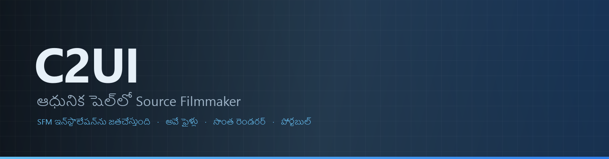

<details align="center"><summary>&nbsp;🌐 <b>🇮🇳 తెలుగు</b> &nbsp;·&nbsp; <sub>Language · Язык · 語言 · Idioma · Sprache · भाषा · لغة</sub></summary>

<table align="center">
<tr><td align="center"><a href="../../README.md">🇷🇺<br>Русский</a></td><td align="center"><a href="../README/EN-en.md">🇬🇧<br>English</a></td><td align="center"><a href="../README/PL-pl.md">🇵🇱<br>Polski</a></td><td align="center"><a href="../README/UK-ua.md">🇺🇦<br>Українська</a></td><td align="center"><a href="../README/DE-de.md">🇩🇪<br>Deutsch</a></td><td align="center"><a href="../README/RO-md.md">🇲🇩<br>Moldovenească</a></td><td align="center"><a href="../README/SL-si.md">🇸🇮<br>Slovenščina</a></td><td align="center"><a href="../README/BE-by.md">🇧🇾<br>Беларуская</a></td></tr>
<tr><td align="center"><a href="../README/KK-kz.md">🇰🇿<br>Қазақша</a></td><td align="center"><a href="../README/JA-jp.md">🇯🇵<br>日本語</a></td><td align="center"><a href="../README/ZH-cn.md">🇨🇳<br>中文</a></td><td align="center"><a href="../README/SV-se.md">🇸🇪<br>Svenska</a></td><td align="center"><a href="../README/ES-es.md">🇪🇸<br>Español</a></td><td align="center"><a href="../README/HI-in.md">🇮🇳<br>हिन्दी</a></td><td align="center"><a href="../README/PT-pt.md">🇵🇹<br>Português</a></td><td align="center"><a href="../README/BN-bd.md">🇧🇩<br>বাংলা</a></td></tr>
<tr><td align="center"><a href="../README/FR-fr.md">🇫🇷<br>Français</a></td><td align="center"><b>🇮🇳<br>తెలుగు</b></td><td align="center"><a href="../README/MR-in.md">🇮🇳<br>मराठी</a></td><td align="center"><a href="../README/TA-in.md">🇮🇳<br>தமிழ்</a></td><td align="center"><a href="../README/TR-tr.md">🇹🇷<br>Türkçe</a></td><td align="center"><a href="../README/UR-pk.md">🇵🇰<br>اردو</a></td><td align="center"><a href="../README/VI-vn.md">🇻🇳<br>Tiếng Việt</a></td><td align="center"><a href="../README/GU-in.md">🇮🇳<br>ગુજરાતી</a></td></tr>
<tr><td align="center"><a href="../README/IT-it.md">🇮🇹<br>Italiano</a></td><td align="center"><a href="../README/KO-kr.md">🇰🇷<br>한국어</a></td><td align="center"><a href="../README/AR-sa.md">🇸🇦<br>العربية</a></td><td align="center"><a href="../README/JV-id.md">🇮🇩<br>Basa Jawa</a></td><td align="center"><a href="../README/ML-in.md">🇮🇳<br>മലയാളം</a></td><td align="center"><a href="../README/NE-np.md">🇳🇵<br>नेपाली</a></td><td align="center"><a href="../README/UZ-uz.md">🇺🇿<br>Oʻzbekcha</a></td><td align="center"><a href="../README/OR-in.md">🇮🇳<br>ଓଡ଼ିଆ</a></td></tr>
</table>

</details>

<p align="center"></p>

<p align="center">
  
  
  
  
  <a href="../../Testing"></a>
  
  <a href="../LICENSE/TE-in.md"></a>
</p>

<p align="center"><b>C2UI</b> — <i>Custom to User Interface</i> — ఆధునిక షెల్‌లో Source Filmmaker ఎడిటర్: అదే కంటెంట్, అదే సెషన్ ఫార్మాట్, అదే డేటా మోడల్, Steam లైబ్రరీ మరియు Unreal Engine 5 ఎడిటర్ శైలిలో ఇంటర్‌ఫేస్.</p>

---

## సిద్ధత

<p align="center"></p>

<p align="center"><a href="../READINESS/TE-in.md"></a></p>

## ఆలోచన

Source Filmmaker బలమైన సాధనం, కానీ దాని ఇంటర్‌ఫేస్ 2012లోనే ఉండిపోయింది. C2UI దాన్ని భర్తీ చేయదు, తిరిగి తయారు చేయదు: లక్ష్యం SFM ను కొంచెం ఆధునికంగా, సౌకర్యవంతంగా చేయడమే.

ఎడిటర్ ఇన్‌స్టాల్ చేసిన SFM ను కనుగొని, దాన్ని కంటెంట్ లైబ్రరీగా జతచేస్తుంది — మోడల్స్, మెటీరియల్స్, టెక్స్చర్లు, సెషన్లు — అదే ఫైళ్లతో అదే ఫార్మాట్‌లో పనిచేస్తుంది. SFM లో చేసినదంతా C2UI లో తెరుచుకుంటుంది, తిరిగి కూడా.

మొదటి లక్ష్యం ఎముకలు, రిగ్‌లతో సహా SFM తో పూర్తి అనుకూలత. తర్వాత — SFM లో లోపించినవి.

```
  ┌──────────────┐                       ┌──────────────────────────────┐
  │   C2UI       │ ──── "SFM ఎక్కడ?" ────▶│  SourceFilmmaker/game/       │
  │              │                       │    usermod/gameinfo.txt      │
  │  సొంత UI     │ ◀─────── మౌంట్ ────────│    tf/  hl2/  tf_movies/ …   │
  │  సొంత రెండర్  │     చదవడం మాత్రమే      │    models/ materials/ dmx    │
  └──────────────┘                       └──────────────────────────────┘
```

- **పోర్టబుల్.** అప్లికేషన్ ఫోల్డర్ వెలుపల ఏమీ రాయబడదు: సెట్టింగ్‌లు `App/User`, క్యాష్ `App/Cache`, తాత్కాలికం `App/Temporary`. ఫోల్డర్ తొలగించండి, ఆనవాళ్లు లేవు.
- **SFM ను ఎప్పుడూ నడపదు.** నడిపించే ప్రాసెస్ లేదు, స్వాధీనం చేసుకునే విండోలు లేవు. ఇన్‌స్టాలేషన్ కంటెంట్ ప్యాక్ లాగా చదవబడుతుంది.
- **ఫార్మాట్లు ధృవీకరించబడ్డాయి, ఊహించలేదు.** ప్రతి రీడర్ నిజమైన ఇన్‌స్టాలేషన్‌తో తనిఖీ చేయబడింది; ఫార్మాట్ ఆశ్చర్యకరమైనది చేస్తే, కోడ్ చెబుతుంది.
- **సేవ్ ఖచ్చితం.** మార్పు లేకుండా చదివి రాసిన సెషన్ అదే ఫైల్.
- **ఇంజిన్‌కు డిపెండెన్సీలు లేవు.** `Core/` మరియు మొత్తం టెస్ట్ సూట్ స్వచ్ఛమైన Python పై నడుస్తాయి; విండోకు మాత్రమే Qt మరియు OpenGL కావాలి.

## నిర్మాణం

```
C2UI_SDK/
├── README.md
├── Core/               ఇంజిన్: ఫార్మాట్లు, వర్చువల్ ఫైల్ సిస్టమ్, ఇండెక్స్, బ్రిడ్జ్‌లు
│   ├── API/            ఎడిటర్, టూల్స్ మరియు ప్లగిన్‌ల ఒప్పందం
│   ├── Code/           ఇంజిన్: యానిమేషన్, ఆపరేటర్లు, ముఖాలు, సవరణ
│   │   └── formats/    Valve రీడర్లు: mdl vvd vtx vmt vtf dmx bsp
│   └── dev-kit/        SDK స్లాట్‌లు (ఖాళీ) మరియు ఇన్‌స్టాలేషన్ బ్రిడ్జ్‌లు
├── App/                ఎడిటర్: కంటెంట్ లైబ్రరీ, రెండరర్, విండో
│   ├── Code/           కంటెంట్ లైబ్రరీ, విండో, సెట్టింగ్‌లు
│   │   ├── render/     దృశ్యం, OpenGL రెండరర్, షేడర్లు, కెమెరా
│   │   └── ui/         టైమ్‌లైన్, సెషన్ ట్రీ, ఇన్‌స్పెక్టర్, గ్రాఫ్ ఎడిటర్, డాకింగ్
│   ├── Data/           ప్రోగ్రామ్ వనరులు, చదవడానికి మాత్రమే
│   ├── User/           వినియోగదారు డేటా — ఎప్పుడూ తొలగించబడదు
│   └── Cache/          కంటెంట్ ఇండెక్స్, షేడర్లు, థంబ్‌నెయిల్స్
├── Tools/              స్థానికీకరణ, UI టూల్స్, ప్లగిన్‌లు (తర్వాత)
│   ├── Launcher/       లాంచర్
│   ├── Market Load/    ప్లగిన్ మార్కెట్‌ప్లేస్ క్లయింట్ (తర్వాత)
│   ├── Localization/   అనువాదాలు రూపొందించడం
│   ├── NewPlugins/     ప్లగిన్‌లు రూపొందించడం
│   └── UI/             థీమ్‌లు మరియు వర్క్‌స్పేస్‌లు
├── Testing/            పరీక్షలు, బైట్-ఖచ్చిత ఫిక్స్చర్లు, ఒక రన్నర్
│   ├── core/           ఇంజిన్
│   ├── app/            ఎడిటర్
│   └── fixtures/       నకిలీ ఇన్‌స్టాలేషన్, మోడళ్లు, టెక్స్చర్లు
└── GIT&DOCK/           README, సంసిద్ధత మరియు లైసెన్స్ 32 భాషల్లో
```

### ఇది ఎలా పనిచేస్తుంది

«Source Filmmaker ఎక్కడ?» నుండి తెరపై ఒక ఫ్రేమ్ వరకు మార్గం ఐదు పొరల గుండా వెళుతుంది; ప్రతి పొరకు దాని కింది పొర మాత్రమే తెలుసు.

1. **బ్రిడ్జ్** (`Core/dev-kit/bridge_sfm`) Steam ద్వారా ఇన్‌స్టాలేషన్‌ను కనుగొంటుంది, `gameinfo.txt` చదువుతుంది మరియు ఇంజిన్ క్రమంలో కంటెంట్ మార్గాలను తిరిగి ఇస్తుంది. `sfm.exe` ఎప్పుడూ ప్రారంభించబడదు.
2. **వర్చువల్ ఫైల్ సిస్టమ్ మరియు ఇండెక్స్** (`Core/Code/vfs.py`, `content_index.py`) ఆ మార్గాలను Source లాగా పొరలుగా పేరుస్తాయి: మొదట దొరికిన ఫైల్ గెలుస్తుంది. ఇండెక్స్ `App/Cache`లో ఒక SQLite ఫైల్, కాబట్టి 70 000 ఫైళ్ల నడక ఒకసారే జరుగుతుంది.
3. **ఫార్మాట్లు** (`Core/Code/formats`) మూడవ పక్ష లైబ్రరీలు లేకుండా Valve ఫైళ్లను చదువుతాయి: `.mdl` `.vvd` `.vtx` ఒక మోడల్, `.vmt` `.vtf` మెటీరియల్ మరియు టెక్స్చర్, `.dmx` సెషన్, `.bsp` మ్యాప్. ప్రతి రీడర్ మొత్తం ఇన్‌స్టాలేషన్‌పై తనిఖీ చేయబడింది; సెషన్ బైట్‌కు బైట్ అలాగే తిరిగి రాయబడుతుంది.
4. **సెషన్** DMX మూలకాల గ్రాఫ్. `animation.py` ఒక క్షణంలో ఛానెళ్లను లెక్కిస్తుంది, `operators.py` వ్యక్తీకరణలు మరియు రిగ్ కన్‌స్ట్రెయింట్‌లను నడుపుతుంది, `flex.py` ముఖాలను కదిలిస్తుంది, `pose.py` ఎముక మాత్రికలను నిర్మిస్తుంది. ప్రతి సవరణ `editing.py` ద్వారా రద్దు చేయగల ఆదేశంగా వెళుతుంది.
5. **ఎడిటర్** (`App/Code`) దీన్నుంచి ఒక దృశ్యాన్ని (`render/scene.py`) కూర్చి, తన సొంత OpenGL 3.3 రెండరర్‌తో (`renderer.py`, `shaders.py`) గీస్తుంది: సెషన్ లైట్లు, లైట్‌మ్యాప్‌లు మరియు మ్యాప్ వెలుతురు — చిత్రం ఇంకా SFM కి చాలా దూరంగా ఉంది, పని కొనసాగుతోంది. ప్యానెళ్లు (`ui/`) టైమ్‌లైన్, సెషన్ ట్రీ, ఇన్‌స్పెక్టర్, గ్రాఫ్ ఎడిటర్ మరియు UE5 తరహా డాకింగ్.

ప్రోగ్రామ్ రాసేదంతా దాని ఫోల్డర్‌లోనే ఉంటుంది: సెట్టింగ్‌లు `App/User`లో, ఇండెక్స్ మరియు కాష్ `App/Cache`లో, లాగ్ `App/Temporary`లో. `Core/` ఏమీ రాయదు మరియు Qt పై ఆధారపడదు, కాబట్టి ఇంజిన్ మరియు పరీక్షలు స్వచ్ఛమైన Python పై నడుస్తాయి; Qt మరియు OpenGL విండోకు మాత్రమే అవసరం. `Tools/`లోని యుటిలిటీలు కచ్చితంగా `Core/API`పై నిర్మించబడ్డాయి — ఆ API మూడవ పక్ష ప్లగిన్‌లకూ సరిపోతుందని ఇలా నిరూపించబడుతుంది.

### నడపడం

Windows, Python 3.13 మరియు Source Filmmaker ఇన్‌స్టాలేషన్ అవసరం.

```bash
git clone https://github.com/Arkomiko/SFM_C2UI.git
cd SFM_C2UI
python -m venv .venv
.venv/Scripts/python.exe -m pip install -r Tools/Launcher/requirements.txt
.venv/Scripts/python.exe Tools/Launcher/c2ui.py
```

మొదటి ప్రారంభంలో Steam ద్వారా SFM ను వెతుకుతుంది; దొరకకపోతే అడుగుతుంది. <kbd>Ctrl</kbd>+<kbd>O</kbd> సెషన్ తెరుస్తుంది, <kbd>Space</kbd> ప్లే, <kbd>C</kbd> షాట్ కెమెరా, <kbd>T</kbd>/<kbd>R</kbd> మూవ్/రొటేట్, <kbd>M</kbd> మోషన్ ఎడిటర్, <kbd>Ctrl</kbd>+<kbd>Z</kbd> అన్‌డు, <kbd>Ctrl</kbd>+<kbd>S</kbd> సేవ్. ప్యానెల్‌లు శీర్షిక ద్వారా లాగబడతాయి. పరీక్షలకు ఏమీ అవసరం లేదు:

```bash
python Testing/run.py
```

### ప్రణాళికలో

**తర్వాత**
- మ్యాప్ రూపం: నీరు, prop_dynamic, లైట్ గోబో టెక్స్చర్లు, `$bumpmap` మరియు `$envmap`, సెషన్ లైట్ల నుండి నీడలు.
- ఎగుమతి చేసిన సినిమాల్లో ధ్వని.
- `.c2plg` ప్లగిన్‌లు మరియు `Tools/Market Load`లో మార్కెట్‌ప్లేస్ క్లయింట్; తర్వాత థీమ్‌లు మరియు వర్క్‌స్పేస్‌లు.
- టైమ్‌లైన్‌లో ధ్వని, పార్టికల్స్, రింకిల్ మ్యాప్‌లు, మోషన్ ఎడిటర్ ప్రీసెట్‌లు మరియు లేయర్లు, గ్రాఫ్ ఎడిటర్‌లో టాంజెంట్లు.

**ఆ తర్వాత**
- పూర్తి మ్యాప్‌లపై పనితీరు: స్టాటిక్ ప్రాప్ ఇన్‌స్టాన్సింగ్, పోజ్ కాష్.
- ఇంజిన్ పునర్నిర్మాణం: మెరుగైన వెలుతురు మరియు నీడల కోసం కొత్త మ్యాప్-కంపైల్ పారామితులు, 120 000 యూనిట్ల మ్యాప్ పరిమితి.
- సొంత Python మరియు స్వీయ-నవీకరణతో ప్యాక్ చేసిన లాంచర్; ఎడిటర్ స్థానికీకరణ.

## లైసెన్స్ మరియు కృతజ్ఞతలు

C2UI సొంత కోడ్ **C2UI లైసెన్స్** కింద ఉంది: వ్యక్తిగత, వాణిజ్యేతర ఉపయోగానికి స్వేచ్ఛ; వాణిజ్య ఉపయోగం రచయిత లిఖిత అనుమతితో మాత్రమే; మార్చిన వెర్షన్లు మూల ప్రాజెక్ట్‌ను, రచయిత Arkomiko ను పేర్కొనాలి. ప్లగిన్‌లు, యాడాన్‌లు **C2UI — Plugins & Addons (C2UI‑Pl&AD)** లైసెన్స్ కింద.

Source Filmmaker, Team Fortress 2, Source ఇంజిన్ Valve వి; ప్రాజెక్ట్ వాటి ఫార్మాట్లు చదువుతుంది, వాటి ఫైళ్లు చేర్చదు, Steam నుండి మీ సొంత SFM కాపీతో మాత్రమే పనిచేస్తుంది.

<p align="center"><a href="../LICENSE/TE-in.md"></a></p>
