<p align="center"></p>

<p align="center"><a href="../../README.md">🇷🇺 Русский</a> · <a href="EN-en.md">🇬🇧 English</a> · <a href="PL-pl.md">🇵🇱 Polski</a> · <a href="UK-ua.md">🇺🇦 Українська</a> · <a href="DE-de.md">🇩🇪 Deutsch</a> · <a href="RO-md.md">🇲🇩 Moldovenească</a> · <a href="SL-si.md">🇸🇮 Slovenščina</a> · <a href="BE-by.md">🇧🇾 Беларуская</a> · <a href="KK-kz.md">🇰🇿 Қазақша</a> · <a href="JA-jp.md">🇯🇵 日本語</a> · <a href="ZH-cn.md">🇨🇳 中文</a> · <a href="SV-se.md">🇸🇪 Svenska</a> · <a href="ES-es.md">🇪🇸 Español</a> · <a href="HI-in.md">🇮🇳 हिन्दी</a> · <a href="PT-pt.md">🇵🇹 Português</a> · <a href="BN-bd.md">🇧🇩 বাংলা</a> · <a href="FR-fr.md">🇫🇷 Français</a> · <a href="TE-in.md">🇮🇳 తెలుగు</a> · <a href="MR-in.md">🇮🇳 मराठी</a> · <a href="TA-in.md">🇮🇳 தமிழ்</a> · <b>🇹🇷 Türkçe</b> · <a href="UR-pk.md">🇵🇰 اردو</a> · <a href="VI-vn.md">🇻🇳 Tiếng Việt</a> · <a href="GU-in.md">🇮🇳 ગુજરાતી</a> · <a href="IT-it.md">🇮🇹 Italiano</a> · <a href="KO-kr.md">🇰🇷 한국어</a> · <a href="AR-sa.md">🇸🇦 العربية</a> · <a href="JV-id.md">🇮🇩 Basa Jawa</a> · <a href="ML-in.md">🇮🇳 മലയാളം</a> · <a href="NE-np.md">🇳🇵 नेपाली</a> · <a href="UZ-uz.md">🇺🇿 Oʻzbekcha</a> · <a href="OR-in.md">🇮🇳 ଓଡ଼ିଆ</a></p>

<p align="center">
  
  
  
  
  <a href="../../Testing"></a>
  
</p>

<p align="center"><b>C2UI</b> — <i>Custom to User Interface</i> — — modern bir kabuk içinde Source Filmmaker düzenleyicisi: aynı içerik, aynı oturum biçimi, aynı veri modeli, Steam kitaplığı ve Unreal Engine 5 düzenleyicisi ruhunda bir arayüz.</p>

---

## Fikir

Source Filmmaker, arayüzü 2012'de kalmış güçlü bir araçtır. C2UI onun yerini almaz ve onu yeniden yapmaz: amaç yalnızca SFM'yi biraz daha modern ve rahat hale getirmektir.

Düzenleyici kurulu SFM'yi bulur, onu bir içerik kitaplığı olarak bağlar — modeller, malzemeler, dokular, oturumlar — ve aynı dosyalarla aynı biçimde çalışır. SFM'de yapılan her şey C2UI'de açılır, tersi de geçerlidir.

İlk hedef, kemikler ve rig'ler dahil SFM ile tam uyumluluktur. Sonrası, SFM'de eksik olanlar.

```
  ┌──────────────┐    "SFM nerede?"    ┌──────────────────────────────┐
  │   C2UI       │ ─────────────────────▶│  SourceFilmmaker/game/       │
  │              │                       │    usermod/gameinfo.txt      │
  │  kendi UI    │ ◀─────   bağlı   ───────│    tf/  hl2/  tf_movies/ …   │
  │  kendi render │      salt okunur      │    models/ materials/ dmx    │
  └──────────────┘                       └──────────────────────────────┘
```

## Hazırlık



 <b>Yayın için genel hazırlık: 41%</b>

Her alan açılabilir: neyin zaten çalıştığı ve neyin henüz olmadığı. Yüzdeler, SFM'nin yapabildiklerine göre bir tahmindir.

<details><summary> <b>SFM'yi bulma ve bağlama</b></summary>

Steam kayıt defteri → `libraryfolders.vdf` → `gameinfo.txt` arama yolları, motorun kendi sırasıyla. Standart kurulumda altı bağlama. Uygulama klasörü dışına hiçbir şey yazılmaz.

</details>
<details><summary> <b>İçerik dizini</b></summary>

70 199 dosya 1,1 s soğuk / 0,02 s önbellekten; bağlamalar arası geçersiz kılmalar tam motor gibi çözülür.

</details>
<details><summary> <b>Modeller — <code>.mdl</code> <code>.vvd</code> <code>.vtx</code></b></summary>

Sürüm 44, 48, 49. İskelet, mesh'ler, tüm ayrıntı seviyeleri, gövde grupları. 1 500 model yüklendi, 0 hata.

</details>
<details><summary> <b>Malzemeler — <code>.vmt</code></b></summary>

Gelen 19 554 malzemenin tümü okunur; `patch`, DX blokları, proxy'ler.

</details>
<details><summary> <b>Dokular — <code>.vtf</code></b></summary>

Sürüm 7.0–7.5, DXT1/3/5 ve tüm sıkıştırılmamış biçimler, cubemap'ler, mip'ler. DXT kod çözme olmadan GPU'ya gider.

</details>
<details><summary> <b>Oturumlar — <code>.dmx</code></b></summary>

İkili 1–5 ve KeyValues2. Kurulumdaki her oturum ve parçacık dosyası **bayt bayt** geri yazılır.

</details>
<details><summary> <b>Ekranda oturum</b></summary>

Zaman çizelgesinde çekimler ve ses parçaları, öğe ağacı, her çekimin sahnesi kendi kamerasından. Henüz yok: haritalar, parçacıklar, ses.

</details>
<details><summary> <b>Animasyon</b></summary>

Kanallar ve günlükler imleçte değerlendirilir; kaydırma ve oynatma. Kemikler, kameralar ve görünürlük oturumu izler.

</details>
<details><summary> <b>Yüzler</b></summary>

Flex denetleyicileri, derlenmiş kurallar ve köşe animasyonu — karakterler konuşur ve ifade gösterir. Henüz yok: kırışıklık haritaları.

</details>
<details><summary> <b>Rig'ler</b></summary>

İfadeler, point/orient/parent/aim kısıtları, iki kemikli IK. Henüz yok: tam operatör bağımlılık grafiği, rig oluşturma.

</details>
<details><summary> <b>Düzenleme</b></summary>

Tıklayarak seçim, taşı/döndür manipülatörü, her öznitelik için denetçi, imleçte anahtar, geri al/yinele, bayt düzeyinde kayıt.

</details>
<details><summary> <b>Motion editor</b></summary>

Cetvelde hold ve falloff ile zaman seçimi; düzenleme SFM'deki gibi üzerine yayılır. Henüz yok: ön ayarlar, katmanlar.

</details>
<details><summary> <b>Grafik düzenleyici</b></summary>

Seçili öğeyi süren her logun eğrileri: X/Y/Z, pitch/yaw/roll, skalerler. Anahtarlar canlı önizlemeyle zaman ve değerde sürüklenir, çift tık ekler, Delete siler; zaman ekseni zaman çizelgesinindir. Henüz yok: teğetler ve eğri türleri, anahtar grubunu ölçekleme.

</details>
<details><summary> <b>Panel yerleştirme</b></summary>

UE5 ve Visual Studio'daki gibi panelleri önizlemeli hedef pusulasına sürükleyin. Henüz yok: kayıtlı yerleşimler, temalar.

</details>
<details><summary> <b>Source gölgelendirme</b></summary>

Sadece doku ve basit ışık. Henüz yok: phong, rim, lightwarp, sahne ışıkları, gölgeler.

</details>
<details><summary> <b>Haritalar — <code>.bsp</code></b></summary>

Başlanmadı.

</details>
<details><summary> <b>Görüntü ve videoya render</b></summary>

Başlanmadı.

</details>
<details><summary> <b>Eklentiler <code>.c2plg</code></b></summary>

Başlanmadı.

</details>
<details><summary> <b>Temalar ve çalışma alanları</b></summary>

Bilerek sonra: düzenleyicide temalanmaya değer bir şey olana dek tek görünüm.

</details>

**Yayına hazır değil.** Temel — SFM'nin kullandığı her dosya biçimi, doğru okunmuş ve tüm kurulumda doğrulanmış — yerinde ve test edilmiş; bir oturum açılabilir, oynatılabilir, değiştirilebilir ve kaydedilebilir. Eksik olan çalışmanın *rahatlığı*: grafik düzenleyici, Source gölgelendirme, haritalar, dışa aktarma. Bir animatör içinde bir günlük iş yapabilene dek sürüm numarası yok.

<br clear="all">

<p align="center"><br><sub>Bugünkü düzenleyici, Valve'ın Meet the Heavy'si açık: zaman çizelgesinde çekimler ve ses, oturum ağacı, ilk çekim kendi kamerasından, oturumun dediği gibi pozlanmış ve yüz ifadeli karakterler.</sub></p>

## Onu farklı kılan

- **Taşınabilir.** Uygulama klasörü dışına hiçbir şey yazılmaz: ayarlar `App/User`, önbellek `App/Cache`, geçici `App/Temporary`. Klasörü silin, iz kalmaz.
- **SFM'yi hiç çalıştırmaz.** Yönetilecek süreç yok, ele geçirilecek pencere yok. Kurulum bir içerik paketi gibi okunur.
- **Biçimler doğrulanmış, varsayılmamış.** Her okuyucu gerçek kurulumla karşılaştırıldı; bir biçim şaşırtıcı bir şey yapıyorsa kod bunu söyler.
- **Kayıt tamdır.** Değiştirilmeden okunup yazılan oturum aynı dosyadır.
- **Motorun bağımlılığı yok.** `Core/` ve tüm test paketi çıplak Python'da çalışır; yalnızca pencere Qt ve OpenGL ister.

## Çalıştırma

Windows, Python 3.13 ve bir Source Filmmaker kurulumu gerekir.

```bash
git clone https://github.com/Arkomiko/SFM_C2UI.git
cd SFM_C2UI
python -m venv .venv
.venv/Scripts/python.exe -m pip install -r requirements.txt
.venv/Scripts/python.exe c2ui.py
```

İlk açılışta SFM Steam üzerinden aranır; bulunamazsa program sorar. <kbd>Ctrl</kbd>+<kbd>O</kbd> oturum açar, <kbd>Space</kbd> oynatır, <kbd>C</kbd> çekim kamerasından bakar, <kbd>T</kbd>/<kbd>R</kbd> taşı/döndür, <kbd>M</kbd> motion editor, <kbd>Ctrl</kbd>+<kbd>Z</kbd> geri alır, <kbd>Ctrl</kbd>+<kbd>S</kbd> kaydeder. Paneller başlıklarından sürüklenir. Testler hiçbir şey gerektirmez:

```bash
python Testing/run.py
```

## Yapı

```
C2UI_SDK/
├── c2ui.py            başlatıcı
├── Core/              motor: biçimler, sanal dosya sistemi, dizin, köprüler
├── App/               düzenleyici: içerik kitaplığı, renderer, pencere
├── Tools/             yerelleştirme, UI araçları, eklentiler (sonra)
├── Testing/           testler, bayt düzeyinde fixture'lar, tek runner
└── GIT&DOCK/README/   bu README diğer dillerde
```

## Yol haritası

1. **Source gölgelendirme** — SFM'nin çizdiği gibi VertexLitGeneric: phong, rim, lightwarp, sahne ışıkları.
2. **Haritalar** — arka plan için `.bsp`.
3. **Çıktı** — görüntü ve video dışa aktarma.
4. **Eklentiler** — `.c2plg` biçimi; sonra temalar ve çalışma alanları.

## Lisans ve teşekkür

Source Filmmaker, Team Fortress 2 ve Source motoru Valve'a aittir. Bu proje onların dosya biçimlerini okur, hiçbir dosyalarını içermez ve yalnızca Steam üzerinden zaten sahip olduğunuz SFM kopyasıyla çalışır.

C2UI'nin kendi kodunun lisansı henüz seçilmedi — o zamana dek tüm hakları saklıdır. Issue'lar ve pull request'ler yine de hoş karşılanır.

<p align="center"><br><sub>Kurulumdan rastgele seçilen altmış dört model, C2UI'nin kendi renderer'ı ile çizildi.</sub></p>
