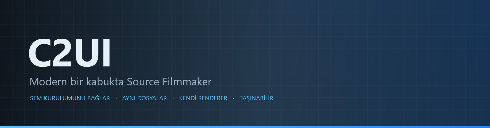

<details align="center"><summary>&nbsp;🌐 <b>🇹🇷 Türkçe</b> &nbsp;·&nbsp; <sub>Language · Язык · 語言 · Idioma · Sprache · भाषा · لغة</sub></summary>

<table align="center">
<tr><td align="center"><a href="../../README.md">🇷🇺<br>Русский</a></td><td align="center"><a href="../README/EN-en.md">🇬🇧<br>English</a></td><td align="center"><a href="../README/PL-pl.md">🇵🇱<br>Polski</a></td><td align="center"><a href="../README/UK-ua.md">🇺🇦<br>Українська</a></td><td align="center"><a href="../README/DE-de.md">🇩🇪<br>Deutsch</a></td><td align="center"><a href="../README/RO-md.md">🇲🇩<br>Moldovenească</a></td><td align="center"><a href="../README/SL-si.md">🇸🇮<br>Slovenščina</a></td><td align="center"><a href="../README/BE-by.md">🇧🇾<br>Беларуская</a></td></tr>
<tr><td align="center"><a href="../README/KK-kz.md">🇰🇿<br>Қазақша</a></td><td align="center"><a href="../README/JA-jp.md">🇯🇵<br>日本語</a></td><td align="center"><a href="../README/ZH-cn.md">🇨🇳<br>中文</a></td><td align="center"><a href="../README/SV-se.md">🇸🇪<br>Svenska</a></td><td align="center"><a href="../README/ES-es.md">🇪🇸<br>Español</a></td><td align="center"><a href="../README/HI-in.md">🇮🇳<br>हिन्दी</a></td><td align="center"><a href="../README/PT-pt.md">🇵🇹<br>Português</a></td><td align="center"><a href="../README/BN-bd.md">🇧🇩<br>বাংলা</a></td></tr>
<tr><td align="center"><a href="../README/FR-fr.md">🇫🇷<br>Français</a></td><td align="center"><a href="../README/TE-in.md">🇮🇳<br>తెలుగు</a></td><td align="center"><a href="../README/MR-in.md">🇮🇳<br>मराठी</a></td><td align="center"><a href="../README/TA-in.md">🇮🇳<br>தமிழ்</a></td><td align="center"><b>🇹🇷<br>Türkçe</b></td><td align="center"><a href="../README/UR-pk.md">🇵🇰<br>اردو</a></td><td align="center"><a href="../README/VI-vn.md">🇻🇳<br>Tiếng Việt</a></td><td align="center"><a href="../README/GU-in.md">🇮🇳<br>ગુજરાતી</a></td></tr>
<tr><td align="center"><a href="../README/IT-it.md">🇮🇹<br>Italiano</a></td><td align="center"><a href="../README/KO-kr.md">🇰🇷<br>한국어</a></td><td align="center"><a href="../README/AR-sa.md">🇸🇦<br>العربية</a></td><td align="center"><a href="../README/JV-id.md">🇮🇩<br>Basa Jawa</a></td><td align="center"><a href="../README/ML-in.md">🇮🇳<br>മലയാളം</a></td><td align="center"><a href="../README/NE-np.md">🇳🇵<br>नेपाली</a></td><td align="center"><a href="../README/UZ-uz.md">🇺🇿<br>Oʻzbekcha</a></td><td align="center"><a href="../README/OR-in.md">🇮🇳<br>ଓଡ଼ିଆ</a></td></tr>
</table>

</details>

<p align="center"></p>

<p align="center">
  
  
  
  
  <a href="../../Testing"></a>
  
  <a href="../LICENSE/TR-tr.md"></a>
</p>

<p align="center"><b>C2UI</b> — <i>Custom to User Interface</i> — modern bir kabuk içinde Source Filmmaker düzenleyicisi: aynı içerik, aynı oturum biçimi, aynı veri modeli, Steam kitaplığı ve Unreal Engine 5 düzenleyicisi ruhunda bir arayüz.</p>

---

## Hazırlık

<p align="center"></p>

<p align="center"><a href="../READINESS/TR-tr.md"></a></p>

## Fikir

Source Filmmaker, arayüzü 2012'de kalmış güçlü bir araçtır. C2UI onun yerini almaz ve onu yeniden yapmaz: amaç yalnızca SFM'yi biraz daha modern ve rahat hale getirmektir.

Düzenleyici kurulu SFM'yi bulur, onu bir içerik kitaplığı olarak bağlar — modeller, malzemeler, dokular, oturumlar — ve aynı dosyalarla aynı biçimde çalışır. SFM'de yapılan her şey C2UI'de açılır, tersi de geçerlidir.

İlk hedef, kemikler ve rig'ler dahil SFM ile tam uyumluluktur. Sonrası, SFM'de eksik olanlar.

```
  ┌───────────────┐                         ┌──────────────────────────────┐
  │   C2UI        │ ──── "SFM nerede?" ────▶│  SourceFilmmaker/game/       │
  │               │                         │    usermod/gameinfo.txt      │
  │  kendi UI     │ ◀──────── bağlı ────────│    tf/  hl2/  tf_movies/ …   │
  │  kendi render │       salt okunur       │    models/ materials/ dmx    │
  └───────────────┘                         └──────────────────────────────┘
```

- **Taşınabilir.** Uygulama klasörü dışına hiçbir şey yazılmaz: ayarlar `App/User`, önbellek `App/Cache`, geçici `App/Temporary`. Klasörü silin, iz kalmaz.
- **SFM'yi hiç çalıştırmaz.** Yönetilecek süreç yok, ele geçirilecek pencere yok. Kurulum bir içerik paketi gibi okunur.
- **Biçimler doğrulanmış, varsayılmamış.** Her okuyucu gerçek kurulumla karşılaştırıldı; bir biçim şaşırtıcı bir şey yapıyorsa kod bunu söyler.
- **Kayıt tamdır.** Değiştirilmeden okunup yazılan oturum aynı dosyadır.
- **Motorun bağımlılığı yok.** `Core/` ve tüm test paketi çıplak Python'da çalışır; yalnızca pencere Qt ve OpenGL ister.

## Yapı

```
C2UI_SDK/
├── README.md
├── Core/               motor: biçimler, sanal dosya sistemi, dizin, köprüler
│   ├── API/            düzenleyici, araçlar ve eklentiler için sözleşme
│   ├── Code/           motor: animasyon, operatörler, yüzler, düzenleme
│   │   └── formats/    Valve okuyucuları: mdl vvd vtx vmt vtf dmx bsp
│   └── dev-kit/        SDK yuvaları (boş) ve kurulumlara köprüler
├── Launcher/           başlatıcı
├── App/                düzenleyici: içerik kitaplığı, renderer, pencere
│   ├── Code/           içerik kütüphanesi, pencere, ayarlar
│   │   ├── render/     sahne, OpenGL işleyici, gölgelendiriciler, kamera
│   │   └── ui/         zaman çizelgesi, oturum ağacı, denetçi, graph editor, yerleştirme
│   ├── Data/           program kaynakları, salt okunur
│   ├── User/           kullanıcı verisi — asla silinmez
│   └── Cache/          içerik dizini, gölgelendiriciler, küçük resimler
├── Tools/              yerelleştirme, UI araçları, eklentiler (sonra)
│   ├── Market Load/    eklenti pazar yeri istemcisi (sonra)
│   ├── Localization/   çeviri hazırlama
│   ├── NewPlugins/     eklenti hazırlama
│   └── UI/             temalar ve çalışma alanları
├── Testing/            testler, bayt düzeyinde fixture'lar, tek runner
│   ├── core/           motor
│   ├── app/            düzenleyici
│   └── fixtures/       sahte kurulum, modeller, dokular
└── GIT&DOCK/           README, hazırlık ve lisans 32 dilde
```

### Nasıl çalışır

«Source Filmmaker nerede?» sorusundan ekrandaki bir kareye giden yol beş katmandan geçer; her katman yalnızca altındakini bilir.

1. **Köprü** (`Core/dev-kit/bridge_sfm`) kurulumu Steam üzerinden bulur, `gameinfo.txt` dosyasını okur ve içerik yollarını motorun sırasıyla döndürür. `sfm.exe` asla başlatılmaz.
2. **Sanal dosya sistemi ve dizin** (`Core/Code/vfs.py`, `content_index.py`) bu yolları Source gibi katmanlar: ilk bulunan dosya kazanır. Dizin `App/Cache` içinde tek bir SQLite dosyasıdır; 70 000 dosyanın taranması bu yüzden bir kez yapılır.
3. **Biçimler** (`Core/Code/formats`) Valve dosyalarını üçüncü taraf kütüphane olmadan okur: `.mdl` `.vvd` `.vtx` bir model, `.vmt` `.vtf` bir malzeme ve dokusu, `.dmx` bir oturum, `.bsp` bir haritadır. Her okuyucu tüm kurulumda doğrulanmıştır; bir oturum bayt bayt aynı geri yazılır.
4. **Oturum** DMX öğelerinden oluşan bir grafiktir. `animation.py` bir andaki kanalları hesaplar, `operators.py` ifadeleri ve rig kısıtlarını çalıştırır, `flex.py` yüzleri hareket ettirir, `pose.py` kemik matrislerini kurar. Her düzenleme `editing.py` üzerinden geri alınabilir bir komut olarak geçer.
5. **Düzenleyici** (`App/Code`) bundan bir sahne (`render/scene.py`) kurar ve kendi OpenGL 3.3 işleyicisiyle (`renderer.py`, `shaders.py`) çizer: oturum ışıkları, lightmap'ler ve haritanın aydınlatması — görüntü SFM'ninkinden hâlâ uzak ve üzerinde çalışılıyor. Paneller (`ui/`) zaman çizelgesi, oturum ağacı, denetçi, graph editor ve UE5 tarzı yerleştirmedir.

Programın yazdığı her şey kendi klasöründe kalır: ayarlar `App/User`, dizin ve önbellekler `App/Cache`, günlük `App/Temporary`. `Core/` hiçbir şey yazmaz ve Qt'ye bağımlı değildir; motor ve testler bu yüzden yalın Python'da çalışır; Qt ve OpenGL yalnızca pencereye gerekir. `Tools/` içindeki araçlar sıkı sıkıya `Core/API` üzerine kurulur — API'nin üçüncü taraf eklentilere de yettiği böyle kanıtlanır.

### Çalıştırma

Windows, Python 3.13 ve bir Source Filmmaker kurulumu gerekir.

```bash
git clone https://github.com/Arkomiko/SFM_C2UI.git
cd SFM_C2UI
python -m venv .venv
.venv/Scripts/python.exe -m pip install -r Launcher/requirements.txt
.venv/Scripts/python.exe Launcher/launcher.py
```

Bu, başlatıcıyı açar: üç düğmeli küçük bir pencere. Görünümü geçicidir — App ortaya çıkınca yeniden yazılacak; penceresi şimdilik yalnızca Rusça.

<p align="center"><a href="../LAUNCHER/TR-tr.md"></a></p>

İlk açılışta SFM Steam üzerinden aranır; bulunamazsa program sorar. <kbd>Ctrl</kbd>+<kbd>O</kbd> oturum açar, <kbd>Space</kbd> oynatır, <kbd>C</kbd> çekim kamerasından bakar, <kbd>T</kbd>/<kbd>R</kbd> taşı/döndür, <kbd>M</kbd> motion editor, <kbd>Ctrl</kbd>+<kbd>Z</kbd> geri alır, <kbd>Ctrl</kbd>+<kbd>S</kbd> kaydeder. Paneller başlıklarından sürüklenir. Testler hiçbir şey gerektirmez:

```bash
python Testing/run.py
```

### Planlanan

**Sırada**
- Haritanın görünümü: su, prop_dynamic, ışıkların gobo dokuları, `$bumpmap` ve `$envmap`, oturum ışıklarından gölgeler.
- Dışa aktarılan filmlerde ses.
- `.c2plg` eklentileri ve `Tools/Market Load` içindeki pazar yeri istemcisi; sonra temalar ve çalışma alanları.
- Zaman çizelgesinde ses, parçacıklar, wrinkle map'ler, motion editor ön ayarları ve katmanları, graph editor'da teğetler.

**Daha sonra**
- Tam haritalarda performans: örneklenmiş statik prop'lar, önbelleğe alınmış pozlar.
- Motorun yeniden yapımı: daha iyi aydınlatma ve gölge için yeni harita derleme parametreleri, 120 000 birimlik harita sınırı.
- Kendi Python'u ve otomatik güncellemesi olan paketlenmiş bir başlatıcı; düzenleyicinin yerelleştirilmesi.

## Lisans ve teşekkür

C2UI'nin kendi kodu **C2UI lisansı** altındadır: kişisel ve ticari olmayan kullanım serbest; ticari kullanım yalnızca yazarın yazılı onayıyla; değiştirilmiş sürümler özgün projeyi ve yazarı Arkomiko'yu belirtmelidir. Eklentiler ve ek paketler **C2UI — Plugins & Addons (C2UI‑Pl&AD)** lisansı altındadır.

Source Filmmaker, Team Fortress 2 ve Source motoru Valve'a aittir; proje onların biçimlerini okur, hiçbir dosyalarını içermez ve yalnızca Steam'deki kendi SFM kopyanızla çalışır.

<p align="center"><a href="../LICENSE/TR-tr.md"></a></p>
