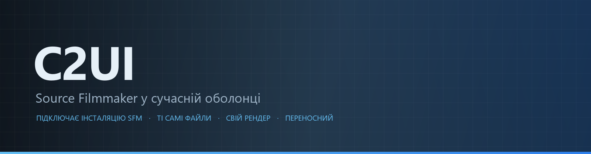

<details align="center"><summary>&nbsp;🌐 <b>🇺🇦 Українська</b> &nbsp;·&nbsp; <sub>Language · Язык · 語言 · Idioma · Sprache · भाषा · لغة</sub></summary>

<table align="center">
<tr><td align="center"><a href="../../README.md">🇷🇺<br>Русский</a></td><td align="center"><a href="../README/EN-en.md">🇬🇧<br>English</a></td><td align="center"><a href="../README/PL-pl.md">🇵🇱<br>Polski</a></td><td align="center"><b>🇺🇦<br>Українська</b></td><td align="center"><a href="../README/DE-de.md">🇩🇪<br>Deutsch</a></td><td align="center"><a href="../README/RO-md.md">🇲🇩<br>Moldovenească</a></td><td align="center"><a href="../README/SL-si.md">🇸🇮<br>Slovenščina</a></td><td align="center"><a href="../README/BE-by.md">🇧🇾<br>Беларуская</a></td></tr>
<tr><td align="center"><a href="../README/KK-kz.md">🇰🇿<br>Қазақша</a></td><td align="center"><a href="../README/JA-jp.md">🇯🇵<br>日本語</a></td><td align="center"><a href="../README/ZH-cn.md">🇨🇳<br>中文</a></td><td align="center"><a href="../README/SV-se.md">🇸🇪<br>Svenska</a></td><td align="center"><a href="../README/ES-es.md">🇪🇸<br>Español</a></td><td align="center"><a href="../README/HI-in.md">🇮🇳<br>हिन्दी</a></td><td align="center"><a href="../README/PT-pt.md">🇵🇹<br>Português</a></td><td align="center"><a href="../README/BN-bd.md">🇧🇩<br>বাংলা</a></td></tr>
<tr><td align="center"><a href="../README/FR-fr.md">🇫🇷<br>Français</a></td><td align="center"><a href="../README/TE-in.md">🇮🇳<br>తెలుగు</a></td><td align="center"><a href="../README/MR-in.md">🇮🇳<br>मराठी</a></td><td align="center"><a href="../README/TA-in.md">🇮🇳<br>தமிழ்</a></td><td align="center"><a href="../README/TR-tr.md">🇹🇷<br>Türkçe</a></td><td align="center"><a href="../README/UR-pk.md">🇵🇰<br>اردو</a></td><td align="center"><a href="../README/VI-vn.md">🇻🇳<br>Tiếng Việt</a></td><td align="center"><a href="../README/GU-in.md">🇮🇳<br>ગુજરાતી</a></td></tr>
<tr><td align="center"><a href="../README/IT-it.md">🇮🇹<br>Italiano</a></td><td align="center"><a href="../README/KO-kr.md">🇰🇷<br>한국어</a></td><td align="center"><a href="../README/AR-sa.md">🇸🇦<br>العربية</a></td><td align="center"><a href="../README/JV-id.md">🇮🇩<br>Basa Jawa</a></td><td align="center"><a href="../README/ML-in.md">🇮🇳<br>മലയാളം</a></td><td align="center"><a href="../README/NE-np.md">🇳🇵<br>नेपाली</a></td><td align="center"><a href="../README/UZ-uz.md">🇺🇿<br>Oʻzbekcha</a></td><td align="center"><a href="../README/OR-in.md">🇮🇳<br>ଓଡ଼ିଆ</a></td></tr>
</table>

</details>

<p align="center"></p>

<p align="center">
  
  
  
  
  
  <a href="../../Testing"></a>
  
  <a href="../LICENSE/UK-ua.md"></a>
</p>

<p align="center"><b>C2UI</b> — <i>Custom to User Interface</i> — редактор Source Filmmaker у сучасній оболонці: той самий контент, той самий формат сесій, та сама модель даних, інтерфейс у дусі бібліотеки Steam і редактора Unreal Engine 5.</p>

> [!IMPORTANT]
> **Розробку призупинено.** Репозиторій лишається відкритим: код, документація та історія на місці, усе описане нижче працює так, як описано. Числа готовності, issues і дорожня карта відображають стан на момент паузи.

---

## Готовність

<p align="center"></p>

<p align="center"><a href="../READINESS/UK-ua.md"></a></p>

## Ідея

Source Filmmaker — сильний інструмент, інтерфейс якого лишився у 2012 році. C2UI не замінює його і не переробляє: завдання — зробити SFM трохи сучаснішим і зручнішим.

Редактор знаходить встановлений SFM, підключає його як бібліотеку контенту — моделі, матеріали, текстури, сесії — і працює з тими самими файлами в тому самому форматі. Усе, що зроблено в SFM, відкривається в C2UI, і навпаки.

Перша мета — повна сумісність із SFM, включно з кістками та ригами. Далі — те, чого в SFM бракувало.

```
  ┌──────────────┐                       ┌──────────────────────────────┐
  │   C2UI       │ ───── "де SFM?" ─────▶│  SourceFilmmaker/game/       │
  │              │                       │    usermod/gameinfo.txt      │
  │  свій UI     │ ◀────── монтує ───────│    tf/  hl2/  tf_movies/ …   │
  │  свій рендер │     лише читання      │    models/ materials/ dmx    │
  └──────────────┘                       └──────────────────────────────┘
```

- **Переносний.** Нічого не пишеться поза текою програми: налаштування в `App/User`, кеш у `App/Cache`, тимчасове в `App/Temporary`. Видалили теку — сліду не лишилось.
- **Не запускає SFM.** Немає процесу, яким треба керувати, немає вікон, які треба перехоплювати. Інсталяція читається як пакет контенту.
- **Формати перевірені, а не припущені.** Кожна читалка звірена зі справжньою інсталяцією; там, де формат робить щось неочевидне, код про це каже.
- **Збереження точне.** Сесія, прочитана і записана без змін, — той самий файл.
- **Ядро без залежностей.** `Core/` і всі тести працюють на голому Python; Qt і OpenGL потрібні лише вікну.

## Структура

```
C2UI_SDK/
├── README.md
├── Core/               ядро: формати, віртуальна ФС, індекс, мости до інсталяцій
│   ├── API/            контракт для редактора, інструментів і плагінів
│   ├── Code/           рушій: анімація, оператори, обличчя, правки
│   │   └── formats/    читачі Valve: mdl vvd vtx vmt vtf dmx bsp
│   └── dev-kit/        слоти SDK (порожні) та мости до установок
├── Launcher/           лаунчер
├── App/                редактор: бібліотека контенту, рендер, вікно
│   ├── Code/           бібліотека контенту, вікно, налаштування
│   │   ├── render/     сцена, рендерер OpenGL, шейдери, камера
│   │   └── ui/         таймлайн, дерево сесії, інспектор, graph editor, докінг
│   ├── Data/           ресурси програми, лише читання
│   ├── User/           дані користувача — ніколи не видаляються
│   └── Cache/          індекс контенту, шейдери, мініатюри
├── Tools/              локалізація, інструменти UI, плагіни (пізніше)
│   ├── Market Load/    клієнт маркетплейсу плагінів (пізніше)
│   ├── Localization/   створення перекладів
│   ├── NewPlugins/     створення плагінів
│   └── UI/             теми й робочі простори
├── Testing/            тести, побайтові фікстури, один ранер
│   ├── core/           рушій
│   ├── app/            редактор
│   └── fixtures/       підроблена установка, моделі, текстури
└── GIT&DOCK/           README, готовність і ліцензія 32 мовами
```

### Як це працює

Шлях від «де Source Filmmaker?» до кадру на екрані проходить через п'ять шарів; кожен наступний знає лише про попередній.

1. **Міст** (`Core/dev-kit/bridge_sfm`) знаходить установку через Steam, читає `gameinfo.txt` і віддає шляхи контенту в порядку рушія. `sfm.exe` не запускається.
2. **Віртуальна ФС та індекс** (`Core/Code/vfs.py`, `content_index.py`) накладають ці шляхи один на одного, як Source: перший знайдений файл перемагає. Індекс — один файл SQLite в `App/Cache`, тому обхід 70 000 файлів робиться один раз.
3. **Формати** (`Core/Code/formats`) читають файли Valve без сторонніх бібліотек: `.mdl` `.vvd` `.vtx` — модель, `.vmt` `.vtf` — матеріал і текстура, `.dmx` — сесія, `.bsp` — карта. Кожен читач перевірений на всій установці; сесія записується назад байт у байт.
4. **Сесія** — граф елементів DMX. `animation.py` обчислює канали в момент часу, `operators.py` виконує вирази та констрейнти ригів, `flex.py` рухає обличчя, `pose.py` збирає матриці кісток. Кожна правка йде через `editing.py` як команда зі скасуванням.
5. **Редактор** (`App/Code`) збирає з цього сцену (`render/scene.py`) і малює її власним рендерером на OpenGL 3.3 (`renderer.py`, `shaders.py`): світло сесії, лайтмапи та освітлення карти — картинка поки далека від SFM і доопрацьовується. Панелі (`ui/`) — таймлайн, дерево сесії, інспектор, graph editor, докінг у дусі UE5.

Усе, що програма пише, лишається в її теці: `App/User` — налаштування, `App/Cache` — індекс і кеш, `App/Temporary` — журнал. `Core/` нічого не пише й не залежить від Qt, тому рушій і тести працюють на голому Python; Qt і OpenGL потрібні лише вікну. Інструменти в `Tools/` збираються суворо поверх `Core/API` — так перевіряється, що API достатній і для сторонніх плагінів.

### Запуск

Потрібні Windows, Python 3.13 і встановлений Source Filmmaker.

```bash
git clone https://github.com/Arkomiko/SFM_C2UI.git
cd SFM_C2UI
python -m venv .venv
.venv/Scripts/python.exe -m pip install -r Launcher/requirements.txt
.venv/Scripts/python.exe Launcher/launcher.py
```

Відкривається вікно лаунчера з трьома кнопками. Вигляд у нього тимчасовий — його перепишуть, коли з'явиться App; саме вікно поки лише російською.

<p align="center"><a href="../LAUNCHER/UK-ua.md"></a></p>

При першому запуску SFM шукається через Steam; якщо не знайшовся — програма спитає. <kbd>Ctrl</kbd>+<kbd>O</kbd> відкриває сесію, <kbd>Space</kbd> — відтворення, <kbd>C</kbd> — камера шота, <kbd>T</kbd>/<kbd>R</kbd> — переміщення/поворот, <kbd>M</kbd> — motion editor, <kbd>Ctrl</kbd>+<kbd>Z</kbd> — скасування, <kbd>Ctrl</kbd>+<kbd>S</kbd> — зберегти. Панелі перетягуються за заголовок. Тести не потребують нічого:

```bash
python Testing/run.py
```

### У планах

**Найближче**
- Вигляд карти: вода, prop_dynamic, гобо-текстури світла, `$bumpmap` і `$envmap`, тіні від світла сесії.
- Звук в експортованому відео.
- Плагіни `.c2plg` та клієнт маркетплейсу в `Tools/Market Load`; потім теми й робочі простори.
- Звук на таймлайні, частинки, wrinkle-карти, пресети та шари motion editor, дотичні в graph editor.

**Далі**
- Продуктивність на повних картах: інстансинг статичних пропів, кеш поз.
- Переробка рушія: нові параметри компіляції карт для кращого освітлення й тіней, ліміт карти 120 000 юнітів.
- Упакований лаунчер із власним Python та автооновленням; локалізація редактора.

## Ліцензія і подяки

Власний код C2UI поширюється за **ліцензією C2UI**: вільно для особистих і некомерційних потреб; комерційне використання — лише за письмовою згодою автора; змінені версії мають посилатися на оригінальний проєкт і його автора Arkomiko. Плагіни й аддони — за ліцензією **C2UI — Plugins & Addons (C2UI‑Pl&AD)**.

Source Filmmaker, Team Fortress 2 і рушій Source належать Valve; проєкт читає їхні формати, не містить їхніх файлів і працює лише з вашою копією SFM зі Steam.

<p align="center"><a href="../LICENSE/UK-ua.md"></a></p>
