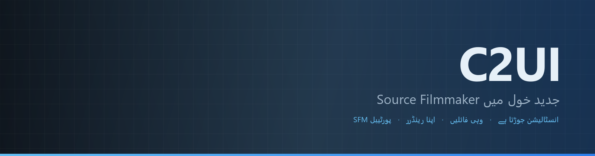

<details align="center"><summary>&nbsp;🌐 <b>🇵🇰 اردو</b> &nbsp;·&nbsp; <sub>Language · Язык · 語言 · Idioma · Sprache · भाषा · لغة</sub></summary>

<table align="center">
<tr><td align="center"><a href="../../README.md">🇷🇺<br>Русский</a></td><td align="center"><a href="../README/EN-en.md">🇬🇧<br>English</a></td><td align="center"><a href="../README/PL-pl.md">🇵🇱<br>Polski</a></td><td align="center"><a href="../README/UK-ua.md">🇺🇦<br>Українська</a></td><td align="center"><a href="../README/DE-de.md">🇩🇪<br>Deutsch</a></td><td align="center"><a href="../README/RO-md.md">🇲🇩<br>Moldovenească</a></td><td align="center"><a href="../README/SL-si.md">🇸🇮<br>Slovenščina</a></td><td align="center"><a href="../README/BE-by.md">🇧🇾<br>Беларуская</a></td></tr>
<tr><td align="center"><a href="../README/KK-kz.md">🇰🇿<br>Қазақша</a></td><td align="center"><a href="../README/JA-jp.md">🇯🇵<br>日本語</a></td><td align="center"><a href="../README/ZH-cn.md">🇨🇳<br>中文</a></td><td align="center"><a href="../README/SV-se.md">🇸🇪<br>Svenska</a></td><td align="center"><a href="../README/ES-es.md">🇪🇸<br>Español</a></td><td align="center"><a href="../README/HI-in.md">🇮🇳<br>हिन्दी</a></td><td align="center"><a href="../README/PT-pt.md">🇵🇹<br>Português</a></td><td align="center"><a href="../README/BN-bd.md">🇧🇩<br>বাংলা</a></td></tr>
<tr><td align="center"><a href="../README/FR-fr.md">🇫🇷<br>Français</a></td><td align="center"><a href="../README/TE-in.md">🇮🇳<br>తెలుగు</a></td><td align="center"><a href="../README/MR-in.md">🇮🇳<br>मराठी</a></td><td align="center"><a href="../README/TA-in.md">🇮🇳<br>தமிழ்</a></td><td align="center"><a href="../README/TR-tr.md">🇹🇷<br>Türkçe</a></td><td align="center"><b>🇵🇰<br>اردو</b></td><td align="center"><a href="../README/VI-vn.md">🇻🇳<br>Tiếng Việt</a></td><td align="center"><a href="../README/GU-in.md">🇮🇳<br>ગુજરાતી</a></td></tr>
<tr><td align="center"><a href="../README/IT-it.md">🇮🇹<br>Italiano</a></td><td align="center"><a href="../README/KO-kr.md">🇰🇷<br>한국어</a></td><td align="center"><a href="../README/AR-sa.md">🇸🇦<br>العربية</a></td><td align="center"><a href="../README/JV-id.md">🇮🇩<br>Basa Jawa</a></td><td align="center"><a href="../README/ML-in.md">🇮🇳<br>മലയാളം</a></td><td align="center"><a href="../README/NE-np.md">🇳🇵<br>नेपाली</a></td><td align="center"><a href="../README/UZ-uz.md">🇺🇿<br>Oʻzbekcha</a></td><td align="center"><a href="../README/OR-in.md">🇮🇳<br>ଓଡ଼ିଆ</a></td></tr>
</table>

</details>

<p align="center"></p>

<p align="center">
  
  
  
  
  <a href="../../Testing"></a>
  
  <a href="../LICENSE/UR-pk.md"></a>
</p>

<p align="center"><b>C2UI</b> — <i>Custom to User Interface</i> — جدید خول میں Source Filmmaker کا ایڈیٹر: وہی مواد، وہی سیشن فارمیٹ، وہی ڈیٹا ماڈل، اور Steam لائبریری و Unreal Engine 5 ایڈیٹر کے انداز کا انٹرفیس۔</p>

---

## تیاری

<p align="center"></p>

<p align="center"><a href="../READINESS/UR-pk.md"></a></p>

## خیال

Source Filmmaker ایک مضبوط ٹول ہے جس کا انٹرفیس 2012 میں رہ گیا۔ C2UI اسے بدلتا یا دوبارہ نہیں بناتا: مقصد بس SFM کو تھوڑا جدید اور آسان بنانا ہے۔

ایڈیٹر انسٹال شدہ SFM کو ڈھونڈتا ہے، اسے مواد کی لائبریری کے طور پر جوڑتا ہے — ماڈل، میٹیریل، ٹیکسچر، سیشن — اور انہی فائلوں کے ساتھ اسی فارمیٹ میں کام کرتا ہے۔ SFM میں بنی ہر چیز C2UI میں کھلتی ہے، اور اس کے برعکس بھی۔

پہلا مقصد ہڈیوں اور رگز سمیت SFM کے ساتھ مکمل مطابقت ہے۔ اس کے بعد — جو SFM میں کم تھا۔

```
  ┌──────────────┐                       ┌──────────────────────────────┐
  │   C2UI       │ ──── "SFM کہاں؟" ────▶│  SourceFilmmaker/game/       │
  │              │                       │    usermod/gameinfo.txt      │
  │  اپنا UI     │ ◀─────── ماؤنٹ ───────│    tf/  hl2/  tf_movies/ …   │
  │  اپنا رینڈر  │       صرف پڑھنا       │    models/ materials/ dmx    │
  └──────────────┘                       └──────────────────────────────┘
```

- **پورٹیبل۔** ایپلیکیشن فولڈر کے باہر کچھ نہیں لکھا جاتا: سیٹنگز `App/User` میں، کیش `App/Cache` میں، عارضی `App/Temporary` میں۔ فولڈر حذف کریں اور کوئی نشان نہیں۔
- **SFM کبھی نہیں چلاتا۔** چلانے کا کوئی پروسیس نہیں، قبضے کی کوئی ونڈو نہیں۔ انسٹالیشن مواد کے پیک کی طرح پڑھی جاتی ہے۔
- **فارمیٹ تصدیق شدہ، مفروضہ نہیں۔** ہر ریڈر اصل انسٹالیشن سے جانچا گیا؛ جہاں فارمیٹ کچھ غیر متوقع کرتا ہے، کوڈ بتاتا ہے۔
- **سیو درست ہے۔** بغیر تبدیلی پڑھا اور لکھا سیشن وہی فائل ہے۔
- **انجن کا کوئی انحصار نہیں۔** `Core/` اور پورا ٹیسٹ سوٹ خالص Python پر چلتا ہے؛ صرف ونڈو کو Qt اور OpenGL چاہیے۔

## ساخت

```
C2UI_SDK/
├── README.md
├── Core/               انجن: فارمیٹ، ورچوئل فائل سسٹم، انڈیکس، برج
│   ├── API/            ایڈیٹر، اوزار اور پلگ اِنز کے لیے معاہدہ
│   ├── Code/           انجن: اینیمیشن، آپریٹرز، چہرے، ترمیم
│   │   └── formats/    Valve ریڈرز: mdl vvd vtx vmt vtf dmx bsp
│   └── dev-kit/        SDK سلاٹس (خالی) اور انسٹالیشنز کے برج
├── App/                ایڈیٹر: مواد لائبریری، رینڈرر، ونڈو
│   ├── Code/           کانٹینٹ لائبریری، ونڈو، سیٹنگز
│   │   ├── render/     منظر، OpenGL رینڈرر، شیڈرز، کیمرہ
│   │   └── ui/         ٹائم لائن، سیشن ٹری، انسپکٹر، گراف ایڈیٹر، ڈاکنگ
│   ├── Data/           پروگرام کے وسائل، صرف پڑھنے کے لیے
│   ├── User/           صارف کا ڈیٹا — کبھی حذف نہیں ہوتا
│   └── Cache/          کانٹینٹ انڈیکس، شیڈرز، تھمب نیلز
├── Tools/              لوکلائزیشن، UI ٹولز، پلگ ان (بعد میں)
│   ├── Launcher/       لانچر
│   ├── Market Load/    پلگ اِن مارکیٹ پلیس کلائنٹ (بعد میں)
│   ├── Localization/   تراجم تیار کرنا
│   ├── NewPlugins/     پلگ اِنز تیار کرنا
│   └── UI/             تھیمز اور ورک اسپیسز
├── Testing/            ٹیسٹ، بائٹ درست فکسچر، ایک رنر
│   ├── core/           انجن
│   ├── app/            ایڈیٹر
│   └── fixtures/       نقلی انسٹالیشن، ماڈلز، ٹیکسچرز
└── GIT&DOCK/           README، تیاری اور لائسنس 32 زبانوں میں
```

### یہ کیسے کام کرتا ہے

«Source Filmmaker کہاں ہے؟» سے اسکرین پر ایک فریم تک کا راستہ پانچ تہوں سے گزرتا ہے؛ ہر تہہ صرف اپنے نیچے والی تہہ کو جانتی ہے۔

1. **برج** (`Core/dev-kit/bridge_sfm`) Steam کے ذریعے انسٹالیشن ڈھونڈتا ہے، `gameinfo.txt` پڑھتا ہے اور انجن کی ترتیب میں مواد کے راستے واپس دیتا ہے۔ `sfm.exe` کبھی نہیں چلایا جاتا۔
2. **ورچوئل فائل سسٹم اور انڈیکس** (`Core/Code/vfs.py`, `content_index.py`) ان راستوں کو Source کی طرح تہہ در تہہ رکھتے ہیں: پہلے ملنے والی فائل جیتتی ہے۔ انڈیکس `App/Cache` میں ایک SQLite فائل ہے، اس لیے 70 000 فائلوں کا چکر ایک ہی بار لگتا ہے۔
3. **فارمیٹس** (`Core/Code/formats`) Valve کی فائلیں کسی بیرونی لائبریری کے بغیر پڑھتے ہیں: `.mdl` `.vvd` `.vtx` ماڈل ہیں، `.vmt` `.vtf` میٹیریل اور ٹیکسچر، `.dmx` سیشن، `.bsp` نقشہ۔ ہر ریڈر پوری انسٹالیشن پر جانچا گیا ہے؛ سیشن بائٹ بہ بائٹ ویسا ہی واپس لکھا جاتا ہے۔
4. **سیشن** DMX عناصر کا ایک گراف ہے۔ `animation.py` کسی لمحے پر چینلز کی قدر نکالتا ہے، `operators.py` ایکسپریشنز اور رِگ کنسٹرینٹس چلاتا ہے، `flex.py` چہرے ہلاتا ہے، `pose.py` ہڈیوں کے میٹرکس بناتا ہے۔ ہر ترمیم `editing.py` سے ایک واپس لیے جانے والے کمانڈ کی صورت گزرتی ہے۔
5. **ایڈیٹر** (`App/Code`) اس سے ایک منظر (`render/scene.py`) بناتا ہے اور اسے اپنے OpenGL 3.3 رینڈرر (`renderer.py`, `shaders.py`) سے کھینچتا ہے: سیشن کی روشنیاں، لائٹ میپس اور نقشے کی روشنی — تصویر ابھی SFM سے بہت دور ہے اور اس پر کام جاری ہے۔ پینلز (`ui/`) ٹائم لائن، سیشن ٹری، انسپکٹر، گراف ایڈیٹر اور UE5 طرز کی ڈاکنگ ہیں۔

پروگرام جو کچھ لکھتا ہے وہ اس کے فولڈر میں ہی رہتا ہے: سیٹنگز `App/User` میں، انڈیکس اور کیش `App/Cache` میں، لاگ `App/Temporary` میں۔ `Core/` کچھ نہیں لکھتا اور Qt پر انحصار نہیں کرتا، اس لیے انجن اور ٹیسٹ خالص Python پر چلتے ہیں؛ Qt اور OpenGL صرف ونڈو کو درکار ہیں۔ `Tools/` کے اوزار سختی سے `Core/API` پر بنے ہیں — یوں ثابت ہوتا ہے کہ یہ API تیسرے فریق کے پلگ اِنز کے لیے بھی کافی ہے۔

### چلانا

Windows، Python 3.13 اور Source Filmmaker انسٹالیشن درکار۔

```bash
git clone https://github.com/Arkomiko/SFM_C2UI.git
cd SFM_C2UI
python -m venv .venv
.venv/Scripts/python.exe -m pip install -r Tools/Launcher/requirements.txt
.venv/Scripts/python.exe Tools/Launcher/c2ui.py
```

پہلی بار Steam سے SFM تلاش کرتا ہے؛ نہ ملے تو پوچھتا ہے۔ <kbd>Ctrl</kbd>+<kbd>O</kbd> سیشن کھولتا ہے، <kbd>Space</kbd> پلے، <kbd>C</kbd> شاٹ کیمرہ، <kbd>T</kbd>/<kbd>R</kbd> موو/روٹیٹ، <kbd>M</kbd> موشن ایڈیٹر، <kbd>Ctrl</kbd>+<kbd>Z</kbd> انڈو، <kbd>Ctrl</kbd>+<kbd>S</kbd> سیو۔ پینل عنوان سے گھسیٹے جاتے ہیں۔ ٹیسٹ کو کچھ نہیں چاہیے:

```bash
python Testing/run.py
```

### منصوبے میں

**اگلا**
- نقشے کی شکل: پانی، prop_dynamic، روشنیوں کے گوبو ٹیکسچر، `$bumpmap` اور `$envmap`، سیشن کی روشنیوں کے سائے۔
- ایکسپورٹ کی گئی فلموں میں آواز۔
- `.c2plg` پلگ اِنز اور `Tools/Market Load` میں مارکیٹ پلیس کلائنٹ؛ پھر تھیمز اور ورک اسپیسز۔
- ٹائم لائن پر آواز، پارٹیکلز، رِنکل میپس، موشن ایڈیٹر کے پری سیٹس اور لیئرز، گراف ایڈیٹر میں ٹینجنٹس۔

**بعد میں**
- مکمل نقشوں پر کارکردگی: اسٹیٹک پراپس کی انسٹینسنگ، پوز کیش۔
- انجن کی ازسرِنو تعمیر: بہتر روشنی اور سایوں کے لیے نئے میپ کمپائل پیرامیٹرز، 120 000 یونٹ کی نقشہ حد۔
- اپنے Python اور خودکار اپ ڈیٹ والا پیکج شدہ لانچر؛ ایڈیٹر کی لوکلائزیشن۔

## لائسنس اور اعتراف

C2UI کا اپنا کوڈ **C2UI لائسنس** کے تحت ہے: ذاتی اور غیر تجارتی استعمال کے لیے آزاد؛ تجارتی استعمال صرف مصنف کی تحریری رضامندی سے؛ ترمیم شدہ ورژن میں اصل پروجیکٹ اور اس کے مصنف Arkomiko کا ذکر لازم۔ پلگ ان اور ایڈ آن **C2UI — Plugins & Addons (C2UI‑Pl&AD)** لائسنس کے تحت ہیں۔

Source Filmmaker، Team Fortress 2 اور Source انجن Valve کے ہیں؛ پروجیکٹ ان کے فارمیٹ پڑھتا ہے، ان کی کوئی فائل شامل نہیں کرتا، اور صرف Steam سے آپ کی اپنی SFM کاپی کے ساتھ کام کرتا ہے۔

<p align="center"><a href="../LICENSE/UR-pk.md"></a></p>
