<p align="center"></p>

<p align="center"><a href="../../README.md">🇷🇺 Русский</a> · <a href="EN-en.md">🇬🇧 English</a> · <a href="PL-pl.md">🇵🇱 Polski</a> · <a href="UK-ua.md">🇺🇦 Українська</a> · <a href="DE-de.md">🇩🇪 Deutsch</a> · <a href="RO-md.md">🇲🇩 Moldovenească</a> · <a href="SL-si.md">🇸🇮 Slovenščina</a> · <a href="BE-by.md">🇧🇾 Беларуская</a> · <a href="KK-kz.md">🇰🇿 Қазақша</a> · <a href="JA-jp.md">🇯🇵 日本語</a> · <a href="ZH-cn.md">🇨🇳 中文</a> · <a href="SV-se.md">🇸🇪 Svenska</a> · <a href="ES-es.md">🇪🇸 Español</a> · <a href="HI-in.md">🇮🇳 हिन्दी</a> · <a href="PT-pt.md">🇵🇹 Português</a> · <a href="BN-bd.md">🇧🇩 বাংলা</a> · <a href="FR-fr.md">🇫🇷 Français</a> · <a href="TE-in.md">🇮🇳 తెలుగు</a> · <a href="MR-in.md">🇮🇳 मराठी</a> · <a href="TA-in.md">🇮🇳 தமிழ்</a> · <a href="TR-tr.md">🇹🇷 Türkçe</a> · <b>🇵🇰 اردو</b> · <a href="VI-vn.md">🇻🇳 Tiếng Việt</a> · <a href="GU-in.md">🇮🇳 ગુજરાતી</a> · <a href="IT-it.md">🇮🇹 Italiano</a> · <a href="KO-kr.md">🇰🇷 한국어</a> · <a href="AR-sa.md">🇸🇦 العربية</a> · <a href="JV-id.md">🇮🇩 Basa Jawa</a> · <a href="ML-in.md">🇮🇳 മലയാളം</a> · <a href="NE-np.md">🇳🇵 नेपाली</a> · <a href="UZ-uz.md">🇺🇿 Oʻzbekcha</a> · <a href="OR-in.md">🇮🇳 ଓଡ଼ିଆ</a></p>

<p align="center">
  
  
  
  
  <a href="../../Testing"></a>
  
</p>

<p align="center"><b>C2UI</b> — <i>Custom to User Interface</i> — — جدید خول میں Source Filmmaker کا ایڈیٹر: وہی مواد، وہی سیشن فارمیٹ، وہی ڈیٹا ماڈل، اور Steam لائبریری و Unreal Engine 5 ایڈیٹر کے انداز کا انٹرفیس۔</p>

---

## تیاری

<p align="center"></p>

<p align="center"> <b>ریلیز کے لیے مجموعی تیاری: 41%</b></p>

<p align="center"><a href="../assets/UR-pk/sidebar.md"></a></p>

## خیال

Source Filmmaker ایک مضبوط ٹول ہے جس کا انٹرفیس 2012 میں رہ گیا۔ C2UI اسے بدلتا یا دوبارہ نہیں بناتا: مقصد بس SFM کو تھوڑا جدید اور آسان بنانا ہے۔

ایڈیٹر انسٹال شدہ SFM کو ڈھونڈتا ہے، اسے مواد کی لائبریری کے طور پر جوڑتا ہے — ماڈل، میٹیریل، ٹیکسچر، سیشن — اور انہی فائلوں کے ساتھ اسی فارمیٹ میں کام کرتا ہے۔ SFM میں بنی ہر چیز C2UI میں کھلتی ہے، اور اس کے برعکس بھی۔

پہلا مقصد ہڈیوں اور رگز سمیت SFM کے ساتھ مکمل مطابقت ہے۔ اس کے بعد — جو SFM میں کم تھا۔

```
  ┌──────────────┐    "SFM کہاں؟"    ┌──────────────────────────────┐
  │   C2UI       │ ─────────────────────▶│  SourceFilmmaker/game/       │
  │              │                       │    usermod/gameinfo.txt      │
  │  اپنا UI     │ ◀─────   ماؤنٹ   ───────│    tf/  hl2/  tf_movies/ …   │
  │  اپنا رینڈر  │       صرف پڑھنا       │    models/ materials/ dmx    │
  └──────────────┘                       └──────────────────────────────┘
```

<p align="center"><br><sub>آج کا ایڈیٹر، Valve کا Meet the Heavy کھلا ہوا: ٹائم لائن پر شاٹس اور آواز، سیشن ٹری، پہلا شاٹ اپنے کیمرے سے، سیشن کے مطابق پوز اور چہروں والے کردار۔</sub></p>

## کیا مختلف ہے

- **پورٹیبل۔** ایپلیکیشن فولڈر کے باہر کچھ نہیں لکھا جاتا: سیٹنگز `App/User` میں، کیش `App/Cache` میں، عارضی `App/Temporary` میں۔ فولڈر حذف کریں اور کوئی نشان نہیں۔
- **SFM کبھی نہیں چلاتا۔** چلانے کا کوئی پروسیس نہیں، قبضے کی کوئی ونڈو نہیں۔ انسٹالیشن مواد کے پیک کی طرح پڑھی جاتی ہے۔
- **فارمیٹ تصدیق شدہ، مفروضہ نہیں۔** ہر ریڈر اصل انسٹالیشن سے جانچا گیا؛ جہاں فارمیٹ کچھ غیر متوقع کرتا ہے، کوڈ بتاتا ہے۔
- **سیو درست ہے۔** بغیر تبدیلی پڑھا اور لکھا سیشن وہی فائل ہے۔
- **انجن کا کوئی انحصار نہیں۔** `Core/` اور پورا ٹیسٹ سوٹ خالص Python پر چلتا ہے؛ صرف ونڈو کو Qt اور OpenGL چاہیے۔

## چلانا

Windows، Python 3.13 اور Source Filmmaker انسٹالیشن درکار۔

```bash
git clone https://github.com/Arkomiko/SFM_C2UI.git
cd SFM_C2UI
python -m venv .venv
.venv/Scripts/python.exe -m pip install -r Tools/Launcher/requirements.txt
.venv/Scripts/python.exe Tools/Launcher/c2ui.py
```

پہلی بار Steam سے SFM تلاش کرتا ہے؛ نہ ملے تو پوچھتا ہے۔ <kbd>Ctrl</kbd>+<kbd>O</kbd> سیشن کھولتا ہے، <kbd>Space</kbd> پلے، <kbd>C</kbd> شاٹ کیمرہ، <kbd>T</kbd>/<kbd>R</kbd> موو/روٹیٹ، <kbd>M</kbd> موشن ایڈیٹر، <kbd>Ctrl</kbd>+<kbd>Z</kbd> انڈو، <kbd>Ctrl</kbd>+<kbd>S</kbd> سیو۔ پینل عنوان سے گھسیٹے جاتے ہیں۔ ٹیسٹ کو کچھ نہیں چاہیے:

```bash
python Testing/run.py
```

## ساخت

```
C2UI_SDK/
├── README.md
├── Core/              انجن: فارمیٹ، ورچوئل فائل سسٹم، انڈیکس، برج
├── App/               ایڈیٹر: مواد لائبریری، رینڈرر، ونڈو
├── Tools/             لوکلائزیشن، UI ٹولز، پلگ ان (بعد میں)
│   └── Launcher/      لانچر
├── Testing/           ٹیسٹ، بائٹ درست فکسچر، ایک رنر
└── GIT&DOCK/          یہ README دیگر زبانوں میں
```

## روڈ میپ

1. **Source شیڈنگ** — VertexLitGeneric جیسے SFM بناتا ہے: phong، rim، lightwarp، منظر کی روشنیاں۔
2. **نقشے** — پس منظر کے لیے `.bsp`۔
3. **آؤٹ پٹ** — تصویر اور ویڈیو ایکسپورٹ۔
4. **پلگ ان** — `.c2plg` فارمیٹ؛ پھر تھیم اور ورک اسپیس۔

## لائسنس اور اعتراف

C2UI کا اپنا کوڈ **C2UI لائسنس** کے تحت ہے: ذاتی اور غیر تجارتی استعمال کے لیے آزاد؛ تجارتی استعمال صرف مصنف کی تحریری رضامندی سے؛ ترمیم شدہ ورژن میں اصل پروجیکٹ اور اس کے مصنف Arkomiko کا ذکر لازم۔ پلگ ان اور ایڈ آن **C2UI — Plugins & Addons (C2UI‑Pl&AD)** لائسنس کے تحت ہیں۔

Source Filmmaker، Team Fortress 2 اور Source انجن Valve کے ہیں؛ پروجیکٹ ان کے فارمیٹ پڑھتا ہے، ان کی کوئی فائل شامل نہیں کرتا، اور صرف Steam سے آپ کی اپنی SFM کاپی کے ساتھ کام کرتا ہے۔

<p align="center"><a href="../LICENSE/UR-pk.md"></a></p>

<p align="center"><br><sub>انسٹالیشن سے بے ترتیب چنے چونسٹھ ماڈل، C2UI کے اپنے رینڈرر سے بنائے گئے۔</sub></p>
