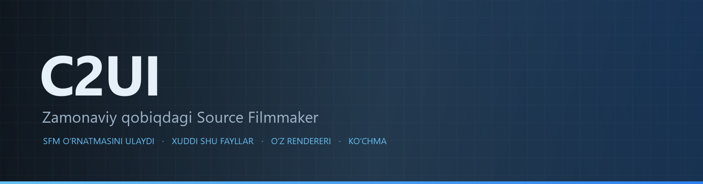

<details align="center"><summary>&nbsp;🌐 <b>🇺🇿 Oʻzbekcha</b> &nbsp;·&nbsp; <sub>Language · Язык · 語言 · Idioma · Sprache · भाषा · لغة</sub></summary>

<table align="center">
<tr><td align="center"><a href="../../README.md">🇷🇺<br>Русский</a></td><td align="center"><a href="../README/EN-en.md">🇬🇧<br>English</a></td><td align="center"><a href="../README/PL-pl.md">🇵🇱<br>Polski</a></td><td align="center"><a href="../README/UK-ua.md">🇺🇦<br>Українська</a></td><td align="center"><a href="../README/DE-de.md">🇩🇪<br>Deutsch</a></td><td align="center"><a href="../README/RO-md.md">🇲🇩<br>Moldovenească</a></td><td align="center"><a href="../README/SL-si.md">🇸🇮<br>Slovenščina</a></td><td align="center"><a href="../README/BE-by.md">🇧🇾<br>Беларуская</a></td></tr>
<tr><td align="center"><a href="../README/KK-kz.md">🇰🇿<br>Қазақша</a></td><td align="center"><a href="../README/JA-jp.md">🇯🇵<br>日本語</a></td><td align="center"><a href="../README/ZH-cn.md">🇨🇳<br>中文</a></td><td align="center"><a href="../README/SV-se.md">🇸🇪<br>Svenska</a></td><td align="center"><a href="../README/ES-es.md">🇪🇸<br>Español</a></td><td align="center"><a href="../README/HI-in.md">🇮🇳<br>हिन्दी</a></td><td align="center"><a href="../README/PT-pt.md">🇵🇹<br>Português</a></td><td align="center"><a href="../README/BN-bd.md">🇧🇩<br>বাংলা</a></td></tr>
<tr><td align="center"><a href="../README/FR-fr.md">🇫🇷<br>Français</a></td><td align="center"><a href="../README/TE-in.md">🇮🇳<br>తెలుగు</a></td><td align="center"><a href="../README/MR-in.md">🇮🇳<br>मराठी</a></td><td align="center"><a href="../README/TA-in.md">🇮🇳<br>தமிழ்</a></td><td align="center"><a href="../README/TR-tr.md">🇹🇷<br>Türkçe</a></td><td align="center"><a href="../README/UR-pk.md">🇵🇰<br>اردو</a></td><td align="center"><a href="../README/VI-vn.md">🇻🇳<br>Tiếng Việt</a></td><td align="center"><a href="../README/GU-in.md">🇮🇳<br>ગુજરાતી</a></td></tr>
<tr><td align="center"><a href="../README/IT-it.md">🇮🇹<br>Italiano</a></td><td align="center"><a href="../README/KO-kr.md">🇰🇷<br>한국어</a></td><td align="center"><a href="../README/AR-sa.md">🇸🇦<br>العربية</a></td><td align="center"><a href="../README/JV-id.md">🇮🇩<br>Basa Jawa</a></td><td align="center"><a href="../README/ML-in.md">🇮🇳<br>മലയാളം</a></td><td align="center"><a href="../README/NE-np.md">🇳🇵<br>नेपाली</a></td><td align="center"><b>🇺🇿<br>Oʻzbekcha</b></td><td align="center"><a href="../README/OR-in.md">🇮🇳<br>ଓଡ଼ିଆ</a></td></tr>
</table>

</details>

<p align="center"></p>

<p align="center">
  
  
  
  
  <a href="../../Testing"></a>
  
  <a href="../LICENSE/UZ-uz.md"></a>
</p>

<p align="center"><b>C2UI</b> — <i>Custom to User Interface</i> — zamonaviy qobiqdagi Source Filmmaker muharriri: xuddi shu kontent, xuddi shu sessiya formati, xuddi shu maʼlumotlar modeli, Steam kutubxonasi va Unreal Engine 5 muharriri ruhidagi interfeys.</p>

---

## Tayyorlik

<p align="center"></p>

<p align="center"><a href="../READINESS/UZ-uz.md"></a></p>

## Gʻoya

Source Filmmaker — interfeysi 2012 yilda qolib ketgan kuchli vosita. C2UI uni almashtirmaydi va qayta yasamaydi: maqsad — SFM ni biroz zamonaviyroq va qulayroq qilish.

Muharrir oʻrnatilgan SFM ni topadi, uni kontent kutubxonasi sifatida ulaydi — modellar, materiallar, teksturalar, sessiyalar — va xuddi shu fayllar bilan xuddi shu formatda ishlaydi. SFM da qilingan hamma narsa C2UI da ochiladi, aksincha ham.

Birinchi maqsad — suyaklar va riglar bilan birga SFM bilan toʻliq moslik. Keyin — SFM da yetishmagan narsalar.

```
  ┌──────────────┐                          ┌──────────────────────────────┐
  │   C2UI       │ ──── "SFM qayerda?" ────▶│  SourceFilmmaker/game/       │
  │              │                          │    usermod/gameinfo.txt      │
  │  oʻz UI      │ ◀─────── ulangan ────────│    tf/  hl2/  tf_movies/ …   │
  │  oʻz render  │       faqat oʻqish       │    models/ materials/ dmx    │
  └──────────────┘                          └──────────────────────────────┘
```

- **Koʻchma.** Ilova papkasidan tashqarida hech narsa yozilmaydi: sozlamalar `App/User`, kesh `App/Cache`, vaqtinchalik `App/Temporary`. Papkani oʻchirsangiz — iz qolmaydi.
- **SFM ni hech qachon ishga tushirmaydi.** Boshqariladigan jarayon yoʻq, egallanadigan oynalar yoʻq. Oʻrnatma kontent paketi kabi oʻqiladi.
- **Formatlar tekshirilgan, taxmin qilinmagan.** Har bir oʻquvchi haqiqiy oʻrnatma bilan solishtirilgan; format kutilmagan narsa qilsa, kod bu haqda aytadi.
- **Saqlash aniq.** Oʻzgarishsiz oʻqilgan va yozilgan sessiya — xuddi shu fayl.
- **Dvigatelda bogʻliqliklar yoʻq.** `Core/` va barcha testlar sof Python da ishlaydi; Qt va OpenGL faqat oynaga kerak.

<p align="center"><br><sub>Bugungi muharrir, Valve ning Meet the Heavy sessiyasi ochiq: taymlaynda shotlar va ovoz, sessiya daraxti, birinchi shot oʻz kamerasi orqali, sessiyadagi holat va yuz ifodalari bilan personajlar.</sub></p>

## Tuzilma

```
C2UI_SDK/
├── README.md
├── Core/               dvigatel: formatlar, virtual fayl tizimi, indeks, koʻpriklar
│   ├── API/            muharrir, vositalar va plaginlar uchun shartnoma
│   ├── Code/           dvigatel: animatsiya, operatorlar, yuzlar, tahrir
│   │   └── formats/    Valve o'qigichlari: mdl vvd vtx vmt vtf dmx bsp
│   └── dev-kit/        SDK uyalari (bo'sh) va o'rnatmalarga ko'priklar
├── App/                muharrir: kontent kutubxonasi, renderer, oyna
│   ├── Code/           kontent kutubxonasi, oyna, sozlamalar
│   │   ├── render/     sahna, OpenGL rendereri, sheyderlar, kamera
│   │   └── ui/         taymlayn, seans daraxti, inspektor, graph editor, doking
│   ├── Data/           dastur resurslari, faqat o'qish
│   ├── User/           foydalanuvchi ma'lumotlari — hech qachon o'chirilmaydi
│   └── Cache/          kontent indeksi, sheyderlar, miniatyuralar
├── Tools/              lokalizatsiya, UI vositalari, plaginlar (keyinroq)
│   ├── Launcher/       ishga tushirgich
│   ├── Market Load/    plagin marketpleysi mijozi (keyinroq)
│   ├── Localization/   tarjimalar yaratish
│   ├── NewPlugins/     plaginlar yaratish
│   └── UI/             mavzular va ish maydonlari
├── Testing/            testlar, baytgacha aniq fiksturalar, bitta runner
│   ├── core/           dvigatel
│   ├── app/            muharrir
│   └── fixtures/       soxta o'rnatma, modellar, teksturalar
└── GIT&DOCK/           README, tayyorlik va litsenziya 32 tilda
```

### Bu qanday ishlaydi

«Source Filmmaker qayerda?» degan savoldan ekrandagi bitta kadrgacha bo'lgan yo'l besh qatlamdan o'tadi; har bir qatlam faqat o'zidan pastdagini biladi.

1. **Ko'prik** (`Core/dev-kit/bridge_sfm`) o'rnatmani Steam orqali topadi, `gameinfo.txt` ni o'qiydi va kontent yo'llarini dvigatel tartibida qaytaradi. `sfm.exe` hech qachon ishga tushirilmaydi.
2. **Virtual fayl tizimi va indeks** (`Core/Code/vfs.py`, `content_index.py`) bu yo'llarni Source kabi qatlamlaydi: birinchi topilgan fayl g'olib. Indeks — `App/Cache` dagi bitta SQLite fayl, shuning uchun 70 000 faylni aylanib chiqish bir marta bajariladi.
3. **Formatlar** (`Core/Code/formats`) Valve fayllarini tashqi kutubxonalarsiz o'qiydi: `.mdl` `.vvd` `.vtx` — model, `.vmt` `.vtf` — material va tekstura, `.dmx` — seans, `.bsp` — xarita. Har bir o'qigich butun o'rnatmada tekshirilgan; seans baytma-bayt qayta yoziladi.
4. **Seans** — DMX elementlari grafi. `animation.py` kanallarni vaqt lahzasida hisoblaydi, `operators.py` ifodalar va rig cheklovlarini bajaradi, `flex.py` yuzlarni harakatlantiradi, `pose.py` suyak matritsalarini yig'adi. Har bir tahrir `editing.py` orqali bekor qilinadigan buyruq sifatida o'tadi.
5. **Muharrir** (`App/Code`) bundan sahna (`render/scene.py`) yig'adi va uni o'z OpenGL 3.3 rendereri (`renderer.py`, `shaders.py`) bilan chizadi: seans chiroqlari, laytmaplar va xarita yoritilishi — SFM ko'rsatganidek. Panellar (`ui/`) — taymlayn, seans daraxti, inspektor, graph editor va UE5 uslubidagi doking.

Dastur yozadigan hamma narsa o'z papkasida qoladi: `App/User` — sozlamalar, `App/Cache` — indeks va kesh, `App/Temporary` — jurnal. `Core/` hech narsa yozmaydi va Qt ga bog'liq emas, shuning uchun dvigatel va testlar sof Python da ishlaydi; Qt va OpenGL faqat oynaga kerak. `Tools/` dagi vositalar qat'iy `Core/API` ustida quriladi — shu tariqa API tashqi plaginlar uchun ham yetarli ekani isbotlanadi.

<p align="center"><br><sub>Oʻrnatmadan tasodifiy tanlangan oltmish toʻrt model, C2UI ning oʻz rendereri bilan chizilgan.</sub></p>

### Ishga tushirish

Windows, Python 3.13 va oʻrnatilgan Source Filmmaker kerak.

```bash
git clone https://github.com/Arkomiko/SFM_C2UI.git
cd SFM_C2UI
python -m venv .venv
.venv/Scripts/python.exe -m pip install -r Tools/Launcher/requirements.txt
.venv/Scripts/python.exe Tools/Launcher/c2ui.py
```

Birinchi ishga tushirishda SFM Steam orqali qidiriladi; topilmasa — dastur soʻraydi. <kbd>Ctrl</kbd>+<kbd>O</kbd> sessiyani ochadi, <kbd>Space</kbd> — ijro, <kbd>C</kbd> — shot kamerasi, <kbd>T</kbd>/<kbd>R</kbd> — koʻchirish/aylantirish, <kbd>M</kbd> — motion editor, <kbd>Ctrl</kbd>+<kbd>Z</kbd> — bekor qilish, <kbd>Ctrl</kbd>+<kbd>S</kbd> — saqlash. Panellar sarlavhasidan tortiladi. Testlarga hech narsa kerak emas:

```bash
python Testing/run.py
```

### Rejada

**Keyingi**
- Xarita ko'rinishi: suv, prop_dynamic, chiroqlarning gobo teksturalari, `$bumpmap` va `$envmap`, seans chiroqlaridan soyalar.
- Eksport qilingan filmlarda ovoz.
- `.c2plg` plaginlari va `Tools/Market Load` dagi marketpleys mijozi; keyin mavzular va ish maydonlari.
- Taymlayndagi ovoz, zarrachalar, wrinkle-xaritalar, motion editor presetlari va qatlamlari, graph editor dagi urinmalar.

**Keyinroq**
- To'liq xaritalarda unumdorlik: statik proplar instansingi, pozalar keshi.
- Dvigatelni qayta ishlash: yaxshilangan yoritish va soyalar uchun yangi xarita kompilyatsiya parametrlari, 120 000 birlik xarita chegarasi.
- O'z Python i va avtoyangilanishi bo'lgan paketlangan launcher; muharrirni mahalliylashtirish.

## Litsenziya va minnatdorchilik

C2UI ning oʻz kodi **C2UI litsenziyasi** ostida: shaxsiy va notijorat maqsadlarda erkin; tijorat maqsadida faqat muallifning yozma roziligi bilan; oʻzgartirilgan versiyalar asl loyiha va uning muallifi Arkomiko ni koʻrsatishi shart. Plaginlar va addonlar **C2UI — Plugins & Addons (C2UI‑Pl&AD)** litsenziyasi ostida.

Source Filmmaker, Team Fortress 2 va Source dvigateli Valve ga tegishli; loyiha ularning formatlarini oʻqiydi, fayllarini oʻz ichiga olmaydi va faqat Steam dagi oʻz SFM nusxangiz bilan ishlaydi.

<p align="center"><a href="../LICENSE/UZ-uz.md"></a></p>
