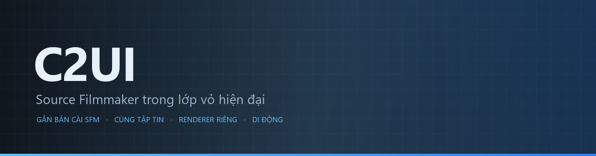

<details align="center"><summary>&nbsp;🌐 <b>🇻🇳 Tiếng Việt</b> &nbsp;·&nbsp; <sub>Language · Язык · 語言 · Idioma · Sprache · भाषा · لغة</sub></summary>

<table align="center">
<tr><td align="center"><a href="../../README.md">🇷🇺<br>Русский</a></td><td align="center"><a href="../README/EN-en.md">🇬🇧<br>English</a></td><td align="center"><a href="../README/PL-pl.md">🇵🇱<br>Polski</a></td><td align="center"><a href="../README/UK-ua.md">🇺🇦<br>Українська</a></td><td align="center"><a href="../README/DE-de.md">🇩🇪<br>Deutsch</a></td><td align="center"><a href="../README/RO-md.md">🇲🇩<br>Moldovenească</a></td><td align="center"><a href="../README/SL-si.md">🇸🇮<br>Slovenščina</a></td><td align="center"><a href="../README/BE-by.md">🇧🇾<br>Беларуская</a></td></tr>
<tr><td align="center"><a href="../README/KK-kz.md">🇰🇿<br>Қазақша</a></td><td align="center"><a href="../README/JA-jp.md">🇯🇵<br>日本語</a></td><td align="center"><a href="../README/ZH-cn.md">🇨🇳<br>中文</a></td><td align="center"><a href="../README/SV-se.md">🇸🇪<br>Svenska</a></td><td align="center"><a href="../README/ES-es.md">🇪🇸<br>Español</a></td><td align="center"><a href="../README/HI-in.md">🇮🇳<br>हिन्दी</a></td><td align="center"><a href="../README/PT-pt.md">🇵🇹<br>Português</a></td><td align="center"><a href="../README/BN-bd.md">🇧🇩<br>বাংলা</a></td></tr>
<tr><td align="center"><a href="../README/FR-fr.md">🇫🇷<br>Français</a></td><td align="center"><a href="../README/TE-in.md">🇮🇳<br>తెలుగు</a></td><td align="center"><a href="../README/MR-in.md">🇮🇳<br>मराठी</a></td><td align="center"><a href="../README/TA-in.md">🇮🇳<br>தமிழ்</a></td><td align="center"><a href="../README/TR-tr.md">🇹🇷<br>Türkçe</a></td><td align="center"><a href="../README/UR-pk.md">🇵🇰<br>اردو</a></td><td align="center"><b>🇻🇳<br>Tiếng Việt</b></td><td align="center"><a href="../README/GU-in.md">🇮🇳<br>ગુજરાતી</a></td></tr>
<tr><td align="center"><a href="../README/IT-it.md">🇮🇹<br>Italiano</a></td><td align="center"><a href="../README/KO-kr.md">🇰🇷<br>한국어</a></td><td align="center"><a href="../README/AR-sa.md">🇸🇦<br>العربية</a></td><td align="center"><a href="../README/JV-id.md">🇮🇩<br>Basa Jawa</a></td><td align="center"><a href="../README/ML-in.md">🇮🇳<br>മലയാളം</a></td><td align="center"><a href="../README/NE-np.md">🇳🇵<br>नेपाली</a></td><td align="center"><a href="../README/UZ-uz.md">🇺🇿<br>Oʻzbekcha</a></td><td align="center"><a href="../README/OR-in.md">🇮🇳<br>ଓଡ଼ିଆ</a></td></tr>
</table>

</details>

<p align="center"></p>

<p align="center">
  
  
  
  
  <a href="../../Testing"></a>
  
  <a href="../LICENSE/VI-vn.md"></a>
</p>

<p align="center"><b>C2UI</b> — <i>Custom to User Interface</i> — trình biên tập Source Filmmaker trong một lớp vỏ hiện đại: cùng nội dung, cùng định dạng phiên, cùng mô hình dữ liệu, giao diện theo tinh thần thư viện Steam và trình biên tập Unreal Engine 5.</p>

---

## Mức sẵn sàng

<p align="center"></p>

<p align="center"><a href="../READINESS/VI-vn.md"></a></p>

## Ý tưởng

Source Filmmaker là một công cụ mạnh nhưng giao diện dừng lại ở năm 2012. C2UI không thay thế hay làm lại nó: mục tiêu chỉ là làm SFM hiện đại và thoải mái hơn một chút.

Trình biên tập tìm SFM đã cài, gắn nó như một thư viện nội dung — mô hình, vật liệu, kết cấu, phiên — và làm việc với cùng những tập tin đó ở cùng định dạng. Mọi thứ làm trong SFM đều mở được trong C2UI, và ngược lại.

Mục tiêu đầu tiên là tương thích hoàn toàn với SFM, kể cả xương và rig. Sau đó là những gì SFM còn thiếu.

```
  ┌───────────────┐                        ┌──────────────────────────────┐
  │   C2UI        │ ──── "SFM ở đâu?" ────▶│  SourceFilmmaker/game/       │
  │               │                        │    usermod/gameinfo.txt      │
  │  UI riêng     │ ◀────── gắn kết ───────│    tf/  hl2/  tf_movies/ …   │
  │  render riêng │        chỉ đọc         │    models/ materials/ dmx    │
  └───────────────┘                        └──────────────────────────────┘
```

- **Di động.** Không ghi gì ngoài thư mục ứng dụng: thiết lập trong `App/User`, cache trong `App/Cache`, tạm trong `App/Temporary`. Xóa thư mục là hết dấu vết.
- **Không bao giờ chạy SFM.** Không tiến trình để điều khiển, không cửa sổ để chiếm. Bản cài được đọc như một gói nội dung.
- **Định dạng được kiểm chứng, không giả định.** Mọi trình đọc được đối chiếu với bản cài thật; nơi định dạng làm điều bất ngờ, mã nói rõ.
- **Lưu chính xác.** Phiên đọc rồi ghi không đổi là cùng một tập tin.
- **Engine không phụ thuộc.** `Core/` và toàn bộ kiểm thử chạy trên Python thuần; chỉ cửa sổ cần Qt và OpenGL.

<p align="center"><br><sub>Trình biên tập hôm nay, mở Meet the Heavy của Valve: các cảnh và âm thanh trên dòng thời gian, cây phiên, cảnh đầu nhìn qua camera riêng của nó, nhân vật tạo dáng và biểu cảm đúng như phiên.</sub></p>

## Cấu trúc

```
C2UI_SDK/
├── README.md
├── Core/               engine: định dạng, hệ tập tin ảo, chỉ mục, cầu nối
│   ├── API/            hợp đồng cho trình biên tập, công cụ và plugin
│   ├── Code/           engine: hoạt ảnh, toán tử, khuôn mặt, chỉnh sửa
│   │   └── formats/    trình đọc Valve: mdl vvd vtx vmt vtf dmx bsp
│   └── dev-kit/        khe SDK (trống) và cầu nối tới bản cài đặt
├── App/                trình biên tập: thư viện nội dung, renderer, cửa sổ
│   ├── Code/           thư viện nội dung, cửa sổ, cài đặt
│   │   ├── render/     cảnh, bộ kết xuất OpenGL, shader, camera
│   │   └── ui/         dòng thời gian, cây phiên, trình kiểm tra, graph editor, neo bảng
│   ├── Data/           tài nguyên chương trình, chỉ đọc
│   ├── User/           dữ liệu người dùng — không bao giờ bị xóa
│   └── Cache/          chỉ mục nội dung, shader, ảnh thu nhỏ
├── Tools/              bản địa hóa, công cụ UI, plugin (sau)
│   ├── Launcher/       trình khởi chạy
│   ├── Market Load/    trình khách chợ plugin (sau này)
│   ├── Localization/   soạn bản dịch
│   ├── NewPlugins/     soạn plugin
│   └── UI/             chủ đề và không gian làm việc
├── Testing/            kiểm thử, fixture chính xác từng byte, một runner
│   ├── core/           engine
│   ├── app/            trình biên tập
│   └── fixtures/       bản cài đặt giả, mô hình, texture
└── GIT&DOCK/           README, mức hoàn thiện và giấy phép bằng 32 ngôn ngữ
```

### Cách hoạt động

Con đường từ «Source Filmmaker ở đâu?» đến một khung hình trên màn hình đi qua năm lớp; mỗi lớp chỉ biết lớp ngay dưới nó.

1. **Cầu nối** (`Core/dev-kit/bridge_sfm`) tìm bản cài đặt qua Steam, đọc `gameinfo.txt` và trả về các đường dẫn nội dung theo thứ tự của engine. `sfm.exe` không bao giờ được khởi chạy.
2. **Hệ thống tệp ảo và chỉ mục** (`Core/Code/vfs.py`, `content_index.py`) xếp lớp các đường dẫn đó như Source: tệp tìm thấy đầu tiên thắng. Chỉ mục là một tệp SQLite duy nhất trong `App/Cache`, nên việc duyệt 70 000 tệp chỉ tốn một lần.
3. **Các định dạng** (`Core/Code/formats`) đọc tệp của Valve mà không cần thư viện bên thứ ba: `.mdl` `.vvd` `.vtx` là một mô hình, `.vmt` `.vtf` là vật liệu và texture, `.dmx` là phiên làm việc, `.bsp` là bản đồ. Mỗi trình đọc được kiểm chứng trên toàn bộ bản cài đặt; phiên làm việc được ghi lại chính xác từng byte.
4. **Phiên làm việc** là một đồ thị các phần tử DMX. `animation.py` tính các kênh tại một thời điểm, `operators.py` chạy biểu thức và ràng buộc rig, `flex.py` cử động khuôn mặt, `pose.py` dựng ma trận xương. Mỗi chỉnh sửa đi qua `editing.py` dưới dạng lệnh có thể hoàn tác.
5. **Trình biên tập** (`App/Code`) dựng từ đó một cảnh (`render/scene.py`) và vẽ bằng bộ kết xuất OpenGL 3.3 của riêng mình (`renderer.py`, `shaders.py`): đèn của phiên, lightmap và ánh sáng bản đồ đúng như SFM hiển thị. Các bảng (`ui/`) gồm dòng thời gian, cây phiên, trình kiểm tra, graph editor và neo bảng kiểu UE5.

Mọi thứ chương trình ghi đều nằm trong thư mục của nó: `App/User` cho cài đặt, `App/Cache` cho chỉ mục và bộ nhớ đệm, `App/Temporary` cho nhật ký. `Core/` không ghi gì và không phụ thuộc Qt, nên engine và các bài kiểm thử chạy trên Python thuần; Qt và OpenGL chỉ cần cho cửa sổ. Các tiện ích trong `Tools/` được xây dựng hoàn toàn trên `Core/API` — đó là cách chứng minh API đủ dùng cho cả plugin bên thứ ba.

<p align="center"><br><sub>Sáu mươi bốn mô hình chọn ngẫu nhiên từ bản cài, vẽ bằng renderer riêng của C2UI.</sub></p>

### Chạy

Cần Windows, Python 3.13 và một bản cài Source Filmmaker.

```bash
git clone https://github.com/Arkomiko/SFM_C2UI.git
cd SFM_C2UI
python -m venv .venv
.venv/Scripts/python.exe -m pip install -r Tools/Launcher/requirements.txt
.venv/Scripts/python.exe Tools/Launcher/c2ui.py
```

Lần đầu chạy sẽ tìm SFM qua Steam; không thấy thì hỏi. <kbd>Ctrl</kbd>+<kbd>O</kbd> mở phiên, <kbd>Space</kbd> phát, <kbd>C</kbd> camera cảnh, <kbd>T</kbd>/<kbd>R</kbd> di chuyển/xoay, <kbd>M</kbd> motion editor, <kbd>Ctrl</kbd>+<kbd>Z</kbd> hoàn tác, <kbd>Ctrl</kbd>+<kbd>S</kbd> lưu. Bảng kéo bằng tiêu đề. Kiểm thử không cần gì:

```bash
python Testing/run.py
```

### Dự kiến

**Tiếp theo**
- Diện mạo bản đồ: nước, prop_dynamic, texture gobo của đèn, `$bumpmap` và `$envmap`, bóng đổ từ đèn của phiên.
- Âm thanh trong phim đã xuất.
- Plugin `.c2plg` và trình khách chợ ứng dụng trong `Tools/Market Load`; sau đó là chủ đề và không gian làm việc.
- Âm thanh trên dòng thời gian, hạt, wrinkle map, preset và lớp của motion editor, tiếp tuyến trong graph editor.

**Sau này**
- Hiệu năng trên bản đồ đầy đủ: instancing prop tĩnh, bộ nhớ đệm tư thế.
- Làm lại engine: tham số biên dịch bản đồ mới cho ánh sáng và bóng đổ tốt hơn, giới hạn bản đồ 120 000 đơn vị.
- Trình khởi chạy đóng gói với Python riêng và tự cập nhật; bản địa hóa trình biên tập.

## Giấy phép và ghi công

Mã riêng của C2UI theo **giấy phép C2UI**: tự do cho mục đích cá nhân và phi thương mại; sử dụng thương mại chỉ khi có sự đồng ý bằng văn bản của tác giả; các phiên bản sửa đổi phải ghi nhận dự án gốc và tác giả Arkomiko. Plugin và addon theo giấy phép **C2UI — Plugins & Addons (C2UI‑Pl&AD)**.

Source Filmmaker, Team Fortress 2 và engine Source thuộc Valve; dự án đọc định dạng của họ, không kèm tập tin nào của họ và chỉ hoạt động với bản SFM bạn có từ Steam.

<p align="center"><a href="../LICENSE/VI-vn.md"></a></p>
