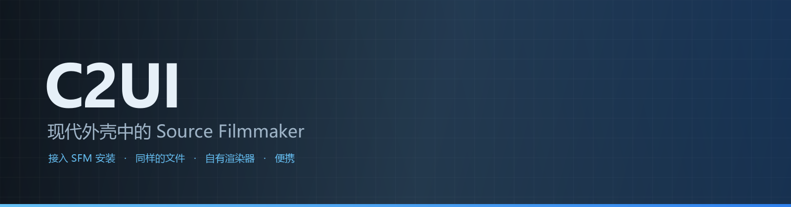

<p align="center"></p>

<p align="center"><a href="../../README.md">🇷🇺 Русский</a> · <a href="EN-en.md">🇬🇧 English</a> · <a href="PL-pl.md">🇵🇱 Polski</a> · <a href="UK-ua.md">🇺🇦 Українська</a> · <a href="DE-de.md">🇩🇪 Deutsch</a> · <a href="RO-md.md">🇲🇩 Moldovenească</a> · <a href="SL-si.md">🇸🇮 Slovenščina</a> · <a href="BE-by.md">🇧🇾 Беларуская</a> · <a href="KK-kz.md">🇰🇿 Қазақша</a> · <a href="JA-jp.md">🇯🇵 日本語</a> · <b>🇨🇳 中文</b> · <a href="SV-se.md">🇸🇪 Svenska</a> · <a href="ES-es.md">🇪🇸 Español</a> · <a href="HI-in.md">🇮🇳 हिन्दी</a> · <a href="PT-pt.md">🇵🇹 Português</a> · <a href="BN-bd.md">🇧🇩 বাংলা</a> · <a href="FR-fr.md">🇫🇷 Français</a> · <a href="TE-in.md">🇮🇳 తెలుగు</a> · <a href="MR-in.md">🇮🇳 मराठी</a> · <a href="TA-in.md">🇮🇳 தமிழ்</a> · <a href="TR-tr.md">🇹🇷 Türkçe</a> · <a href="UR-pk.md">🇵🇰 اردو</a> · <a href="VI-vn.md">🇻🇳 Tiếng Việt</a> · <a href="GU-in.md">🇮🇳 ગુજરાતી</a> · <a href="IT-it.md">🇮🇹 Italiano</a> · <a href="KO-kr.md">🇰🇷 한국어</a> · <a href="AR-sa.md">🇸🇦 العربية</a> · <a href="JV-id.md">🇮🇩 Basa Jawa</a> · <a href="ML-in.md">🇮🇳 മലയാളം</a> · <a href="NE-np.md">🇳🇵 नेपाली</a> · <a href="UZ-uz.md">🇺🇿 Oʻzbekcha</a> · <a href="OR-in.md">🇮🇳 ଓଡ଼ିଆ</a></p>

<p align="center">
  
  
  
  
  <a href="../../Testing"></a>
  
</p>

<p align="center"><b>C2UI</b> — <i>Custom to User Interface</i> — 是放在现代外壳中的 Source Filmmaker 编辑器：同样的内容、同样的会话格式、同样的数据模型，界面延续 Steam 库与 Unreal Engine 5 编辑器的风格。</p>

---

## 完成度

<p align="center"></p>

<p align="center"> <b>整体发布就绪度：41%</b></p>

<p align="center"><a href="../assets/ZH-cn/sidebar.md"></a></p>

## 想法

Source Filmmaker 是一款强大的工具，但界面停留在 2012 年。C2UI 不取代它，也不重做它：目标只是让 SFM 更现代、更顺手一点。

编辑器会找到已安装的 SFM，把它作为内容库接入——模型、材质、纹理、会话——并以同样的格式处理同样的文件。在 SFM 里做的一切都能在 C2UI 中打开，反之亦然。

第一个目标是与 SFM 完全兼容，包括骨骼和绑定。之后再补上 SFM 一直缺少的东西。

```
  ┌──────────────┐    "SFM 在哪?"    ┌──────────────────────────────┐
  │   C2UI       │ ─────────────────────▶│  SourceFilmmaker/game/       │
  │              │                       │    usermod/gameinfo.txt      │
  │  自有 UI     │ ◀─────   挂载    ───────│    tf/  hl2/  tf_movies/ …   │
  │  自有渲染    │         只读          │    models/ materials/ dmx    │
  └──────────────┘                       └──────────────────────────────┘
```

<p align="center"><br><sub>今天的编辑器，打开了 Valve 的《Meet the Heavy》：时间线上的镜头和声音、会话树、通过自身相机看到的第一个镜头、按会话摆好姿势和表情的角色。</sub></p>

## 有何不同

- **便携。** 应用程序文件夹之外不写入任何内容：设置在 `App/User`，缓存在 `App/Cache`，临时文件在 `App/Temporary`。删掉文件夹就不留痕迹。
- **从不运行 SFM。** 没有要驱动的进程，没有要劫持的窗口。安装被当作内容包读取。
- **格式经过验证，而非假设。** 每个读取器都对照真实安装检查过；格式做了出人意料的事情时，代码会说明。
- **保存精确。** 未经修改读取并写入的会话就是同一个文件。
- **引擎没有依赖。** `Core/` 和整套测试在纯 Python 上运行；只有窗口需要 Qt 和 OpenGL。

## 运行

需要 Windows、Python 3.13 和已安装的 Source Filmmaker。

```bash
git clone https://github.com/Arkomiko/SFM_C2UI.git
cd SFM_C2UI
python -m venv .venv
.venv/Scripts/python.exe -m pip install -r Tools/Launcher/requirements.txt
.venv/Scripts/python.exe Tools/Launcher/c2ui.py
```

首次启动时通过 Steam 查找 SFM；找不到则询问。<kbd>Ctrl</kbd>+<kbd>O</kbd> 打开会话，<kbd>Space</kbd> 播放，<kbd>C</kbd> 通过镜头相机观看，<kbd>T</kbd>/<kbd>R</kbd> 移动/旋转，<kbd>M</kbd> 运动编辑器，<kbd>Ctrl</kbd>+<kbd>Z</kbd> 撤销，<kbd>Ctrl</kbd>+<kbd>S</kbd> 保存。面板按标题拖动。测试不需要任何东西：

```bash
python Testing/run.py
```

## 结构

```
C2UI_SDK/
├── README.md
├── Core/              引擎：格式、虚拟文件系统、索引、桥接
├── App/               编辑器：内容库、渲染器、窗口
├── Tools/             本地化、UI 工具、插件（稍后）
│   └── Launcher/      启动器
├── Testing/           测试、逐字节夹具、单一运行器
└── GIT&DOCK/          本 README 的其他语言版本
```

## 路线图

1. **Source 着色** — SFM 绘制的 VertexLitGeneric：phong、rim、lightwarp、场景灯光。
2. **地图** — 用作背景的 `.bsp`。
3. **输出** — 图像和视频导出。
4. **插件** — `.c2plg` 格式；然后是主题和工作区。

## 许可与致谢

C2UI 自身代码采用 **C2UI 许可证**：个人及非商业用途可自由使用；商业用途须获得作者书面同意；修改版本必须注明原项目及其作者 Arkomiko。插件和附加组件采用 **C2UI — Plugins & Addons (C2UI‑Pl&AD)** 许可证。

Source Filmmaker、Team Fortress 2 和 Source 引擎属于 Valve；本项目读取它们的格式，不附带它们的任何文件，只与你从 Steam 获得的 SFM 副本一起工作。

<p align="center"><a href="../LICENSE/ZH-cn.md"></a></p>

<p align="center"><br><sub>从安装中随机挑选的六十四个模型，由 C2UI 自己的渲染器绘制。</sub></p>
