# Reifegrad von C2UI im Detail

&nbsp;🌐 <b>🇩🇪 Deutsch</b> &nbsp;·&nbsp; Language · Язык · 語言 · Idioma · Sprache · भाषा · لغة

<table align="center">
<tr><td align="center"><a href="../RU-ru/sidebar.md">🇷🇺 Русский</a></td><td align="center"><a href="../EN-en/sidebar.md">🇬🇧 English</a></td><td align="center"><a href="../PL-pl/sidebar.md">🇵🇱 Polski</a></td><td align="center"><a href="../UK-ua/sidebar.md">🇺🇦 Українська</a></td><td align="center"><b>🇩🇪 Deutsch</b></td><td align="center"><a href="../RO-md/sidebar.md">🇲🇩 Moldovenească</a></td><td align="center"><a href="../SL-si/sidebar.md">🇸🇮 Slovenščina</a></td><td align="center"><a href="../BE-by/sidebar.md">🇧🇾 Беларуская</a></td></tr>
<tr><td align="center"><a href="../KK-kz/sidebar.md">🇰🇿 Қазақша</a></td><td align="center"><a href="../JA-jp/sidebar.md">🇯🇵 日本語</a></td><td align="center"><a href="../ZH-cn/sidebar.md">🇨🇳 中文</a></td><td align="center"><a href="../SV-se/sidebar.md">🇸🇪 Svenska</a></td><td align="center"><a href="../ES-es/sidebar.md">🇪🇸 Español</a></td><td align="center"><a href="../HI-in/sidebar.md">🇮🇳 हिन्दी</a></td><td align="center"><a href="../PT-pt/sidebar.md">🇵🇹 Português</a></td><td align="center"><a href="../BN-bd/sidebar.md">🇧🇩 বাংলা</a></td></tr>
<tr><td align="center"><a href="../FR-fr/sidebar.md">🇫🇷 Français</a></td><td align="center"><a href="../TE-in/sidebar.md">🇮🇳 తెలుగు</a></td><td align="center"><a href="../MR-in/sidebar.md">🇮🇳 मराठी</a></td><td align="center"><a href="../TA-in/sidebar.md">🇮🇳 தமிழ்</a></td><td align="center"><a href="../TR-tr/sidebar.md">🇹🇷 Türkçe</a></td><td align="center"><a href="../UR-pk/sidebar.md">🇵🇰 اردو</a></td><td align="center"><a href="../VI-vn/sidebar.md">🇻🇳 Tiếng Việt</a></td><td align="center"><a href="../GU-in/sidebar.md">🇮🇳 ગુજરાતી</a></td></tr>
<tr><td align="center"><a href="../IT-it/sidebar.md">🇮🇹 Italiano</a></td><td align="center"><a href="../KO-kr/sidebar.md">🇰🇷 한국어</a></td><td align="center"><a href="../AR-sa/sidebar.md">🇸🇦 العربية</a></td><td align="center"><a href="../JV-id/sidebar.md">🇮🇩 Basa Jawa</a></td><td align="center"><a href="../ML-in/sidebar.md">🇮🇳 മലയാളം</a></td><td align="center"><a href="../NE-np/sidebar.md">🇳🇵 नेपाली</a></td><td align="center"><a href="../UZ-uz/sidebar.md">🇺🇿 Oʻzbekcha</a></td><td align="center"><a href="../OR-in/sidebar.md">🇮🇳 ଓଡ଼ିଆ</a></td></tr>
</table>

 <b>Gesamtreife für eine Veröffentlichung: 51%</b>

Jeder Bereich lässt sich aufklappen: was schon funktioniert und was noch fehlt. Die Prozente sind eine Einschätzung gegenüber dem, was SFM kann.

###  SFM finden und einbinden

Steam-Registry → `libraryfolders.vdf` → Suchpfade aus `gameinfo.txt` in der Reihenfolge der Engine. Sechs Einbindungen bei einer Standardinstallation. Nichts wird außerhalb des Programmordners geschrieben.

###  Inhaltsindex

70 199 Dateien in 1,1 s kalt / 0,02 s aus dem Cache; Überschreibungen zwischen Einbindungen werden wie in der Engine aufgelöst.

###  Modelle — <code>.mdl</code> <code>.vvd</code> <code>.vtx</code>

Versionen 44, 48, 49. Skelett, Meshes, alle Detailstufen, Body-Gruppen. 1 500 Modelle geladen, 0 Fehler.

###  Materialien — <code>.vmt</code>

Alle 19 554 mitgelieferten Materialien werden gelesen; `patch`, DX-Blöcke, Proxies.

###  Texturen — <code>.vtf</code>

Versionen 7.0–7.5, DXT1/3/5 und alle unkomprimierten Formate, Cubemaps, Mips. DXT geht ohne Dekodierung auf die GPU.

###  Sitzungen — <code>.dmx</code>

Binär 1–5 und KeyValues2. Jede Sitzung und Partikeldatei der Installation wird **Byte für Byte** identisch zurückgeschrieben.

###  Sitzung auf dem Bildschirm

Shots und Tonspuren auf der Zeitleiste, der Elementbaum, die Szene jedes Shots durch seine Kamera. Noch nicht: Karten, Partikel, Ton.

###  Animation

Kanäle und Logs am Cursor ausgewertet; Scrubben und Abspielen. Knochen, Kameras und Sichtbarkeit folgen der Sitzung.

###  Gesichter

Flex-Controller, die kompilierten Regeln und Vertex-Animation — Figuren sprechen und zeigen Mimik. Noch nicht: Wrinkle-Maps.

###  Rigs

Ausdrücke, Point/Orient/Parent/Aim-Constraints, Zwei-Knochen-IK. Noch nicht: der volle Operator-Abhängigkeitsgraph, Rig-Erstellung.

###  Bearbeiten

Klick zum Auswählen, Manipulator zum Verschieben/Drehen, Inspektor für jedes Attribut, Key am Cursor, Rückgängig/Wiederholen, byteexaktes Speichern.

###  Motion-Editor

Zeitauswahl mit Hold und Falloff auf dem Lineal; eine Änderung verteilt sich darüber wie in SFM. Noch nicht: Presets, Ebenen.

###  Graph-Editor

Kurven jedes Logs des gewählten Elements: X/Y/Z, Pitch/Yaw/Roll, Skalare. Keys werden in Zeit und Wert mit Live-Vorschau gezogen, Doppelklick fügt ein, Entf löscht; die Zeitachse ist die der Zeitleiste. Noch nicht: Tangenten und Kurventypen, Skalieren einer Key-Gruppe.

###  Panel-Docking

Panels auf einen Zielkompass mit Vorschau ziehen, wie in UE5 und Visual Studio. Noch nicht: gespeicherte Layouts, Themes.

###  Source-Shading

Sitzungslichter (DmeProjectedLight): Frustum, Source-Abschwächung, Ausblenden bis maxDistance; Half-Lambert, $lightwarptexture, Phong ($phongexponent/boost/fresnelranges), $rimlight, $selfillum. Die Welt der Karte über ihre Lightmaps. Noch nicht: Schatten, Gobo-Texturen, $bumpmap, $envmap, Ambient-Cubes, Skybox.

###  Karten — <code>.bsp</code>

Versionen 19–21: Weltgeometrie, Displacement-Gelände, Brush-Entities, statische Props, die Pak-Materialien der Karte. Frustum-Culling. Noch nicht: Lightmaps, Skybox, Wasser, prop_dynamic.

###  Rendern in Bild und Video

Nicht begonnen.

###  Plugins <code>.c2plg</code>

Nicht begonnen.

###  Themes und Arbeitsbereiche

Bewusst später: ein Look, bis der Editor etwas hat, das sich zu gestalten lohnt.

**Nicht veröffentlichungsreif.** Das Fundament — jedes Dateiformat, das SFM nutzt, korrekt gelesen und an der ganzen Installation geprüft — steht und ist getestet; eine Sitzung lässt sich öffnen, abspielen, ändern und speichern. Es fehlt der *Komfort* der Arbeit: Graph-Editor, Source-Shading, Karten, Export. Keine Versionsnummer, bevor ein Animator einen Arbeitstag darin verbringen kann.

