# C2UI ની તૈયારી — વિગતવાર

<a href="../RU-ru/sidebar.md">🇷🇺 Русский</a> · <a href="../EN-en/sidebar.md">🇬🇧 English</a> · <a href="../PL-pl/sidebar.md">🇵🇱 Polski</a> · <a href="../UK-ua/sidebar.md">🇺🇦 Українська</a> · <a href="../DE-de/sidebar.md">🇩🇪 Deutsch</a> · <a href="../RO-md/sidebar.md">🇲🇩 Moldovenească</a> · <a href="../SL-si/sidebar.md">🇸🇮 Slovenščina</a> · <a href="../BE-by/sidebar.md">🇧🇾 Беларуская</a> · <a href="../KK-kz/sidebar.md">🇰🇿 Қазақша</a> · <a href="../JA-jp/sidebar.md">🇯🇵 日本語</a> · <a href="../ZH-cn/sidebar.md">🇨🇳 中文</a> · <a href="../SV-se/sidebar.md">🇸🇪 Svenska</a> · <a href="../ES-es/sidebar.md">🇪🇸 Español</a> · <a href="../HI-in/sidebar.md">🇮🇳 हिन्दी</a> · <a href="../PT-pt/sidebar.md">🇵🇹 Português</a> · <a href="../BN-bd/sidebar.md">🇧🇩 বাংলা</a> · <a href="../FR-fr/sidebar.md">🇫🇷 Français</a> · <a href="../TE-in/sidebar.md">🇮🇳 తెలుగు</a> · <a href="../MR-in/sidebar.md">🇮🇳 मराठी</a> · <a href="../TA-in/sidebar.md">🇮🇳 தமிழ்</a> · <a href="../TR-tr/sidebar.md">🇹🇷 Türkçe</a> · <a href="../UR-pk/sidebar.md">🇵🇰 اردو</a> · <a href="../VI-vn/sidebar.md">🇻🇳 Tiếng Việt</a> · <b>🇮🇳 ગુજરાતી</b> · <a href="../IT-it/sidebar.md">🇮🇹 Italiano</a> · <a href="../KO-kr/sidebar.md">🇰🇷 한국어</a> · <a href="../AR-sa/sidebar.md">🇸🇦 العربية</a> · <a href="../JV-id/sidebar.md">🇮🇩 Basa Jawa</a> · <a href="../ML-in/sidebar.md">🇮🇳 മലയാളം</a> · <a href="../NE-np/sidebar.md">🇳🇵 नेपाली</a> · <a href="../UZ-uz/sidebar.md">🇺🇿 Oʻzbekcha</a> · <a href="../OR-in/sidebar.md">🇮🇳 ଓଡ଼ିଆ</a>

 <b>રિલીઝ માટે એકંદર તૈયારી: 41%</b>

દરેક ક્ષેત્ર ખુલે છે: શું પહેલેથી કામ કરે છે અને શું હજુ નથી. ટકાવારી SFM ની ક્ષમતાઓની સાપેક્ષ અંદાજ છે.

###  SFM શોધવું અને માઉન્ટ કરવું

Steam રજિસ્ટ્રી → `libraryfolders.vdf` → `gameinfo.txt` ના સર્ચ પાથ, એન્જિનના ક્રમમાં. માનક ઇન્સ્ટોલ પર છ માઉન્ટ. એપ્લિકેશન ફોલ્ડર બહાર કંઈ લખાતું નથી.

###  કન્ટેન્ટ ઇન્ડેક્સ

70 199 ફાઇલો 1.1 સે ઠંડું / 0.02 સે કેશમાંથી; માઉન્ટ વચ્ચેના ઓવરરાઇડ એન્જિન જેમ જ ઉકેલાય છે.

###  મોડેલ — <code>.mdl</code> <code>.vvd</code> <code>.vtx</code>

વર્ઝન 44, 48, 49. હાડપિંજર, મેશ, બધા વિગત સ્તર, બોડી ગ્રુપ. 1 500 મોડેલ લોડ, 0 નિષ્ફળતા.

###  મટીરિયલ — <code>.vmt</code>

બધા 19 554 મટીરિયલ વંચાય છે; `patch`, DX બ્લોક, પ્રોક્સી.

###  ટેક્સચર — <code>.vtf</code>

વર્ઝન 7.0–7.5, DXT1/3/5 અને બધા અસંકુચિત ફોર્મેટ, ક્યુબમેપ, મિપ. DXT ડીકોડ વિના GPU માં જાય છે.

###  સેશન — <code>.dmx</code>

બાઇનરી 1–5 અને KeyValues2. ઇન્સ્ટોલની દરેક સેશન અને પાર્ટિકલ ફાઇલ **બાઇટ બાય બાઇટ** પાછી લખાય છે.

###  સ્ક્રીન પર સેશન

ટાઇમલાઇન પર શોટ અને સાઉન્ડ ટ્રેક, એલિમેન્ટ ટ્રી, દરેક શોટનું દૃશ્ય તેના કેમેરાથી. હજુ નહીં: નકશા, પાર્ટિકલ, અવાજ.

###  એનિમેશન

કર્સર પર ચેનલ અને લોગ મૂલ્યાંકિત; સ્ક્રબ અને પ્લે. હાડકાં, કેમેરા અને દૃશ્યતા સેશનને અનુસરે છે.

###  ચહેરા

Flex કંટ્રોલર, કમ્પાઇલ કરેલા નિયમો અને વર્ટેક્સ એનિમેશન — પાત્રો બોલે છે અને ભાવ બતાવે છે. હજુ નહીં: કરચલી નકશા.

###  રિગ

એક્સપ્રેશન, point/orient/parent/aim કન્સ્ટ્રેન્ટ, બે-હાડકાં IK. હજુ નહીં: સંપૂર્ણ ઓપરેટર નિર્ભરતા ગ્રાફ, રિગ બનાવવું.

###  એડિટિંગ

ક્લિકથી પસંદગી, મૂવ/રોટેટ મેનિપ્યુલેટર, કોઈપણ એટ્રિબ્યુટનો ઇન્સ્પેક્ટર, કર્સર પર કી, અનડુ/રીડુ, બાઇટ-ચોક્કસ સેવ.

###  મોશન એડિટર

રૂલર પર હોલ્ડ અને ફોલઓફ સાથે સમય પસંદગી; ફેરફાર SFM જેમ તેના પર ફેલાય છે. હજુ નહીં: પ્રીસેટ, લેયર.

###  ગ્રાફ એડિટર

પસંદ કરેલા એલિમેન્ટને ચલાવતા દરેક લોગના વળાંક: X/Y/Z, pitch/yaw/roll, સ્કેલર. કી લાઇવ પ્રીવ્યૂ સાથે સમય અને મૂલ્યમાં ખેંચાય છે, ડબલ-ક્લિક ઉમેરે છે, Delete દૂર કરે છે; સમય અક્ષ ટાઇમલાઇનનો. હજુ નહીં: ટેન્જન્ટ અને વળાંક પ્રકાર, કી જૂથનું સ્કેલિંગ.

###  પેનલ ડોકિંગ

UE5 અને Visual Studio જેમ, પ્રીવ્યૂ સાથે લક્ષ્યોના કંપાસ પર પેનલ ખેંચો. હજુ નહીં: સાચવેલા લેઆઉટ, થીમ.

###  Source શેડિંગ

ફક્ત ટેક્સચર અને સાદો પ્રકાશ. હજુ નહીં: phong, rim, lightwarp, દૃશ્યની લાઇટ, છાયા.

###  નકશા — <code>.bsp</code>

શરૂ થયું નથી.

###  છબી અને વિડિયોમાં રેન્ડર

શરૂ થયું નથી.

###  પ્લગઇન <code>.c2plg</code>

શરૂ થયું નથી.

###  થીમ અને વર્કસ્પેસ

જાણી જોઈને પછી: એડિટરમાં સજાવવા લાયક કંઈ આવે ત્યાં સુધી એક જ દેખાવ.

**રિલીઝ માટે તૈયાર નથી.** પાયો — SFM વાપરે તે દરેક ફાઇલ ફોર્મેટ, યોગ્ય રીતે વાંચેલો અને સંપૂર્ણ ઇન્સ્ટોલેશન પર ચકાસેલો — હાજર અને પરીક્ષિત છે; સેશન ખોલી, ચલાવી, બદલી અને સાચવી શકાય છે. ખૂટે છે કામની *સુવિધા*: ગ્રાફ એડિટર, Source શેડિંગ, નકશા, નિકાસ. એનિમેટર તેમાં એક દિવસનું કામ કરી શકે ત્યાં સુધી કોઈ વર્ઝન નંબર નહીં.

