# C2UI की तैयारी — विस्तार से

<a href="../RU-ru/sidebar.md">🇷🇺 Русский</a> · <a href="../EN-en/sidebar.md">🇬🇧 English</a> · <a href="../PL-pl/sidebar.md">🇵🇱 Polski</a> · <a href="../UK-ua/sidebar.md">🇺🇦 Українська</a> · <a href="../DE-de/sidebar.md">🇩🇪 Deutsch</a> · <a href="../RO-md/sidebar.md">🇲🇩 Moldovenească</a> · <a href="../SL-si/sidebar.md">🇸🇮 Slovenščina</a> · <a href="../BE-by/sidebar.md">🇧🇾 Беларуская</a> · <a href="../KK-kz/sidebar.md">🇰🇿 Қазақша</a> · <a href="../JA-jp/sidebar.md">🇯🇵 日本語</a> · <a href="../ZH-cn/sidebar.md">🇨🇳 中文</a> · <a href="../SV-se/sidebar.md">🇸🇪 Svenska</a> · <a href="../ES-es/sidebar.md">🇪🇸 Español</a> · <b>🇮🇳 हिन्दी</b> · <a href="../PT-pt/sidebar.md">🇵🇹 Português</a> · <a href="../BN-bd/sidebar.md">🇧🇩 বাংলা</a> · <a href="../FR-fr/sidebar.md">🇫🇷 Français</a> · <a href="../TE-in/sidebar.md">🇮🇳 తెలుగు</a> · <a href="../MR-in/sidebar.md">🇮🇳 मराठी</a> · <a href="../TA-in/sidebar.md">🇮🇳 தமிழ்</a> · <a href="../TR-tr/sidebar.md">🇹🇷 Türkçe</a> · <a href="../UR-pk/sidebar.md">🇵🇰 اردو</a> · <a href="../VI-vn/sidebar.md">🇻🇳 Tiếng Việt</a> · <a href="../GU-in/sidebar.md">🇮🇳 ગુજરાતી</a> · <a href="../IT-it/sidebar.md">🇮🇹 Italiano</a> · <a href="../KO-kr/sidebar.md">🇰🇷 한국어</a> · <a href="../AR-sa/sidebar.md">🇸🇦 العربية</a> · <a href="../JV-id/sidebar.md">🇮🇩 Basa Jawa</a> · <a href="../ML-in/sidebar.md">🇮🇳 മലയാളം</a> · <a href="../NE-np/sidebar.md">🇳🇵 नेपाली</a> · <a href="../UZ-uz/sidebar.md">🇺🇿 Oʻzbekcha</a> · <a href="../OR-in/sidebar.md">🇮🇳 ଓଡ଼ିଆ</a>

 <b>रिलीज़ के लिए कुल तैयारी: 41%</b>

हर क्षेत्र खुलता है: क्या पहले से काम करता है और क्या अभी नहीं है। प्रतिशत SFM की क्षमताओं के सापेक्ष अनुमान हैं।

###  SFM खोजना और माउंट करना

Steam रजिस्ट्री → `libraryfolders.vdf` → `gameinfo.txt` के खोज पथ, इंजन के क्रम में। मानक इंस्टॉलेशन पर छह माउंट। एप्लिकेशन फ़ोल्डर के बाहर कुछ नहीं लिखा जाता।

###  कंटेंट इंडेक्स

70 199 फ़ाइलें 1.1 सेकंड ठंडा / 0.02 सेकंड कैश से; माउंट के बीच ओवरराइड ठीक इंजन की तरह हल होते हैं।

###  मॉडल — <code>.mdl</code> <code>.vvd</code> <code>.vtx</code>

संस्करण 44, 48, 49। कंकाल, मेश, हर विवरण स्तर, बॉडी ग्रुप। 1 500 मॉडल लोड, 0 विफलता।

###  मटीरियल — <code>.vmt</code>

सभी 19 554 शामिल मटीरियल पढ़े जाते हैं; `patch`, DX ब्लॉक, प्रॉक्सी।

###  टेक्सचर — <code>.vtf</code>

संस्करण 7.0–7.5, DXT1/3/5 और सभी असंपीड़ित फ़ॉर्मैट, क्यूबमैप, मिप। DXT बिना डिकोड किए GPU में जाता है।

###  सेशन — <code>.dmx</code>

बाइनरी 1–5 और KeyValues2। इंस्टॉलेशन का हर सेशन और पार्टिकल फ़ाइल **बाइट दर बाइट** वापस लिखी जाती है।

###  स्क्रीन पर सेशन

टाइमलाइन पर शॉट और साउंड ट्रैक, एलिमेंट ट्री, हर शॉट का दृश्य उसके कैमरे से। अभी नहीं: मैप, पार्टिकल, ध्वनि।

###  एनिमेशन

चैनल और लॉग कर्सर पर मूल्यांकित; स्क्रब और प्ले। हड्डियाँ, कैमरे और दृश्यता सेशन का अनुसरण करते हैं।

###  चेहरे

Flex कंट्रोलर, संकलित नियम और वर्टेक्स एनिमेशन — किरदार बोलते और भाव दिखाते हैं। अभी नहीं: झुर्री मैप।

###  रिग

एक्सप्रेशन, point/orient/parent/aim कंस्ट्रेंट, दो-हड्डी IK। अभी नहीं: पूरा ऑपरेटर निर्भरता ग्राफ़, रिग निर्माण।

###  संपादन

क्लिक से चयन, मूव/रोटेट मैनिपुलेटर, किसी भी एट्रिब्यूट का इंस्पेक्टर, कर्सर पर की, अन्डू/रीडू, बाइट-सटीक सेव।

###  मोशन एडिटर

रूलर पर होल्ड और फ़ॉलऑफ़ के साथ समय चयन; संपादन SFM की तरह उस पर फैलता है। अभी नहीं: प्रीसेट, लेयर।

###  ग्राफ़ एडिटर

चुने एलिमेंट को चलाने वाले हर लॉग के कर्व: X/Y/Z, pitch/yaw/roll, स्केलर। की को समय और मान में लाइव पूर्वावलोकन के साथ खींचें, डबल-क्लिक जोड़ता है, Delete हटाता है; समय अक्ष टाइमलाइन का है। अभी नहीं: टैंजेंट और कर्व प्रकार, की समूह का स्केलिंग।

###  पैनल डॉकिंग

UE5 और Visual Studio की तरह, पूर्वावलोकन के साथ लक्ष्यों के कम्पास पर पैनल खींचें। अभी नहीं: सहेजे लेआउट, थीम।

###  Source शेडिंग

केवल टेक्सचर और साधारण रोशनी। अभी नहीं: phong, rim, lightwarp, दृश्य की रोशनी, छायाएँ।

###  मैप — <code>.bsp</code>

शुरू नहीं हुआ।

###  छवि और वीडियो में रेंडर

शुरू नहीं हुआ।

###  प्लगइन <code>.c2plg</code>

शुरू नहीं हुआ।

###  थीम और वर्कस्पेस

जानबूझकर बाद में: एक ही रूप, जब तक एडिटर में सजाने लायक कुछ न हो।

**रिलीज़ के लिए तैयार नहीं।** नींव — SFM का हर फ़ाइल फ़ॉर्मैट, सही पढ़ा और पूरे इंस्टॉलेशन पर जाँचा — मौजूद और परीक्षित है; सेशन खोला, चलाया, बदला और सहेजा जा सकता है। कमी है काम की *सुविधा* की: ग्राफ़ एडिटर, Source शेडिंग, मैप, एक्सपोर्ट। जब तक कोई एनिमेटर इसमें एक दिन का काम न कर सके, कोई संस्करण संख्या नहीं।

