# Avanzamento di C2UI in dettaglio

<a href="../RU-ru/sidebar.md">🇷🇺 Русский</a> · <a href="../EN-en/sidebar.md">🇬🇧 English</a> · <a href="../PL-pl/sidebar.md">🇵🇱 Polski</a> · <a href="../UK-ua/sidebar.md">🇺🇦 Українська</a> · <a href="../DE-de/sidebar.md">🇩🇪 Deutsch</a> · <a href="../RO-md/sidebar.md">🇲🇩 Moldovenească</a> · <a href="../SL-si/sidebar.md">🇸🇮 Slovenščina</a> · <a href="../BE-by/sidebar.md">🇧🇾 Беларуская</a> · <a href="../KK-kz/sidebar.md">🇰🇿 Қазақша</a> · <a href="../JA-jp/sidebar.md">🇯🇵 日本語</a> · <a href="../ZH-cn/sidebar.md">🇨🇳 中文</a> · <a href="../SV-se/sidebar.md">🇸🇪 Svenska</a> · <a href="../ES-es/sidebar.md">🇪🇸 Español</a> · <a href="../HI-in/sidebar.md">🇮🇳 हिन्दी</a> · <a href="../PT-pt/sidebar.md">🇵🇹 Português</a> · <a href="../BN-bd/sidebar.md">🇧🇩 বাংলা</a> · <a href="../FR-fr/sidebar.md">🇫🇷 Français</a> · <a href="../TE-in/sidebar.md">🇮🇳 తెలుగు</a> · <a href="../MR-in/sidebar.md">🇮🇳 मराठी</a> · <a href="../TA-in/sidebar.md">🇮🇳 தமிழ்</a> · <a href="../TR-tr/sidebar.md">🇹🇷 Türkçe</a> · <a href="../UR-pk/sidebar.md">🇵🇰 اردو</a> · <a href="../VI-vn/sidebar.md">🇻🇳 Tiếng Việt</a> · <a href="../GU-in/sidebar.md">🇮🇳 ગુજરાતી</a> · <b>🇮🇹 Italiano</b> · <a href="../KO-kr/sidebar.md">🇰🇷 한국어</a> · <a href="../AR-sa/sidebar.md">🇸🇦 العربية</a> · <a href="../JV-id/sidebar.md">🇮🇩 Basa Jawa</a> · <a href="../ML-in/sidebar.md">🇮🇳 മലയാളം</a> · <a href="../NE-np/sidebar.md">🇳🇵 नेपाली</a> · <a href="../UZ-uz/sidebar.md">🇺🇿 Oʻzbekcha</a> · <a href="../OR-in/sidebar.md">🇮🇳 ଓଡ଼ିଆ</a>

 <b>Avanzamento complessivo verso il rilascio: 41%</b>

Ogni area si espande: cosa funziona già e cosa non c'è ancora. Le percentuali sono una stima rispetto a ciò che sa fare SFM.

###  Trovare e montare SFM

Registro di Steam → `libraryfolders.vdf` → i percorsi di ricerca di `gameinfo.txt`, nell'ordine del motore. Sei montaggi su un'installazione standard. Nulla viene scritto fuori dalla cartella dell'applicazione.

###  Indice dei contenuti

70 199 file in 1,1 s a freddo / 0,02 s dalla cache; le sovrascritture tra montaggi risolte esattamente come fa il motore.

###  Modelli — <code>.mdl</code> <code>.vvd</code> <code>.vtx</code>

Versioni 44, 48, 49. Scheletro, mesh, ogni livello di dettaglio, gruppi del corpo. 1 500 modelli caricati, 0 errori.

###  Materiali — <code>.vmt</code>

Tutti i 19 554 materiali inclusi si leggono; `patch`, blocchi DX, proxy.

###  Texture — <code>.vtf</code>

Versioni 7.0–7.5, DXT1/3/5 e tutti i formati non compressi, cubemap, mip. Il DXT va alla GPU senza decodifica.

###  Sessioni — <code>.dmx</code>

Binario 1–5 e KeyValues2. Ogni sessione e file di particelle dell'installazione si riscrive **byte per byte**.

###  Sessione a schermo

Inquadrature e tracce audio sulla timeline, l'albero degli elementi, la scena di ogni inquadratura dalla sua camera. Non ancora: mappe, particelle, audio.

###  Animazione

Canali e log valutati al cursore; scrub e riproduzione. Ossa, camere e visibilità seguono la sessione.

###  Volti

Controller flex, regole compilate e animazione dei vertici — i personaggi parlano e fanno espressioni. Non ancora: mappe delle rughe.

###  Rig

Espressioni, vincoli point/orient/parent/aim, IK a due ossa. Non ancora: il grafo completo delle dipendenze degli operatori, la creazione di rig.

###  Modifica

Clic per selezionare, manipolatore sposta/ruota, inspector per ogni attributo, chiave al cursore, annulla/ripeti, salvataggio esatto al byte.

###  Motion editor

Selezione temporale con hold e falloff sul righello; una modifica si distribuisce come in SFM. Non ancora: preset, livelli.

###  Graph editor

Curve di ogni log che muove l'elemento selezionato: X/Y/Z, pitch/yaw/roll, scalari. Le chiavi si trascinano in tempo e valore con anteprima dal vivo, doppio clic inserisce, Canc elimina; l'asse del tempo è quello della timeline. Non ancora: tangenti e tipi di curva, scalatura di un gruppo di chiavi.

###  Aggancio dei pannelli

Trascina i pannelli su una bussola di destinazioni con anteprima, come in UE5 e Visual Studio. Non ancora: layout salvati, temi.

###  Shading Source

Solo texture e una luce semplice. Non ancora: phong, rim, lightwarp, luci di scena, ombre.

###  Mappe — <code>.bsp</code>

Non iniziato.

###  Render in immagine e video

Non iniziato.

###  Plugin <code>.c2plg</code>

Non iniziato.

###  Temi e spazi di lavoro

Volutamente dopo: un solo aspetto finché l'editor non ha qualcosa che meriti un tema.

**Non pronto per il rilascio.** Le fondamenta — ogni formato di file usato da SFM, letto correttamente e verificato su tutta l'installazione — ci sono e sono testate; una sessione si apre, si riproduce, si modifica e si salva. Manca la *comodità* del lavoro: graph editor, shading Source, mappe, esportazione. Nessun numero di versione finché un animatore non può farci una giornata di lavoro.

