# C2UI തയ്യാറെടുപ്പ് — വിശദമായി

&nbsp;🌐 <b>🇮🇳 മലയാളം</b> &nbsp;·&nbsp; Language · Язык · 語言 · Idioma · Sprache · भाषा · لغة

<table align="center">
<tr><td align="center"><a href="../RU-ru/sidebar.md">🇷🇺 Русский</a></td><td align="center"><a href="../EN-en/sidebar.md">🇬🇧 English</a></td><td align="center"><a href="../PL-pl/sidebar.md">🇵🇱 Polski</a></td><td align="center"><a href="../UK-ua/sidebar.md">🇺🇦 Українська</a></td><td align="center"><a href="../DE-de/sidebar.md">🇩🇪 Deutsch</a></td><td align="center"><a href="../RO-md/sidebar.md">🇲🇩 Moldovenească</a></td><td align="center"><a href="../SL-si/sidebar.md">🇸🇮 Slovenščina</a></td><td align="center"><a href="../BE-by/sidebar.md">🇧🇾 Беларуская</a></td></tr>
<tr><td align="center"><a href="../KK-kz/sidebar.md">🇰🇿 Қазақша</a></td><td align="center"><a href="../JA-jp/sidebar.md">🇯🇵 日本語</a></td><td align="center"><a href="../ZH-cn/sidebar.md">🇨🇳 中文</a></td><td align="center"><a href="../SV-se/sidebar.md">🇸🇪 Svenska</a></td><td align="center"><a href="../ES-es/sidebar.md">🇪🇸 Español</a></td><td align="center"><a href="../HI-in/sidebar.md">🇮🇳 हिन्दी</a></td><td align="center"><a href="../PT-pt/sidebar.md">🇵🇹 Português</a></td><td align="center"><a href="../BN-bd/sidebar.md">🇧🇩 বাংলা</a></td></tr>
<tr><td align="center"><a href="../FR-fr/sidebar.md">🇫🇷 Français</a></td><td align="center"><a href="../TE-in/sidebar.md">🇮🇳 తెలుగు</a></td><td align="center"><a href="../MR-in/sidebar.md">🇮🇳 मराठी</a></td><td align="center"><a href="../TA-in/sidebar.md">🇮🇳 தமிழ்</a></td><td align="center"><a href="../TR-tr/sidebar.md">🇹🇷 Türkçe</a></td><td align="center"><a href="../UR-pk/sidebar.md">🇵🇰 اردو</a></td><td align="center"><a href="../VI-vn/sidebar.md">🇻🇳 Tiếng Việt</a></td><td align="center"><a href="../GU-in/sidebar.md">🇮🇳 ગુજરાતી</a></td></tr>
<tr><td align="center"><a href="../IT-it/sidebar.md">🇮🇹 Italiano</a></td><td align="center"><a href="../KO-kr/sidebar.md">🇰🇷 한국어</a></td><td align="center"><a href="../AR-sa/sidebar.md">🇸🇦 العربية</a></td><td align="center"><a href="../JV-id/sidebar.md">🇮🇩 Basa Jawa</a></td><td align="center"><b>🇮🇳 മലയാളം</b></td><td align="center"><a href="../NE-np/sidebar.md">🇳🇵 नेपाली</a></td><td align="center"><a href="../UZ-uz/sidebar.md">🇺🇿 Oʻzbekcha</a></td><td align="center"><a href="../OR-in/sidebar.md">🇮🇳 ଓଡ଼ିଆ</a></td></tr>
</table>

 <b>റിലീസിനുള്ള മൊത്തം തയ്യാറെടുപ്പ്: 51%</b>

ഓരോ മേഖലയും വികസിപ്പിക്കാം: ഇപ്പോൾ തന്നെ പ്രവർത്തിക്കുന്നതും ഇതുവരെ ഇല്ലാത്തതും. ശതമാനങ്ങൾ SFM-ന്റെ കഴിവുകളുമായി താരതമ്യപ്പെടുത്തിയ കണക്കാണ്.

###  SFM കണ്ടെത്തലും മൗണ്ടിംഗും

Steam രജിസ്ട്രി → `libraryfolders.vdf` → `gameinfo.txt`-ന്റെ തിരയൽ പാതകൾ, എഞ്ചിന്റെ ക്രമത്തിൽ. സാധാരണ ഇൻസ്റ്റാളിൽ ആറ് മൗണ്ടുകൾ. ആപ്ലിക്കേഷൻ ഫോൾഡറിന് പുറത്ത് ഒന്നും എഴുതുന്നില്ല.

###  ഉള്ളടക്ക സൂചിക

70 199 ഫയലുകൾ 1.1 സെ തണുത്ത / 0.02 സെ കാഷിൽ നിന്ന്; മൗണ്ടുകൾക്കിടയിലെ ഓവർറൈഡുകൾ എഞ്ചിൻ പോലെ തന്നെ പരിഹരിക്കുന്നു.

###  മോഡലുകൾ — <code>.mdl</code> <code>.vvd</code> <code>.vtx</code>

പതിപ്പുകൾ 44, 48, 49. അസ്ഥികൂടം, മെഷുകൾ, എല്ലാ വിശദാംശ തലങ്ങളും, ബോഡി ഗ്രൂപ്പുകൾ. 1 500 മോഡലുകൾ ലോഡ്, 0 പരാജയങ്ങൾ.

###  മെറ്റീരിയലുകൾ — <code>.vmt</code>

എല്ലാ 19 554 മെറ്റീരിയലുകളും വായിക്കുന്നു; `patch`, DX ബ്ലോക്കുകൾ, പ്രോക്സികൾ.

###  ടെക്സ്ചറുകൾ — <code>.vtf</code>

പതിപ്പുകൾ 7.0–7.5, DXT1/3/5 ഉം എല്ലാ കംപ്രസ് ചെയ്യാത്ത ഫോർമാറ്റുകളും, ക്യൂബ്മാപ്പുകൾ, മിപ്പുകൾ. DXT ഡീകോഡ് ചെയ്യാതെ GPU-ലേക്ക്.

###  സെഷനുകൾ — <code>.dmx</code>

ബൈനറി 1–5 ഉം KeyValues2 ഉം. ഇൻസ്റ്റാളിലെ ഓരോ സെഷനും പാർട്ടിക്കിൽ ഫയലും **ബൈറ്റ് ബൈ ബൈറ്റ്** തിരികെ എഴുതുന്നു.

###  സ്ക്രീനിലെ സെഷൻ

ടൈംലൈനിൽ ഷോട്ടുകളും സൗണ്ട് ട്രാക്കുകളും, എലമെന്റ് ട്രീ, ഓരോ ഷോട്ടിന്റെ രംഗം അതിന്റെ കാമറയിലൂടെ. ഇതുവരെ ഇല്ല: മാപ്പുകൾ, പാർട്ടിക്കിളുകൾ, ശബ്ദം.

###  ആനിമേഷൻ

കഴ്‌സറിൽ ചാനലുകളും ലോഗുകളും വിലയിരുത്തുന്നു; സ്ക്രബും പ്ലേയും. എല്ലുകൾ, കാമറകൾ, ദൃശ്യത സെഷനെ പിന്തുടരുന്നു.

###  മുഖങ്ങൾ

Flex കൺട്രോളറുകൾ, കംപൈൽ ചെയ്ത നിയമങ്ങൾ, വെർട്ടക്സ് ആനിമേഷൻ — കഥാപാത്രങ്ങൾ സംസാരിക്കുന്നു, ഭാവങ്ങൾ കാണിക്കുന്നു. ഇതുവരെ ഇല്ല: ചുളിവ് മാപ്പുകൾ.

###  റിഗുകൾ

എക്സ്പ്രഷനുകൾ, point/orient/parent/aim കൺസ്ട്രെയിന്റുകൾ, രണ്ട്-എല്ല് IK. ഇതുവരെ ഇല്ല: പൂർണ്ണ ഓപ്പറേറ്റർ ആശ്രിതത്വ ഗ്രാഫ്, റിഗ് നിർമ്മാണം.

###  എഡിറ്റിംഗ്

ക്ലിക്ക് ചെയ്ത് തിരഞ്ഞെടുക്കൽ, മൂവ്/റൊട്ടേറ്റ് മാനിപ്പുലേറ്റർ, ഏത് ആട്രിബ്യൂട്ടിനും ഇൻസ്പെക്ടർ, കഴ്‌സറിൽ കീ, അൻഡു/റീഡു, ബൈറ്റ്-കൃത്യമായ സേവ്.

###  മോഷൻ എഡിറ്റർ

റൂളറിൽ ഹോൾഡും ഫോൾഓഫുമുള്ള സമയ തിരഞ്ഞെടുപ്പ്; എഡിറ്റ് SFM പോലെ അതിൽ പരക്കുന്നു. ഇതുവരെ ഇല്ല: പ്രീസെറ്റുകൾ, ലെയറുകൾ.

###  ഗ്രാഫ് എഡിറ്റർ

തിരഞ്ഞെടുത്ത എലമെന്റിനെ നയിക്കുന്ന ഓരോ ലോഗിന്റെയും വളവുകൾ: X/Y/Z, pitch/yaw/roll, സ്കെയിലറുകൾ. കീകൾ ലൈവ് പ്രിവ്യൂവോടെ സമയത്തിലും മൂല്യത്തിലും വലിക്കാം, ഡബിൾ-ക്ലിക്ക് ചേർക്കുന്നു, Delete നീക്കുന്നു; സമയ അക്ഷം ടൈംലൈനിന്റേത്. ഇതുവരെ ഇല്ല: ടാൻജെന്റുകളും വളവ് തരങ്ങളും, കീ ഗ്രൂപ്പ് സ്കെയിലിംഗ്.

###  പാനൽ ഡോക്കിംഗ്

UE5-ലും Visual Studio-യിലും പോലെ, പ്രിവ്യൂവുള്ള ലക്ഷ്യ കോമ്പസിലേക്ക് പാനലുകൾ വലിച്ചിടുക. ഇതുവരെ ഇല്ല: സേവ് ചെയ്ത ലേഔട്ടുകൾ, തീമുകൾ.

###  Source ഷേഡിംഗ്

സെഷൻ ലൈറ്റുകൾ (DmeProjectedLight): ഫ്രസ്റ്റം, Source ക്ഷയം, maxDistance വരെ മങ്ങൽ; ഹാഫ്-ലാംബർട്ട്, $lightwarptexture, phong ($phongexponent/boost/fresnelranges), $rimlight, $selfillum. മാപ്പിന്റെ ലോകം ലൈറ്റ്മാപ്പുകളാൽ. ഇതുവരെ ഇല്ല: നിഴലുകൾ, ഗോബോ ടെക്സ്ചറുകൾ, $bumpmap, $envmap, ആംബിയന്റ് ക്യൂബുകൾ, സ്കൈബോക്സ്.

###  മാപ്പുകൾ — <code>.bsp</code>

പതിപ്പുകൾ 19–21: ലോക ജ്യാമിതി, ഡിസ്‌പ്ലേസ്‌മെന്റ് ഭൂപ്രകൃതി, ബ്രഷ് എന്റിറ്റികൾ, സ്ഥിര പ്രോപ്പുകൾ, മാപ്പിന്റെ സ്വന്തം pak മെറ്റീരിയലുകൾ. ഫ്രസ്റ്റം കള്ളിംഗ്. ഇതുവരെ ഇല്ല: ലൈറ്റ്മാപ്പ്, സ്കൈബോക്സ്, വെള്ളം, prop_dynamic.

###  ചിത്രത്തിലേക്കും വീഡിയോയിലേക്കും റെൻഡർ

തുടങ്ങിയിട്ടില്ല.

###  പ്ലഗിനുകൾ <code>.c2plg</code>

തുടങ്ങിയിട്ടില്ല.

###  തീമുകളും വർക്ക്‌സ്‌പേസുകളും

മനഃപൂർവ്വം പിന്നീട്: എഡിറ്ററിൽ അലങ്കരിക്കാൻ യോഗ്യമായത് വരുന്നതുവരെ ഒരു രൂപം.

**റിലീസിന് തയ്യാറല്ല.** അടിത്തറ — SFM ഉപയോഗിക്കുന്ന ഓരോ ഫയൽ ഫോർമാറ്റും, ശരിയായി വായിച്ച് മുഴുവൻ ഇൻസ്റ്റാളേഷനിലും പരിശോധിച്ചത് — ഉണ്ട്, ടെസ്റ്റ് ചെയ്തിട്ടുണ്ട്; ഒരു സെഷൻ തുറക്കാം, പ്ലേ ചെയ്യാം, മാറ്റാം, സേവ് ചെയ്യാം. ഇല്ലാത്തത് ജോലിയുടെ *സൗകര്യം*: ഗ്രാഫ് എഡിറ്റർ, Source ഷേഡിംഗ്, മാപ്പുകൾ, എക്സ്പോർട്ട്. ഒരു ആനിമേറ്റർ ഇതിൽ ഒരു ദിവസത്തെ ജോലി ചെയ്യാനാവുന്നതുവരെ വേർഷൻ നമ്പർ ഇല്ല.

