# C2UI को तयारी — विस्तृत

&nbsp;🌐 <b>🇳🇵 नेपाली</b> &nbsp;·&nbsp; Language · Язык · 語言 · Idioma · Sprache · भाषा · لغة

<table align="center">
<tr><td align="center"><a href="../RU-ru/sidebar.md">🇷🇺 Русский</a></td><td align="center"><a href="../EN-en/sidebar.md">🇬🇧 English</a></td><td align="center"><a href="../PL-pl/sidebar.md">🇵🇱 Polski</a></td><td align="center"><a href="../UK-ua/sidebar.md">🇺🇦 Українська</a></td><td align="center"><a href="../DE-de/sidebar.md">🇩🇪 Deutsch</a></td><td align="center"><a href="../RO-md/sidebar.md">🇲🇩 Moldovenească</a></td><td align="center"><a href="../SL-si/sidebar.md">🇸🇮 Slovenščina</a></td><td align="center"><a href="../BE-by/sidebar.md">🇧🇾 Беларуская</a></td></tr>
<tr><td align="center"><a href="../KK-kz/sidebar.md">🇰🇿 Қазақша</a></td><td align="center"><a href="../JA-jp/sidebar.md">🇯🇵 日本語</a></td><td align="center"><a href="../ZH-cn/sidebar.md">🇨🇳 中文</a></td><td align="center"><a href="../SV-se/sidebar.md">🇸🇪 Svenska</a></td><td align="center"><a href="../ES-es/sidebar.md">🇪🇸 Español</a></td><td align="center"><a href="../HI-in/sidebar.md">🇮🇳 हिन्दी</a></td><td align="center"><a href="../PT-pt/sidebar.md">🇵🇹 Português</a></td><td align="center"><a href="../BN-bd/sidebar.md">🇧🇩 বাংলা</a></td></tr>
<tr><td align="center"><a href="../FR-fr/sidebar.md">🇫🇷 Français</a></td><td align="center"><a href="../TE-in/sidebar.md">🇮🇳 తెలుగు</a></td><td align="center"><a href="../MR-in/sidebar.md">🇮🇳 मराठी</a></td><td align="center"><a href="../TA-in/sidebar.md">🇮🇳 தமிழ்</a></td><td align="center"><a href="../TR-tr/sidebar.md">🇹🇷 Türkçe</a></td><td align="center"><a href="../UR-pk/sidebar.md">🇵🇰 اردو</a></td><td align="center"><a href="../VI-vn/sidebar.md">🇻🇳 Tiếng Việt</a></td><td align="center"><a href="../GU-in/sidebar.md">🇮🇳 ગુજરાતી</a></td></tr>
<tr><td align="center"><a href="../IT-it/sidebar.md">🇮🇹 Italiano</a></td><td align="center"><a href="../KO-kr/sidebar.md">🇰🇷 한국어</a></td><td align="center"><a href="../AR-sa/sidebar.md">🇸🇦 العربية</a></td><td align="center"><a href="../JV-id/sidebar.md">🇮🇩 Basa Jawa</a></td><td align="center"><a href="../ML-in/sidebar.md">🇮🇳 മലയാളം</a></td><td align="center"><b>🇳🇵 नेपाली</b></td><td align="center"><a href="../UZ-uz/sidebar.md">🇺🇿 Oʻzbekcha</a></td><td align="center"><a href="../OR-in/sidebar.md">🇮🇳 ଓଡ଼ିଆ</a></td></tr>
</table>

 <b>रिलिजका लागि समग्र तयारी: 41%</b>

हरेक क्षेत्र खुल्छ: के पहिले नै काम गर्छ र के अझै छैन। प्रतिशत SFM को क्षमताको तुलनामा अनुमान हो।

###  SFM खोज्ने र माउन्ट गर्ने

Steam रजिस्ट्री → `libraryfolders.vdf` → `gameinfo.txt` का खोज पथ, इन्जिनको क्रममा। मानक स्थापनामा छ माउन्ट। एप्लिकेसन फोल्डरबाहिर केही लेखिँदैन।

###  सामग्री सूचकांक

७० १९९ फाइल १.१ से चिसो / ०.०२ से क्यासबाट; माउन्टबीचका ओभरराइड इन्जिनजस्तै समाधान हुन्छन्।

###  मोडेल — <code>.mdl</code> <code>.vvd</code> <code>.vtx</code>

संस्करण ४४, ४८, ४९। कंकाल, मेश, सबै विवरण स्तर, बडी समूह। १ ५०० मोडेल लोड, ० असफलता।

###  सामग्री — <code>.vmt</code>

सबै १९ ५५४ सामग्री पढिन्छन्; `patch`, DX ब्लक, प्रोक्सी।

###  टेक्सचर — <code>.vtf</code>

संस्करण ७.०–७.५, DXT1/3/5 र सबै असंकुचित ढाँचा, क्युबम्याप, मिप। DXT डिकोड नगरी GPU मा जान्छ।

###  सेसन — <code>.dmx</code>

बाइनरी १–५ र KeyValues2। स्थापनाको हरेक सेसन र पार्टिकल फाइल **बाइट-बाइट** फिर्ता लेखिन्छ।

###  स्क्रिनमा सेसन

टाइमलाइनमा शट र साउन्ड ट्र्याक, एलिमेन्ट ट्री, हरेक शटको दृश्य आफ्नै क्यामेराबाट। अझै छैन: नक्सा, पार्टिकल, आवाज।

###  एनिमेसन

कर्सरमा च्यानल र लग मूल्याङ्कन; स्क्रब र प्ले। हड्डी, क्यामेरा र दृश्यता सेसनलाई पछ्याउँछन्।

###  अनुहार

Flex नियन्त्रक, कम्पाइल गरिएका नियम र भर्टेक्स एनिमेसन — पात्रहरू बोल्छन् र भाव देखाउँछन्। अझै छैन: चाउरी नक्सा।

###  रिग

अभिव्यक्ति, point/orient/parent/aim बाधा, दुई-हड्डी IK। अझै छैन: पूर्ण अपरेटर निर्भरता ग्राफ, रिग निर्माण।

###  सम्पादन

क्लिकबाट चयन, मुभ/रोटेट म्यानिपुलेटर, कुनै पनि एट्रिब्युटको इन्स्पेक्टर, कर्सरमा की, अन्डु/रिडु, बाइट-सटीक सेभ।

###  मोशन सम्पादक

रुलरमा होल्ड र फलअफसहित समय चयन; सम्पादन SFM जस्तै त्यसमा फैलिन्छ। अझै छैन: प्रिसेट, तह।

###  ग्राफ सम्पादक

चयनित एलिमेन्ट चलाउने हरेक लगका वक्र: X/Y/Z, pitch/yaw/roll, स्केलर। की लाइभ पूर्वावलोकनसहित समय र मानमा तानिन्छन्, डबल-क्लिकले थप्छ, Delete ले हटाउँछ; समय अक्ष टाइमलाइनको। अझै छैन: ट्यान्जेन्ट र वक्र प्रकार, की समूहको स्केलिङ।

###  प्यानल डकिङ

UE5 र Visual Studio जस्तै, पूर्वावलोकनसहित लक्ष्यहरूको कम्पासमा प्यानल तान्नुहोस्। अझै छैन: सुरक्षित लेआउट, थिम।

###  Source शेडिङ

टेक्सचर र साधारण प्रकाश मात्र। अझै छैन: phong, rim, lightwarp, दृश्य प्रकाश, छाया।

###  नक्सा — <code>.bsp</code>

सुरु भएको छैन।

###  तस्बिर र भिडियोमा रेन्डर

सुरु भएको छैन।

###  प्लगइन <code>.c2plg</code>

सुरु भएको छैन।

###  थिम र कार्यस्थान

जानीजानी पछि: सम्पादकमा सजाउन योग्य केही नआउँदासम्म एउटै रूप।

**रिलिजका लागि तयार छैन।** जग — SFM ले प्रयोग गर्ने हरेक फाइल ढाँचा, सही पढिएको र पूरै स्थापनामा प्रमाणित — छ र परीक्षण गरिएको छ; सेसन खोल्न, चलाउन, बदल्न र सेभ गर्न सकिन्छ। कमी छ कामको *सहजता*: ग्राफ सम्पादक, Source शेडिङ, नक्सा, निर्यात। एनिमेटरले यसमा एक दिनको काम गर्न नसक्दासम्म संस्करण नम्बर छैन।

