# C2UI ପ୍ରସ୍ତୁତି — ବିସ୍ତୃତ

<a href="../RU-ru/sidebar.md">🇷🇺 Русский</a> · <a href="../EN-en/sidebar.md">🇬🇧 English</a> · <a href="../PL-pl/sidebar.md">🇵🇱 Polski</a> · <a href="../UK-ua/sidebar.md">🇺🇦 Українська</a> · <a href="../DE-de/sidebar.md">🇩🇪 Deutsch</a> · <a href="../RO-md/sidebar.md">🇲🇩 Moldovenească</a> · <a href="../SL-si/sidebar.md">🇸🇮 Slovenščina</a> · <a href="../BE-by/sidebar.md">🇧🇾 Беларуская</a> · <a href="../KK-kz/sidebar.md">🇰🇿 Қазақша</a> · <a href="../JA-jp/sidebar.md">🇯🇵 日本語</a> · <a href="../ZH-cn/sidebar.md">🇨🇳 中文</a> · <a href="../SV-se/sidebar.md">🇸🇪 Svenska</a> · <a href="../ES-es/sidebar.md">🇪🇸 Español</a> · <a href="../HI-in/sidebar.md">🇮🇳 हिन्दी</a> · <a href="../PT-pt/sidebar.md">🇵🇹 Português</a> · <a href="../BN-bd/sidebar.md">🇧🇩 বাংলা</a> · <a href="../FR-fr/sidebar.md">🇫🇷 Français</a> · <a href="../TE-in/sidebar.md">🇮🇳 తెలుగు</a> · <a href="../MR-in/sidebar.md">🇮🇳 मराठी</a> · <a href="../TA-in/sidebar.md">🇮🇳 தமிழ்</a> · <a href="../TR-tr/sidebar.md">🇹🇷 Türkçe</a> · <a href="../UR-pk/sidebar.md">🇵🇰 اردو</a> · <a href="../VI-vn/sidebar.md">🇻🇳 Tiếng Việt</a> · <a href="../GU-in/sidebar.md">🇮🇳 ગુજરાતી</a> · <a href="../IT-it/sidebar.md">🇮🇹 Italiano</a> · <a href="../KO-kr/sidebar.md">🇰🇷 한국어</a> · <a href="../AR-sa/sidebar.md">🇸🇦 العربية</a> · <a href="../JV-id/sidebar.md">🇮🇩 Basa Jawa</a> · <a href="../ML-in/sidebar.md">🇮🇳 മലയാളം</a> · <a href="../NE-np/sidebar.md">🇳🇵 नेपाली</a> · <a href="../UZ-uz/sidebar.md">🇺🇿 Oʻzbekcha</a> · <b>🇮🇳 ଓଡ଼ିଆ</b>

 <b>ରିଲିଜ ପାଇଁ ସମୁଦାୟ ପ୍ରସ୍ତୁତି: 41%</b>

ପ୍ରତ୍ୟେକ କ୍ଷେତ୍ର ଖୋଲାଯାଏ: କଣ ପୂର୍ବରୁ କାମ କରେ ଓ କଣ ଏବେ ନାହିଁ। ପ୍ରତିଶତ SFM ର କ୍ଷମତା ତୁଳନାରେ ଆକଳନ।

###  SFM ଖୋଜିବା ଓ ମାଉଣ୍ଟ କରିବା

Steam ରେଜିଷ୍ଟ୍ରି → `libraryfolders.vdf` → `gameinfo.txt` ର ସର୍ଚ ପାଥ, ଇଞ୍ଜିନ କ୍ରମରେ। ମାନକ ଇନ୍‌ଷ୍ଟଲରେ ଛଅ ମାଉଣ୍ଟ। ଆପ୍ଲିକେସନ ଫୋଲ୍ଡର ବାହାରେ କିଛି ଲେଖା ହୁଏ ନାହିଁ।

###  କଣ୍ଟେଣ୍ଟ ଇଣ୍ଡେକ୍ସ

୭୦ ୧୯୯ ଫାଇଲ ୧.୧ ସେ ଥଣ୍ଡା / ୦.୦୨ ସେ କ୍ୟାସରୁ; ମାଉଣ୍ଟ ମଧ୍ୟରେ ଓଭରରାଇଡ ଇଞ୍ଜିନ ପରି ସମାଧାନ।

###  ମଡେଲ — <code>.mdl</code> <code>.vvd</code> <code>.vtx</code>

ସଂସ୍କରଣ ୪୪, ୪୮, ୪୯। କଙ୍କାଳ, ମେସ, ସବୁ ବିବରଣୀ ସ୍ତର, ବଡି ଗ୍ରୁପ। ୧ ୫୦୦ ମଡେଲ ଲୋଡ, ୦ ବିଫଳତା।

###  ମ୍ୟାଟେରିଆଲ — <code>.vmt</code>

ସବୁ ୧୯ ୫୫୪ ମ୍ୟାଟେରିଆଲ ପଢ଼ାହୁଏ; `patch`, DX ବ୍ଲକ, ପ୍ରକ୍ସି।

###  ଟେକ୍ସଚର — <code>.vtf</code>

ସଂସ୍କରଣ ୭.୦–୭.୫, DXT1/3/5 ଓ ସବୁ ଅସଙ୍କୁଚିତ ଫର୍ମାଟ, କ୍ୟୁବମ୍ୟାପ, ମିପ। DXT ଡିକୋଡ ବିନା GPU କୁ ଯାଏ।

###  ସେସନ — <code>.dmx</code>

ବାଇନାରୀ ୧–୫ ଓ KeyValues2। ଇନ୍‌ଷ୍ଟଲର ପ୍ରତ୍ୟେକ ସେସନ ଓ ପାର୍ଟିକଲ ଫାଇଲ **ବାଇଟ ବାଇଟ** ଫେରି ଲେଖାହୁଏ।

###  ସ୍କ୍ରିନରେ ସେସନ

ଟାଇମଲାଇନରେ ଶଟ ଓ ସାଉଣ୍ଡ ଟ୍ରାକ, ଏଲିମେଣ୍ଟ ଟ୍ରୀ, ପ୍ରତ୍ୟେକ ଶଟର ଦୃଶ୍ୟ ନିଜ କ୍ୟାମେରାରୁ। ଏବେ ନାହିଁ: ମ୍ୟାପ, ପାର୍ଟିକଲ, ଶବ୍ଦ।

###  ଆନିମେସନ

କର୍ସରରେ ଚ୍ୟାନେଲ ଓ ଲଗ ମୂଲ୍ୟାୟନ; ସ୍କ୍ରବ ଓ ପ୍ଲେ। ହାଡ, କ୍ୟାମେରା ଓ ଦୃଶ୍ୟତା ସେସନ ଅନୁସରଣ କରେ।

###  ମୁହଁ

Flex କଣ୍ଟ୍ରୋଲର, କମ୍ପାଇଲ ନିୟମ ଓ ଭର୍ଟେକ୍ସ ଆନିମେସନ — ଚରିତ୍ର କଥା ହୁଅନ୍ତି ଓ ଭାବ ଦେଖାନ୍ତି। ଏବେ ନାହିଁ: ଲୋଚା ମ୍ୟାପ।

###  ରିଗ

ଏକ୍ସପ୍ରେସନ, point/orient/parent/aim କନ୍‌ଷ୍ଟ୍ରେଣ୍ଟ, ଦୁଇ-ହାଡ IK। ଏବେ ନାହିଁ: ପୂର୍ଣ୍ଣ ଅପରେଟର ନିର୍ଭରତା ଗ୍ରାଫ, ରିଗ ନିର୍ମାଣ।

###  ସମ୍ପାଦନା

କ୍ଲିକରେ ଚୟନ, ମୁଭ/ରୋଟେଟ ମ୍ୟାନିପୁଲେଟର, ଯେକୌଣସି ଆଟ୍ରିବ୍ୟୁଟର ଇନ୍‌ସ୍ପେକ୍ଟର, କର୍ସରରେ କି, ଅନଡୁ/ରିଡୁ, ବାଇଟ-ସଠିକ ସେଭ।

###  ମୋସନ ଏଡିଟର

ରୁଲରରେ ହୋଲ୍ଡ ଓ ଫଲଅଫ ସହ ସମୟ ଚୟନ; ସମ୍ପାଦନା SFM ପରି ତାହା ଉପରେ ବ୍ୟାପେ। ଏବେ ନାହିଁ: ପ୍ରିସେଟ, ଲେୟର।

###  ଗ୍ରାଫ ଏଡିଟର

ଚୟନିତ ଏଲିମେଣ୍ଟ ଚଳାଉଥିବା ପ୍ରତ୍ୟେକ ଲଗର ବକ୍ର: X/Y/Z, pitch/yaw/roll, ସ୍କେଲାର। କି ଲାଇଭ ପ୍ରିଭ୍ୟୁ ସହ ସମୟ ଓ ମୂଲ୍ୟରେ ଟଣାଯାଏ, ଡବଲ-କ୍ଲିକ ଯୋଡ଼େ, Delete ହଟାଏ; ସମୟ ଅକ୍ଷ ଟାଇମଲାଇନର। ଏବେ ନାହିଁ: ଟାଞ୍ଜେଣ୍ଟ ଓ ବକ୍ର ପ୍ରକାର, କି ଗୋଷ୍ଠୀ ସ୍କେଲିଂ।

###  ପ୍ୟାନେଲ ଡକିଂ

UE5 ଓ Visual Studio ପରି, ପ୍ରିଭ୍ୟୁ ସହ ଲକ୍ଷ୍ୟ କମ୍ପାସରେ ପ୍ୟାନେଲ ଟାଣନ୍ତୁ। ଏବେ ନାହିଁ: ସେଭ ଲେଆଉଟ, ଥିମ।

###  Source ସେଡିଂ

କେବଳ ଟେକ୍ସଚର ଓ ସରଳ ଆଲୋକ। ଏବେ ନାହିଁ: phong, rim, lightwarp, ଦୃଶ୍ୟ ଆଲୋକ, ଛାଇ।

###  ମ୍ୟାପ — <code>.bsp</code>

ଆରମ୍ଭ ହୋଇନାହିଁ।

###  ଚିତ୍ର ଓ ଭିଡିଓରେ ରେଣ୍ଡର

ଆରମ୍ଭ ହୋଇନାହିଁ।

###  ପ୍ଲଗଇନ <code>.c2plg</code>

ଆରମ୍ଭ ହୋଇନାହିଁ।

###  ଥିମ ଓ ୱାର୍କସ୍ପେସ

ଜାଣିଶୁଣି ପରେ: ଏଡିଟରରେ ସଜାଇବା ଯୋଗ୍ୟ କିଛି ନ ଆସିବା ପର୍ଯ୍ୟନ୍ତ ଗୋଟିଏ ରୂପ।

**ରିଲିଜ ପାଇଁ ପ୍ରସ୍ତୁତ ନୁହେଁ।** ମୂଳଦୁଆ — SFM ବ୍ୟବହାର କରୁଥିବା ପ୍ରତ୍ୟେକ ଫାଇଲ ଫର୍ମାଟ, ଠିକ୍ ପଢ଼ା ଓ ସମ୍ପୂର୍ଣ୍ଣ ଇନ୍‌ଷ୍ଟଲେସନରେ ଯାଞ୍ଚ — ଅଛି ଓ ପରୀକ୍ଷିତ; ସେସନ ଖୋଲି, ଚଲାଇ, ବଦଳାଇ ଓ ସେଭ କରିହେବ। ଅଭାବ କାମର *ସୁବିଧା*: ଗ୍ରାଫ ଏଡିଟର, Source ସେଡିଂ, ମ୍ୟାପ, ଏକ୍ସପୋର୍ଟ। ଆନିମେଟର ଏଥିରେ ଏକ ଦିନର କାମ କରି ନ ପାରିବା ପର୍ଯ୍ୟନ୍ତ ସଂସ୍କରଣ ନମ୍ବର ନାହିଁ।

