# Pregătirea C2UI în detaliu

&nbsp;🌐 <b>🇲🇩 Moldovenească</b> &nbsp;·&nbsp; Language · Язык · 語言 · Idioma · Sprache · भाषा · لغة

<table align="center">
<tr><td align="center"><a href="../RU-ru/sidebar.md">🇷🇺 Русский</a></td><td align="center"><a href="../EN-en/sidebar.md">🇬🇧 English</a></td><td align="center"><a href="../PL-pl/sidebar.md">🇵🇱 Polski</a></td><td align="center"><a href="../UK-ua/sidebar.md">🇺🇦 Українська</a></td><td align="center"><a href="../DE-de/sidebar.md">🇩🇪 Deutsch</a></td><td align="center"><b>🇲🇩 Moldovenească</b></td><td align="center"><a href="../SL-si/sidebar.md">🇸🇮 Slovenščina</a></td><td align="center"><a href="../BE-by/sidebar.md">🇧🇾 Беларуская</a></td></tr>
<tr><td align="center"><a href="../KK-kz/sidebar.md">🇰🇿 Қазақша</a></td><td align="center"><a href="../JA-jp/sidebar.md">🇯🇵 日本語</a></td><td align="center"><a href="../ZH-cn/sidebar.md">🇨🇳 中文</a></td><td align="center"><a href="../SV-se/sidebar.md">🇸🇪 Svenska</a></td><td align="center"><a href="../ES-es/sidebar.md">🇪🇸 Español</a></td><td align="center"><a href="../HI-in/sidebar.md">🇮🇳 हिन्दी</a></td><td align="center"><a href="../PT-pt/sidebar.md">🇵🇹 Português</a></td><td align="center"><a href="../BN-bd/sidebar.md">🇧🇩 বাংলা</a></td></tr>
<tr><td align="center"><a href="../FR-fr/sidebar.md">🇫🇷 Français</a></td><td align="center"><a href="../TE-in/sidebar.md">🇮🇳 తెలుగు</a></td><td align="center"><a href="../MR-in/sidebar.md">🇮🇳 मराठी</a></td><td align="center"><a href="../TA-in/sidebar.md">🇮🇳 தமிழ்</a></td><td align="center"><a href="../TR-tr/sidebar.md">🇹🇷 Türkçe</a></td><td align="center"><a href="../UR-pk/sidebar.md">🇵🇰 اردو</a></td><td align="center"><a href="../VI-vn/sidebar.md">🇻🇳 Tiếng Việt</a></td><td align="center"><a href="../GU-in/sidebar.md">🇮🇳 ગુજરાતી</a></td></tr>
<tr><td align="center"><a href="../IT-it/sidebar.md">🇮🇹 Italiano</a></td><td align="center"><a href="../KO-kr/sidebar.md">🇰🇷 한국어</a></td><td align="center"><a href="../AR-sa/sidebar.md">🇸🇦 العربية</a></td><td align="center"><a href="../JV-id/sidebar.md">🇮🇩 Basa Jawa</a></td><td align="center"><a href="../ML-in/sidebar.md">🇮🇳 മലയാളം</a></td><td align="center"><a href="../NE-np/sidebar.md">🇳🇵 नेपाली</a></td><td align="center"><a href="../UZ-uz/sidebar.md">🇺🇿 Oʻzbekcha</a></td><td align="center"><a href="../OR-in/sidebar.md">🇮🇳 ଓଡ଼ିଆ</a></td></tr>
</table>

 <b>Pregătire generală pentru lansare: 49%</b>

Fiecare zonă se deschide: ce funcționează deja și ce nu există încă. Procentele sunt o estimare față de posibilitățile SFM.

###  Găsirea și montarea SFM

Registrul Steam → `libraryfolders.vdf` → căile din `gameinfo.txt` în ordinea motorului. Șase montări pe o instalare standard. Nimic nu se scrie în afara folderului aplicației.

###  Index de conținut

70 199 fișiere în 1,1 s la rece / 0,02 s din cache; suprascrierile între montări sunt rezolvate exact ca în motor.

###  Modele — <code>.mdl</code> <code>.vvd</code> <code>.vtx</code>

Versiunile 44, 48, 49. Schelet, mesh-uri, toate nivelurile de detaliu, grupuri de corp. 1 500 de modele încărcate, 0 eșecuri.

###  Materiale — <code>.vmt</code>

Toate cele 19 554 de materiale livrate se citesc; `patch`, blocuri DX, proxy-uri.

###  Texturi — <code>.vtf</code>

Versiunile 7.0–7.5, DXT1/3/5 și toate formatele necomprimate, cubemap-uri, mip-uri. DXT merge pe GPU fără decodare.

###  Sesiuni — <code>.dmx</code>

Binar 1–5 și KeyValues2. Fiecare sesiune și fișier de particule din instalare se rescrie **octet cu octet** identic.

###  Sesiunea pe ecran

Cadre și piste de sunet pe cronologie, arborele elementelor, scena fiecărui cadru prin camera sa. Încă nu: hărți, particule, sunet.

###  Animație

Canale și loguri evaluate la cursor; derulare și redare. Oasele, camerele și vizibilitatea urmează sesiunea.

###  Fețe

Controlere flex, regulile compilate și animația de vârfuri — personajele vorbesc și au expresii. Încă nu: hărți de riduri.

###  Rig-uri

Expresii, constrângeri point/orient/parent/aim, IK cu două oase. Încă nu: graful complet al operatorilor, crearea de rig-uri.

###  Editare

Selectare prin clic, manipulator de mutare/rotire, inspector pentru orice atribut, cheie la cursor, anulare/refacere, salvare exactă la octet.

###  Motion editor

Selecție de timp cu hold și falloff pe riglă; o modificare se întinde peste ea ca în SFM. Încă nu: presetări, straturi.

###  Editor de grafice

Curbele fiecărui log al elementului selectat: X/Y/Z, pitch/yaw/roll, scalari. Cheile se trag în timp și valoare cu previzualizare live, dublu clic inserează, Delete șterge; axa timpului e cea a cronologiei. Încă nu: tangente și tipuri de curbe, scalarea unui grup de chei.

###  Andocarea panourilor

Trageți panourile pe o busolă de ținte cu previzualizare, ca în UE5 și Visual Studio. Încă nu: aranjări salvate, teme.

###  Umbrire Source

Luminile sesiunii (DmeProjectedLight): frustum, atenuarea Source, estompare până la maxDistance; half-lambert, $lightwarptexture, phong ($phongexponent/boost/fresnelranges), $rimlight, $selfillum. Lumea hărții prin lightmap-uri. Încă nu: umbre, texturi gobo, $bumpmap, $envmap, cuburi ambientale, skybox.

###  Hărți — <code>.bsp</code>

Versiunile 19–21: geometria lumii, teren displacement, entități brush, prop-uri statice, materialele din pak-ul hărții. Eliminare în afara camerei. Încă nu: lightmap-uri, skybox, apă, prop_dynamic.

###  Randare în imagine și video

Neînceput.

###  Plugin-uri <code>.c2plg</code>

Neînceput.

###  Teme și spații de lucru

Amânat intenționat: un singur aspect până când editorul are ce stiliza.

**Nu este gata de lansare.** Fundația — fiecare format de fișier folosit de SFM, citit corect și verificat pe întreaga instalare — există și este testată; o sesiune poate fi deschisă, redată, modificată și salvată. Lipsește *confortul* lucrului: editorul de grafice, umbrirea Source, hărțile, exportul. Fără număr de versiune până când un animator poate lucra o zi întreagă în el.

