# Pripravljenost C2UI — podrobno

&nbsp;🌐 <b>🇸🇮 Slovenščina</b> &nbsp;·&nbsp; Language · Язык · 語言 · Idioma · Sprache · भाषा · لغة

<table align="center">
<tr><td align="center"><a href="../RU-ru/sidebar.md">🇷🇺 Русский</a></td><td align="center"><a href="../EN-en/sidebar.md">🇬🇧 English</a></td><td align="center"><a href="../PL-pl/sidebar.md">🇵🇱 Polski</a></td><td align="center"><a href="../UK-ua/sidebar.md">🇺🇦 Українська</a></td><td align="center"><a href="../DE-de/sidebar.md">🇩🇪 Deutsch</a></td><td align="center"><a href="../RO-md/sidebar.md">🇲🇩 Moldovenească</a></td><td align="center"><b>🇸🇮 Slovenščina</b></td><td align="center"><a href="../BE-by/sidebar.md">🇧🇾 Беларуская</a></td></tr>
<tr><td align="center"><a href="../KK-kz/sidebar.md">🇰🇿 Қазақша</a></td><td align="center"><a href="../JA-jp/sidebar.md">🇯🇵 日本語</a></td><td align="center"><a href="../ZH-cn/sidebar.md">🇨🇳 中文</a></td><td align="center"><a href="../SV-se/sidebar.md">🇸🇪 Svenska</a></td><td align="center"><a href="../ES-es/sidebar.md">🇪🇸 Español</a></td><td align="center"><a href="../HI-in/sidebar.md">🇮🇳 हिन्दी</a></td><td align="center"><a href="../PT-pt/sidebar.md">🇵🇹 Português</a></td><td align="center"><a href="../BN-bd/sidebar.md">🇧🇩 বাংলা</a></td></tr>
<tr><td align="center"><a href="../FR-fr/sidebar.md">🇫🇷 Français</a></td><td align="center"><a href="../TE-in/sidebar.md">🇮🇳 తెలుగు</a></td><td align="center"><a href="../MR-in/sidebar.md">🇮🇳 मराठी</a></td><td align="center"><a href="../TA-in/sidebar.md">🇮🇳 தமிழ்</a></td><td align="center"><a href="../TR-tr/sidebar.md">🇹🇷 Türkçe</a></td><td align="center"><a href="../UR-pk/sidebar.md">🇵🇰 اردو</a></td><td align="center"><a href="../VI-vn/sidebar.md">🇻🇳 Tiếng Việt</a></td><td align="center"><a href="../GU-in/sidebar.md">🇮🇳 ગુજરાતી</a></td></tr>
<tr><td align="center"><a href="../IT-it/sidebar.md">🇮🇹 Italiano</a></td><td align="center"><a href="../KO-kr/sidebar.md">🇰🇷 한국어</a></td><td align="center"><a href="../AR-sa/sidebar.md">🇸🇦 العربية</a></td><td align="center"><a href="../JV-id/sidebar.md">🇮🇩 Basa Jawa</a></td><td align="center"><a href="../ML-in/sidebar.md">🇮🇳 മലയാളം</a></td><td align="center"><a href="../NE-np/sidebar.md">🇳🇵 नेपाली</a></td><td align="center"><a href="../UZ-uz/sidebar.md">🇺🇿 Oʻzbekcha</a></td><td align="center"><a href="../OR-in/sidebar.md">🇮🇳 ଓଡ଼ିଆ</a></td></tr>
</table>

 <b>Skupna pripravljenost za izdajo: 51%</b>

Vsako področje se razpre: kaj že deluje in česa še ni. Odstotki so ocena glede na zmožnosti SFM.

###  Iskanje in priklop SFM

Register Steam → `libraryfolders.vdf` → poti iz `gameinfo.txt` v vrstnem redu pogona. Šest priklopov na običajni namestitvi. Nič se ne zapiše zunaj mape programa.

###  Kazalo vsebine

70 199 datotek v 1,1 s hladno / 0,02 s iz predpomnilnika; prekrivanja med priklopi se razrešijo kot v pogonu.

###  Modeli — <code>.mdl</code> <code>.vvd</code> <code>.vtx</code>

Različice 44, 48, 49. Okostje, mreže, vse ravni podrobnosti, skupine telesa. 1 500 modelov naloženih, 0 napak.

###  Materiali — <code>.vmt</code>

Vseh 19 554 priloženih materialov se prebere; `patch`, bloki DX, proxyji.

###  Teksture — <code>.vtf</code>

Različice 7.0–7.5, DXT1/3/5 in vsi nestisnjeni formati, cubemapi, mipi. DXT gre na GPU brez dekodiranja.

###  Seje — <code>.dmx</code>

Binarno 1–5 in KeyValues2. Vsaka seja in datoteka delcev iz namestitve se zapiše nazaj **bajt za bajtom** enako.

###  Seja na zaslonu

Posnetki in zvočne steze na časovnici, drevo elementov, prizor vsakega posnetka skozi njegovo kamero. Še ne: zemljevidi, delci, zvok.

###  Animacija

Kanali in dnevniki ovrednoteni pri kazalcu; drsenje in predvajanje. Kosti, kamere in vidnost sledijo seji.

###  Obrazi

Flex kontrolniki, prevedena pravila in animacija oglišč — liki govorijo in kažejo čustva. Še ne: zemljevidi gub.

###  Rigi

Izrazi, omejitve point/orient/parent/aim, dvokostni IK. Še ne: celoten graf odvisnosti operatorjev, ustvarjanje rigov.

###  Urejanje

Izbira s klikom, manipulator za premik/vrtenje, inšpektor za vsak atribut, ključ pri kazalcu, razveljavi/ponovi, bajtno natančno shranjevanje.

###  Motion editor

Časovna izbira s hold in falloff na ravnilu; sprememba se razporedi čez njo kot v SFM. Še ne: prednastavitve, plasti.

###  Urejevalnik grafov

Krivulje vsakega dnevnika izbranega elementa: X/Y/Z, pitch/yaw/roll, skalarji. Ključi se vlečejo po času in vrednosti s predogledom v živo, dvojni klik vstavi, Delete briše; časovna os je časovnica. Še ne: tangente in vrste krivulj, skaliranje skupine ključev.

###  Sidranje plošč

Vlečenje plošč na kompas ciljev s predogledom, kot v UE5 in Visual Studiu. Še ne: shranjene postavitve, teme.

###  Senčenje Source

Luči seje (DmeProjectedLight): frustum, slabljenje Source, pojemanje do maxDistance; half-lambert, $lightwarptexture, phong ($phongexponent/boost/fresnelranges), $rimlight, $selfillum. Svet zemljevida po lightmapih. Še ne: sence, gobo teksture, $bumpmap, $envmap, ambientne kocke, skybox.

###  Zemljevidi — <code>.bsp</code>

Različice 19–21: geometrija sveta, displacement teren, brush entitete, statični propi, materiali iz pak zemljevida. Izločanje zunaj kamere. Še ne: lightmapi, skybox, voda, prop_dynamic.

###  Upodabljanje v sliko in video

Ni začeto.

###  Vtičniki <code>.c2plg</code>

Ni začeto.

###  Teme in delovni prostori

Namerno pozneje: en videz, dokler urejevalnik nima česa oblikovati.

**Ni pripravljen za izdajo.** Temelj — vsak format datotek, ki ga SFM uporablja, pravilno prebran in preverjen na celotni namestitvi — stoji in je testiran; sejo je mogoče odpreti, predvajati, spremeniti in shraniti. Manjka *udobje* dela: urejevalnik grafov, senčenje Source, zemljevidi, izvoz. Brez številke različice, dokler animator v njem ne more opraviti dneva dela.

