# C2UI:s mognad i detalj

&nbsp;🌐 <b>🇸🇪 Svenska</b> &nbsp;·&nbsp; Language · Язык · 語言 · Idioma · Sprache · भाषा · لغة

<table align="center">
<tr><td align="center"><a href="../RU-ru/sidebar.md">🇷🇺 Русский</a></td><td align="center"><a href="../EN-en/sidebar.md">🇬🇧 English</a></td><td align="center"><a href="../PL-pl/sidebar.md">🇵🇱 Polski</a></td><td align="center"><a href="../UK-ua/sidebar.md">🇺🇦 Українська</a></td><td align="center"><a href="../DE-de/sidebar.md">🇩🇪 Deutsch</a></td><td align="center"><a href="../RO-md/sidebar.md">🇲🇩 Moldovenească</a></td><td align="center"><a href="../SL-si/sidebar.md">🇸🇮 Slovenščina</a></td><td align="center"><a href="../BE-by/sidebar.md">🇧🇾 Беларуская</a></td></tr>
<tr><td align="center"><a href="../KK-kz/sidebar.md">🇰🇿 Қазақша</a></td><td align="center"><a href="../JA-jp/sidebar.md">🇯🇵 日本語</a></td><td align="center"><a href="../ZH-cn/sidebar.md">🇨🇳 中文</a></td><td align="center"><b>🇸🇪 Svenska</b></td><td align="center"><a href="../ES-es/sidebar.md">🇪🇸 Español</a></td><td align="center"><a href="../HI-in/sidebar.md">🇮🇳 हिन्दी</a></td><td align="center"><a href="../PT-pt/sidebar.md">🇵🇹 Português</a></td><td align="center"><a href="../BN-bd/sidebar.md">🇧🇩 বাংলা</a></td></tr>
<tr><td align="center"><a href="../FR-fr/sidebar.md">🇫🇷 Français</a></td><td align="center"><a href="../TE-in/sidebar.md">🇮🇳 తెలుగు</a></td><td align="center"><a href="../MR-in/sidebar.md">🇮🇳 मराठी</a></td><td align="center"><a href="../TA-in/sidebar.md">🇮🇳 தமிழ்</a></td><td align="center"><a href="../TR-tr/sidebar.md">🇹🇷 Türkçe</a></td><td align="center"><a href="../UR-pk/sidebar.md">🇵🇰 اردو</a></td><td align="center"><a href="../VI-vn/sidebar.md">🇻🇳 Tiếng Việt</a></td><td align="center"><a href="../GU-in/sidebar.md">🇮🇳 ગુજરાતી</a></td></tr>
<tr><td align="center"><a href="../IT-it/sidebar.md">🇮🇹 Italiano</a></td><td align="center"><a href="../KO-kr/sidebar.md">🇰🇷 한국어</a></td><td align="center"><a href="../AR-sa/sidebar.md">🇸🇦 العربية</a></td><td align="center"><a href="../JV-id/sidebar.md">🇮🇩 Basa Jawa</a></td><td align="center"><a href="../ML-in/sidebar.md">🇮🇳 മലയാളം</a></td><td align="center"><a href="../NE-np/sidebar.md">🇳🇵 नेपाली</a></td><td align="center"><a href="../UZ-uz/sidebar.md">🇺🇿 Oʻzbekcha</a></td><td align="center"><a href="../OR-in/sidebar.md">🇮🇳 ଓଡ଼ିଆ</a></td></tr>
</table>

 <b>Total mognad för release: 44%</b>

Varje område kan fällas ut: vad som redan fungerar och vad som inte finns än. Procenten är en uppskattning mot vad SFM kan.

###  Hitta och montera SFM

Steam-registret → `libraryfolders.vdf` → sökvägarna i `gameinfo.txt`, i motorns egen ordning. Sex monteringar på en standardinstallation. Inget skrivs utanför programmappen.

###  Innehållsindex

70 199 filer på 1,1 s kallt / 0,02 s varmt; överskuggningar mellan monteringar löses exakt som motorn gör.

###  Modeller — <code>.mdl</code> <code>.vvd</code> <code>.vtx</code>

Version 44, 48, 49. Skelett, meshar, alla detaljnivåer, kroppsgrupper. 1 500 modeller laddade, 0 fel.

###  Material — <code>.vmt</code>

Alla 19 554 medföljande material tolkas; `patch`, DX-block, proxyer.

###  Texturer — <code>.vtf</code>

Version 7.0–7.5, DXT1/3/5 och alla okomprimerade format, kubkartor, mippar. DXT går till GPU:n utan avkodning.

###  Sessioner — <code>.dmx</code>

Binär 1–5 och KeyValues2. Varje session och partikelfil i installationen skrivs tillbaka **byte för byte**.

###  Session på skärmen

Shots och ljudspår på en tidslinje, elementträdet, varje shots scen genom sin kamera. Inte ännu: kartor, partiklar, ljud.

###  Animation

Kanaler och loggar utvärderas vid markören; scrubba och spela. Ben, kameror och synlighet följer sessionen.

###  Ansikten

Flex-kontroller, de kompilerade reglerna och vertexanimation — karaktärer pratar och visar känslor. Inte ännu: rynkkartor.

###  Riggar

Uttryck, point/orient/parent/aim-begränsningar, tvåbens-IK. Inte ännu: hela operatorberoendegrafen, riggskapande.

###  Redigering

Klicka för att välja, en flytta/rotera-manipulator, en inspektör för alla attribut, en nyckel vid markören, ångra/gör om, byteexakt sparning.

###  Motion editor

Ett tidsurval med hold och falloff på linjalen; en ändring sprids över det som i SFM. Inte ännu: förinställningar, lager.

###  Grafredigerare

Kurvor för varje logg som styr det valda elementet: X/Y/Z, pitch/yaw/roll, skalärer. Nycklar dras i tid och värde med förhandsvisning, dubbelklick lägger till, Delete tar bort; tidsaxeln är tidslinjens. Inte ännu: tangenter och kurvtyper, skalning av en grupp nycklar.

###  Paneldockning

Dra paneler till en kompass av mål med förhandsvisning, som i UE5 och Visual Studio. Inte ännu: sparade layouter, teman.

###  Source-skuggning

Bara textur och ett enkelt ljus. Inte ännu: phong, rim, lightwarp, scenljus, skuggor.

###  Kartor — <code>.bsp</code>

Version 19–21: världsgeometri, displacement-terräng, brush-entiteter, statiska props, kartans egna pak-material. Frustum-culling. Inte ännu: lightmaps, skybox, vatten, prop_dynamic.

###  Rendering till bild och video

Inte påbörjat.

###  Insticksprogram <code>.c2plg</code>

Inte påbörjat.

###  Teman och arbetsytor

Medvetet senare: ett utseende tills redigeraren har något värt att tema.

**Inte redo för release.** Grunden — varje filformat SFM använder, korrekt läst och verifierat mot hela installationen — finns och är testad; en session kan öppnas, spelas, ändras och sparas. Det som saknas är *bekvämligheten* i arbetet: grafredigeraren, Source-skuggning, kartor, export. Inget versionsnummer förrän en animatör kan göra en dags arbete i den.

