# Готовність C2UI — докладно

<a href="../RU-ru/sidebar.md">🇷🇺 Русский</a> · <a href="../EN-en/sidebar.md">🇬🇧 English</a> · <a href="../PL-pl/sidebar.md">🇵🇱 Polski</a> · <b>🇺🇦 Українська</b> · <a href="../DE-de/sidebar.md">🇩🇪 Deutsch</a> · <a href="../RO-md/sidebar.md">🇲🇩 Moldovenească</a> · <a href="../SL-si/sidebar.md">🇸🇮 Slovenščina</a> · <a href="../BE-by/sidebar.md">🇧🇾 Беларуская</a> · <a href="../KK-kz/sidebar.md">🇰🇿 Қазақша</a> · <a href="../JA-jp/sidebar.md">🇯🇵 日本語</a> · <a href="../ZH-cn/sidebar.md">🇨🇳 中文</a> · <a href="../SV-se/sidebar.md">🇸🇪 Svenska</a> · <a href="../ES-es/sidebar.md">🇪🇸 Español</a> · <a href="../HI-in/sidebar.md">🇮🇳 हिन्दी</a> · <a href="../PT-pt/sidebar.md">🇵🇹 Português</a> · <a href="../BN-bd/sidebar.md">🇧🇩 বাংলা</a> · <a href="../FR-fr/sidebar.md">🇫🇷 Français</a> · <a href="../TE-in/sidebar.md">🇮🇳 తెలుగు</a> · <a href="../MR-in/sidebar.md">🇮🇳 मराठी</a> · <a href="../TA-in/sidebar.md">🇮🇳 தமிழ்</a> · <a href="../TR-tr/sidebar.md">🇹🇷 Türkçe</a> · <a href="../UR-pk/sidebar.md">🇵🇰 اردو</a> · <a href="../VI-vn/sidebar.md">🇻🇳 Tiếng Việt</a> · <a href="../GU-in/sidebar.md">🇮🇳 ગુજરાતી</a> · <a href="../IT-it/sidebar.md">🇮🇹 Italiano</a> · <a href="../KO-kr/sidebar.md">🇰🇷 한국어</a> · <a href="../AR-sa/sidebar.md">🇸🇦 العربية</a> · <a href="../JV-id/sidebar.md">🇮🇩 Basa Jawa</a> · <a href="../ML-in/sidebar.md">🇮🇳 മലയാളം</a> · <a href="../NE-np/sidebar.md">🇳🇵 नेपाली</a> · <a href="../UZ-uz/sidebar.md">🇺🇿 Oʻzbekcha</a> · <a href="../OR-in/sidebar.md">🇮🇳 ଓଡ଼ିଆ</a>

 <b>Загальна готовність до релізу: 41%</b>

Кожна область розгортається: що вже працює і чого поки немає. Відсотки — оцінка відносно можливостей SFM.

###  Пошук і монтування SFM

Реєстр Steam → `libraryfolders.vdf` → шляхи з `gameinfo.txt` у порядку рушія. Шість монтувань на стандартній інсталяції. Нічого не пишеться поза текою програми.

###  Індекс контенту

70 199 файлів за 1,1 с холодно / 0,02 с із кешу; перевизначення між монтуваннями розв'язуються як у рушії.

###  Моделі — <code>.mdl</code> <code>.vvd</code> <code>.vtx</code>

Версії 44, 48, 49. Скелет, меші, всі рівні деталізації, body-групи. 1 500 моделей завантажено, 0 збоїв.

###  Матеріали — <code>.vmt</code>

Усі 19 554 матеріали інсталяції читаються; `patch`, DX-блоки, проксі.

###  Текстури — <code>.vtf</code>

Версії 7.0–7.5, DXT1/3/5 і всі нестиснені формати, кубмапи, mip-рівні. DXT іде в GPU без розпакування.

###  Сесії — <code>.dmx</code>

Binary 1–5 і KeyValues2. Кожна сесія і файл частинок інсталяції записуються назад **побайтово ідентично**.

###  Сесія на екрані

Шоти і звукові доріжки на таймлайні, дерево елементів, сцена шота через його камеру. Немає: карт, частинок, звуку.

###  Анімація

Канали і логи обчислюються на курсорі; скрабінг і відтворення. Кістки, камери, видимість слідують сесії.

###  Обличчя

Flex-контролери, скомпільовані правила і вершинні дельти — персонажі говорять і гримасують. Немає: wrinkle-карт.

###  Риги

Вирази, point/orient/parent/aim-констрейнти, дволанковий IK. Немає: повного графа залежностей операторів, створення ригів.

###  Редагування

Вибір кліком, маніпулятор переміщення/повороту, інспектор будь-якого атрибута, ключ на курсорі, скасування/повтор, побайтово точне збереження.

###  Motion editor

Виділення часу з hold і falloff на лінійці; правка розтікається по виділенню, як у SFM. Немає: пресетів, шарів.

###  Graph editor

Криві кожного логу вибраного елемента: X/Y/Z, pitch/yaw/roll, скаляри. Ключі рухаються мишею за часом і значенням з живим переглядом, вставляються подвійним кліком, видаляються; вісь часу спільна з таймлайном. Немає: дотичних і типів кривих, масштабування групи ключів.

###  Докінг панелей

Перетягування панелей на хрестовину цілей з попереднім переглядом, як в UE5 і Visual Studio. Немає: збережених розкладок, тем.

###  Шейдинг Source

Поки лише текстура і просте світло. Немає: phong, rim, lightwarp, освітлення сцени, тіней.

###  Карти — <code>.bsp</code>

Не розпочато.

###  Рендер у зображення і відео

Не розпочато.

###  Плагіни <code>.c2plg</code>

Не розпочато.

###  Теми і робочі простори

Свідомо відкладено: одна тема, поки редактору нічого оформлювати.

**До релізу не готовий.** Фундамент — кожен формат SFM, прочитаний вірно і перевірений на всій інсталяції, — є і покритий тестами; сесію можна відкрити, програти, змінити і зберегти. Бракує *зручності* роботи: graph editor, шейдингу Source, карт, експорту. Номер версії з'явиться, коли аніматор зможе відпрацювати в ньому день.

