# C2UI tayyorligi — batafsil

&nbsp;🌐 <b>🇺🇿 Oʻzbekcha</b> &nbsp;·&nbsp; Language · Язык · 語言 · Idioma · Sprache · भाषा · لغة

<table align="center">
<tr><td align="center"><a href="../RU-ru/sidebar.md">🇷🇺 Русский</a></td><td align="center"><a href="../EN-en/sidebar.md">🇬🇧 English</a></td><td align="center"><a href="../PL-pl/sidebar.md">🇵🇱 Polski</a></td><td align="center"><a href="../UK-ua/sidebar.md">🇺🇦 Українська</a></td><td align="center"><a href="../DE-de/sidebar.md">🇩🇪 Deutsch</a></td><td align="center"><a href="../RO-md/sidebar.md">🇲🇩 Moldovenească</a></td><td align="center"><a href="../SL-si/sidebar.md">🇸🇮 Slovenščina</a></td><td align="center"><a href="../BE-by/sidebar.md">🇧🇾 Беларуская</a></td></tr>
<tr><td align="center"><a href="../KK-kz/sidebar.md">🇰🇿 Қазақша</a></td><td align="center"><a href="../JA-jp/sidebar.md">🇯🇵 日本語</a></td><td align="center"><a href="../ZH-cn/sidebar.md">🇨🇳 中文</a></td><td align="center"><a href="../SV-se/sidebar.md">🇸🇪 Svenska</a></td><td align="center"><a href="../ES-es/sidebar.md">🇪🇸 Español</a></td><td align="center"><a href="../HI-in/sidebar.md">🇮🇳 हिन्दी</a></td><td align="center"><a href="../PT-pt/sidebar.md">🇵🇹 Português</a></td><td align="center"><a href="../BN-bd/sidebar.md">🇧🇩 বাংলা</a></td></tr>
<tr><td align="center"><a href="../FR-fr/sidebar.md">🇫🇷 Français</a></td><td align="center"><a href="../TE-in/sidebar.md">🇮🇳 తెలుగు</a></td><td align="center"><a href="../MR-in/sidebar.md">🇮🇳 मराठी</a></td><td align="center"><a href="../TA-in/sidebar.md">🇮🇳 தமிழ்</a></td><td align="center"><a href="../TR-tr/sidebar.md">🇹🇷 Türkçe</a></td><td align="center"><a href="../UR-pk/sidebar.md">🇵🇰 اردو</a></td><td align="center"><a href="../VI-vn/sidebar.md">🇻🇳 Tiếng Việt</a></td><td align="center"><a href="../GU-in/sidebar.md">🇮🇳 ગુજરાતી</a></td></tr>
<tr><td align="center"><a href="../IT-it/sidebar.md">🇮🇹 Italiano</a></td><td align="center"><a href="../KO-kr/sidebar.md">🇰🇷 한국어</a></td><td align="center"><a href="../AR-sa/sidebar.md">🇸🇦 العربية</a></td><td align="center"><a href="../JV-id/sidebar.md">🇮🇩 Basa Jawa</a></td><td align="center"><a href="../ML-in/sidebar.md">🇮🇳 മലയാളം</a></td><td align="center"><a href="../NE-np/sidebar.md">🇳🇵 नेपाली</a></td><td align="center"><b>🇺🇿 Oʻzbekcha</b></td><td align="center"><a href="../OR-in/sidebar.md">🇮🇳 ଓଡ଼ିଆ</a></td></tr>
</table>

 <b>Relizga umumiy tayyorlik: 41%</b>

Har bir soha ochiladi: nima allaqachon ishlaydi va nima hali yoʻq. Foizlar — SFM imkoniyatlariga nisbatan baho.

###  SFM ni topish va ulash

Steam reyestri → `libraryfolders.vdf` → `gameinfo.txt` qidiruv yoʻllari, dvigatel tartibida. Standart oʻrnatmada oltita ulanish. Ilova papkasidan tashqarida hech narsa yozilmaydi.

###  Kontent indeksi

70 199 fayl 1,1 s sovuq / 0,02 s keshdan; ulanishlar orasidagi qayta belgilashlar dvigateldagidek hal qilinadi.

###  Modellar — <code>.mdl</code> <code>.vvd</code> <code>.vtx</code>

Versiyalar 44, 48, 49. Skelet, meshlar, barcha detal darajalari, body-guruhlar. 1 500 model yuklandi, 0 xato.

###  Materiallar — <code>.vmt</code>

Barcha 19 554 material oʻqiladi; `patch`, DX bloklari, proksilar.

###  Teksturalar — <code>.vtf</code>

Versiyalar 7.0–7.5, DXT1/3/5 va barcha siqilmagan formatlar, kubmaplar, miplar. DXT dekodlanmasdan GPU ga boradi.

###  Sessiyalar — <code>.dmx</code>

Binary 1–5 va KeyValues2. Oʻrnatmadagi har bir sessiya va zarralar fayli **baytma-bayt** qayta yoziladi.

###  Ekrandagi sessiya

Taymlaynda shotlar va ovoz yoʻlaklari, elementlar daraxti, har bir shot sahnasi oʻz kamerasi orqali. Hali yoʻq: xaritalar, zarralar, ovoz.

###  Animatsiya

Kanallar va loglar kursorda hisoblanadi; skrabbing va ijro. Suyaklar, kameralar va koʻrinish sessiyaga ergashadi.

###  Yuzlar

Flex kontrollerlar, kompilyatsiya qilingan qoidalar va vertex animatsiya — personajlar gapiradi va ifoda koʻrsatadi. Hali yoʻq: ajin xaritalari.

###  Riglar

Ifodalar, point/orient/parent/aim cheklovlari, ikki suyakli IK. Hali yoʻq: toʻliq operator bogʻliqlik grafi, rig yaratish.

###  Tahrirlash

Bosib tanlash, koʻchirish/aylantirish manipulyatori, istalgan atribut uchun inspektor, kursorda kalit, bekor qilish/qaytarish, baytgacha aniq saqlash.

###  Motion editor

Chizgʻichda hold va falloff bilan vaqt tanlovi; tahrir SFM dagidek unga yoyiladi. Hali yoʻq: presetlar, qatlamlar.

###  Graf muharriri

Tanlangan elementni boshqaradigan har bir logning egri chiziqlari: X/Y/Z, pitch/yaw/roll, skalyarlar. Kalitlar jonli koʻrish bilan vaqt va qiymat boʻyicha tortiladi, ikki marta bosish qoʻshadi, Delete oʻchiradi; vaqt oʻqi taymlaynniki. Hali yoʻq: urinmalar va egri turlari, kalitlar guruhini masshtablash.

###  Panellarni ulash

UE5 va Visual Studio dagidek, panellarni oldindan koʻrish bilan maqsadlar kompasiga torting. Hali yoʻq: saqlangan joylashuvlar, mavzular.

###  Source sheyding

Faqat tekstura va oddiy yorugʻlik. Hali yoʻq: phong, rim, lightwarp, sahna yorugʻliklari, soyalar.

###  Xaritalar — <code>.bsp</code>

Boshlanmagan.

###  Rasm va videoga render

Boshlanmagan.

###  Plaginlar <code>.c2plg</code>

Boshlanmagan.

###  Mavzular va ish maydonlari

Ataylab keyinga: muharrirda bezashga arzigulik narsa boʻlmaguncha bitta koʻrinish.

**Relizga tayyor emas.** Asos — SFM ishlatadigan har bir fayl formati, toʻgʻri oʻqilgan va butun oʻrnatmada tekshirilgan — mavjud va testlangan; sessiyani ochish, ijro etish, oʻzgartirish va saqlash mumkin. Yetishmayotgani — ish *qulayligi*: graf muharriri, Source sheyding, xaritalar, eksport. Animator unda bir kunlik ish qila olmaguncha versiya raqami boʻlmaydi.

