# Mức sẵn sàng của C2UI — chi tiết

<a href="../RU-ru/sidebar.md">🇷🇺 Русский</a> · <a href="../EN-en/sidebar.md">🇬🇧 English</a> · <a href="../PL-pl/sidebar.md">🇵🇱 Polski</a> · <a href="../UK-ua/sidebar.md">🇺🇦 Українська</a> · <a href="../DE-de/sidebar.md">🇩🇪 Deutsch</a> · <a href="../RO-md/sidebar.md">🇲🇩 Moldovenească</a> · <a href="../SL-si/sidebar.md">🇸🇮 Slovenščina</a> · <a href="../BE-by/sidebar.md">🇧🇾 Беларуская</a> · <a href="../KK-kz/sidebar.md">🇰🇿 Қазақша</a> · <a href="../JA-jp/sidebar.md">🇯🇵 日本語</a> · <a href="../ZH-cn/sidebar.md">🇨🇳 中文</a> · <a href="../SV-se/sidebar.md">🇸🇪 Svenska</a> · <a href="../ES-es/sidebar.md">🇪🇸 Español</a> · <a href="../HI-in/sidebar.md">🇮🇳 हिन्दी</a> · <a href="../PT-pt/sidebar.md">🇵🇹 Português</a> · <a href="../BN-bd/sidebar.md">🇧🇩 বাংলা</a> · <a href="../FR-fr/sidebar.md">🇫🇷 Français</a> · <a href="../TE-in/sidebar.md">🇮🇳 తెలుగు</a> · <a href="../MR-in/sidebar.md">🇮🇳 मराठी</a> · <a href="../TA-in/sidebar.md">🇮🇳 தமிழ்</a> · <a href="../TR-tr/sidebar.md">🇹🇷 Türkçe</a> · <a href="../UR-pk/sidebar.md">🇵🇰 اردو</a> · <b>🇻🇳 Tiếng Việt</b> · <a href="../GU-in/sidebar.md">🇮🇳 ગુજરાતી</a> · <a href="../IT-it/sidebar.md">🇮🇹 Italiano</a> · <a href="../KO-kr/sidebar.md">🇰🇷 한국어</a> · <a href="../AR-sa/sidebar.md">🇸🇦 العربية</a> · <a href="../JV-id/sidebar.md">🇮🇩 Basa Jawa</a> · <a href="../ML-in/sidebar.md">🇮🇳 മലയാളം</a> · <a href="../NE-np/sidebar.md">🇳🇵 नेपाली</a> · <a href="../UZ-uz/sidebar.md">🇺🇿 Oʻzbekcha</a> · <a href="../OR-in/sidebar.md">🇮🇳 ଓଡ଼ିଆ</a>

 <b>Mức sẵn sàng phát hành tổng thể: 41%</b>

Mỗi mảng có thể mở ra: cái gì đã chạy và cái gì chưa có. Phần trăm là ước lượng so với khả năng của SFM.

###  Tìm và gắn kết SFM

Registry Steam → `libraryfolders.vdf` → đường dẫn tìm kiếm của `gameinfo.txt`, theo đúng thứ tự engine. Sáu điểm gắn kết trên bản cài chuẩn. Không ghi gì ngoài thư mục ứng dụng.

###  Chỉ mục nội dung

70 199 tập tin trong 1,1 s lạnh / 0,02 s từ cache; ghi đè giữa các điểm gắn kết được giải quyết đúng như engine.

###  Mô hình — <code>.mdl</code> <code>.vvd</code> <code>.vtx</code>

Phiên bản 44, 48, 49. Bộ xương, lưới, mọi mức chi tiết, nhóm thân. 1 500 mô hình đã tải, 0 lỗi.

###  Vật liệu — <code>.vmt</code>

Toàn bộ 19 554 vật liệu kèm theo đều đọc được; `patch`, khối DX, proxy.

###  Kết cấu — <code>.vtf</code>

Phiên bản 7.0–7.5, DXT1/3/5 và mọi định dạng không nén, cubemap, mip. DXT lên GPU không cần giải mã.

###  Phiên — <code>.dmx</code>

Nhị phân 1–5 và KeyValues2. Mọi phiên và tập tin hạt trong bản cài ghi lại **từng byte** giống hệt.

###  Phiên trên màn hình

Cảnh và rãnh âm thanh trên dòng thời gian, cây phần tử, khung cảnh mỗi cảnh qua camera của nó. Chưa có: bản đồ, hạt, âm thanh.

###  Hoạt ảnh

Kênh và log được tính tại con trỏ; kéo và phát. Xương, camera và hiển thị theo phiên.

###  Khuôn mặt

Bộ điều khiển flex, quy tắc biên dịch và hoạt ảnh đỉnh — nhân vật nói và biểu cảm. Chưa có: bản đồ nếp nhăn.

###  Rig

Biểu thức, ràng buộc point/orient/parent/aim, IK hai xương. Chưa có: đồ thị phụ thuộc toán tử đầy đủ, tạo rig.

###  Chỉnh sửa

Nhấp để chọn, bộ thao tác di chuyển/xoay, trình kiểm tra mọi thuộc tính, khóa tại con trỏ, hoàn tác/làm lại, lưu chính xác từng byte.

###  Motion editor

Chọn thời gian với hold và falloff trên thước; chỉnh sửa lan ra như trong SFM. Chưa có: preset, lớp.

###  Trình biên tập đồ thị

Đường cong của mọi log điều khiển phần tử được chọn: X/Y/Z, pitch/yaw/roll, vô hướng. Khóa kéo theo thời gian và giá trị với xem trước trực tiếp, nhấp đúp chèn, Delete xóa; trục thời gian là của dòng thời gian. Chưa có: tiếp tuyến và kiểu đường cong, co giãn nhóm khóa.

###  Gắn bảng

Kéo bảng lên la bàn mục tiêu có xem trước, như UE5 và Visual Studio. Chưa có: bố cục đã lưu, chủ đề.

###  Tô bóng Source

Chỉ kết cấu và ánh sáng đơn giản. Chưa có: phong, rim, lightwarp, đèn cảnh, bóng.

###  Bản đồ — <code>.bsp</code>

Chưa bắt đầu.

###  Kết xuất ảnh và video

Chưa bắt đầu.

###  Plugin <code>.c2plg</code>

Chưa bắt đầu.

###  Chủ đề và không gian làm việc

Cố ý để sau: một giao diện cho đến khi trình biên tập có gì đáng trang trí.

**Chưa sẵn sàng phát hành.** Nền tảng — mọi định dạng tập tin SFM dùng, đọc đúng và kiểm chứng trên toàn bản cài — đã có và được kiểm thử; có thể mở, phát, sửa và lưu một phiên. Thiếu là *sự thoải mái* khi làm việc: trình biên tập đồ thị, tô bóng Source, bản đồ, xuất. Không có số phiên bản cho đến khi một nhà hoạt hình làm được một ngày việc trong đó.

