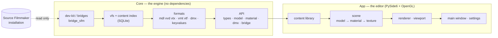

<p align="center">
  
</p>

<p align="center">
  <a href="#status"></a>
  <a href="#running-it"></a>
  <a href="#running-it"></a>
  <a href="#running-it"></a>
  <a href="Testing"></a>
  
</p>

<p align="center">
  <b>C2UI</b> — <i>Custom to User Interface</i> — is my rebuild of Source Filmmaker's editor:<br>
  the same content, the same session format, the same data model, inside a shell
  that borrows its look from the Steam library and its layout from the Unreal Engine 5 editor.
</p>

---

## The idea

Source Filmmaker is a great tool wearing a 2012 interface. I do not want a skin
over `sfm.exe`, and I do not want to reverse-engineer its windows one at a time.
I want an editor that **asks where SFM is installed**, mounts that installation
the way Garry's Mod mounts Counter-Strike, and does everything itself on top of
those files — models, materials, textures, sessions, animation — while never
launching SFM at all.

The target is **feature parity with SFM, one to one** (including bones and rigs),
then the things SFM never got.

```
  ┌──────────────┐    "where is SFM?"    ┌──────────────────────────────┐
  │   C2UI       │ ─────────────────────▶│  SourceFilmmaker/game/       │
  │              │                       │    usermod/gameinfo.txt      │
  │  own UI      │ ◀───── mounted ───────│    tf/  hl2/  tf_movies/ …   │
  │  own render  │      read-only        │    models/ materials/ dmx    │
  │  own state   │                       └──────────────────────────────┘
  └──────────────┘
        │ writes only inside its own folder: App/User, App/Cache, App/Temporary
```

## Where it stands

<p align="center">
  
  <br><sub>The editor today, with Valve's <i>Meet the Heavy</i> session open: shots and sound on the timeline, the session tree, and the first shot seen through its own camera - every model in the pose the session stores.</sub>
</p>

### Status

| Area | State | What that means in practice |
|---|---|---|
| Finding & mounting SFM | ✅ done | Steam registry → `libraryfolders.vdf` → `gameinfo.txt` search paths, in the engine's own order. Six mounts on a stock install. |
| Content index | ✅ done | 70 199 files indexed in 1.1 s cold / 0.02 s warm; overrides between mounts resolved exactly as the engine does. |
| Models — `.mdl` `.vvd` `.vtx` | ✅ done | Versions 44, 48, 49. Skeleton, meshes, all levels of detail. 1 500 models loaded, 0 failures. |
| Materials — `.vmt` | ✅ done | All 19 554 shipped materials parse; `patch`, DX-level blocks, proxies. |
| Textures — `.vtf` | ✅ done | Versions 7.0–7.5, DXT1/3/5 and every uncompressed format, cubemaps, mips. |
| Sessions — `.dmx` | ✅ read / write | Binary 1–5 and KeyValues2. Every session and particle file in the install writes back **byte for byte**. |
| Session on screen | 🟡 basic | Open a session: shots and sound tracks on a timeline, the element tree, each shot's scene through its own camera with every model in the pose the session stores. |
| Viewport | 🟡 basic | Textured models, orbit camera, wireframe, up-axis control. No Source shading (phong, rim, lightwarp) yet. |
| Animation | ✅ playback | Channels and logs evaluated at the time cursor; scrub or play (<kbd>Space</kbd>) and every bone, transform, camera, face and rig follows the session. |
| Faces | ✅ done | Flex controllers, the compiled rule programs and vertex animation — characters talk and emote. |
| Rigs | 🟡 basic | Expression operators, point/orient/parent/aim constraints and two-bone IK. Not yet: the full operator dependency graph, and rig *creation*. |
| Editing | 🟡 basic | Any attribute of any element in the inspector; a change to an animated value becomes a key at the time cursor. Undo/redo, Save and Save As, byte-exact. No viewport manipulator or motion editor yet. |
| Rendering to video / poster | ⬜ planned | |
| Plugins (`.c2plg`) | ⬜ planned | |
| Themes & workspaces | ⬜ deliberately later | One default look until the editor does something worth theming. |

**Release readiness: not yet.** Roughly a third of the way. The foundation —
every file format SFM uses, read correctly and verified against the whole
installation — is in place and tested, and a session can now be opened,
played, changed and saved. What is missing is the *comfort* of editing: a
manipulator in the viewport, the motion editor, the graph editor. No version
number until an animator can do a day's work in it.

<p align="center">
  
  <br><sub>Sixty-four models picked at random from the installation, rendered by C2UI's own renderer.</sub>
</p>

## What makes it different

- **It is portable.** Nothing is written outside the application folder: settings under `App/User`, caches under `App/Cache`, scratch under `App/Temporary`. Delete the folder and it is gone.
- **It never runs SFM.** No process to drive, no windows to hijack, no Python 2.7 to inject into. The installation is read like a content pack.
- **The formats are verified, not assumed.** Every reader was checked against the real installation — all 19 554 materials, an even sample of 4 934 of the 19 734 textures, 1 500 models, every session — and the numbers are in the commit history. Where the format does something surprising (a collision hull that is not render bounds, a triangle layout that changed with model version 49, a texture whose mips are stored smallest first) the code says so.
- **Saving is exact.** A session read and written unchanged is the same file. That is the bar for an editor you trust with your work.
- **The engine has no dependencies.** `Core/` and the whole test suite run on a bare Python. Only the window needs Qt and OpenGL.

## Architecture



Bridges are how an installation becomes content: `bridge_sfm` knows where
Source Filmmaker keeps things; a `bridge_gmod` or `bridge_workshop` would be
another folder next to it. Valve's SDK files are **not** in this repository —
the bridges know their layout, the files stay on your disk.

## Running it

Requires Windows, Python 3.13 and a Source Filmmaker installation.

```bash
git clone https://github.com/Arkomiko/SFM_C2UI.git
cd SFM_C2UI
python -m venv .venv
.venv/Scripts/python.exe -m pip install -r requirements.txt
.venv/Scripts/python.exe c2ui.py
```

On first start it looks for SFM through Steam; if it cannot find it, it asks.
<kbd>Ctrl</kbd>+<kbd>O</kbd> opens a session (`game/usermod/elements/sessions`); <kbd>C</kbd> looks through the shot's camera; <kbd>Space</kbd> plays, drag the timeline to scrub. Pick anything in the Session tree and edit its attributes in the Element panel — an animated value gets a key at the cursor. <kbd>Ctrl</kbd>+<kbd>Z</kbd> undoes, <kbd>Ctrl</kbd>+<kbd>S</kbd> saves.
Type in the search box, pick a model, drag to orbit, wheel to zoom, middle-drag
to pan, <kbd>F</kbd> to frame, <kbd>W</kbd> for wireframe, <kbd>X</kbd> <kbd>Y</kbd> <kbd>Z</kbd> to set the up axis.

The tests need nothing at all:

```bash
python Testing/run.py
```

## Layout

```
C2UI_SDK/
├── c2ui.py            the launcher
├── Core/              engine: formats, virtual file system, index, bridges
│   ├── API/           the contract everything else builds on
│   ├── Code/          the implementation
│   └── dev-kit/       bridges to installations (SDK files stay on your disk)
├── App/               the editor: content library, renderer, window
│   ├── Code/
│   ├── Data/          ships with the program
│   ├── User/          yours — settings, never deleted
│   ├── Cache/         regenerable
│   └── Temporary/     cleared on start
├── Tools/             localisation, UI tooling, plugin scaffolding (later)
└── Testing/           326 tests, byte-exact fixtures, one runner
```

## Roadmap

1. **Manipulators** — move and rotate in the viewport; the motion editor's time selection.
2. **Source shading** — VertexLitGeneric as SFM draws it: phong, rim, lightwarp, sheen.
3. **Maps** — `.bsp` for backgrounds.
4. **Output** — image and video export.
5. **Plugins** — the `.c2plg` format; then themes and workspaces.

## Licence & credits

Source Filmmaker, Team Fortress 2 and the Source engine are Valve's. This
project reads their file formats; it ships none of their files, and works only
with a copy of SFM you already have through Steam.

The licence for C2UI's own code has not been chosen yet — until it is, all
rights reserved. Issues and pull requests are welcome all the same.

---

<details>
<summary><b>По-русски</b></summary>

**C2UI** — это моя пересборка редактора Source Filmmaker: тот же контент, тот же
формат сессий, та же модель данных, но в оболочке, которая берёт внешний вид от
библиотеки Steam, а компоновку — от редактора Unreal Engine 5.

Программа спрашивает, где установлен SFM, и монтирует установку как контент
(как Garry's Mod монтирует Counter-Strike). Сам `sfm.exe` никогда не запускается.
Всё пишется только внутри собственной папки — она переносима.

**Что готово:** поиск и монтирование SFM, индекс контента, модели
(`.mdl/.vvd/.vtx`), материалы (`.vmt`), текстуры (`.vtf`), чтение и
побайтово точная запись сессий (`.dmx`), вьюпорт с текстурами и скиннингом,
открытие сессии: таймлайн с шотами и звуком, дерево, сцена шота через его камеру,
анимация по каналам и логам — скраббинг и воспроизведение, лицевая
анимация (flex), риги: выражения, констрейнты, двухзвенный IK.
Каждый формат проверен на всей установке.

**Чего нет:** манипулятора во вьюпорте и motion editor (править можно только
через инспектор), рендера в видео, карт.
Сессию можно открыть и посмотреть, но не изменить. **К релизу не готов** —
примерно треть пути. Номер версии появится, когда сессию можно будет
открыть, изменить и сохранить.

Запуск: см. раздел *Running it*. Тесты: `python Testing/run.py`.

</details>
